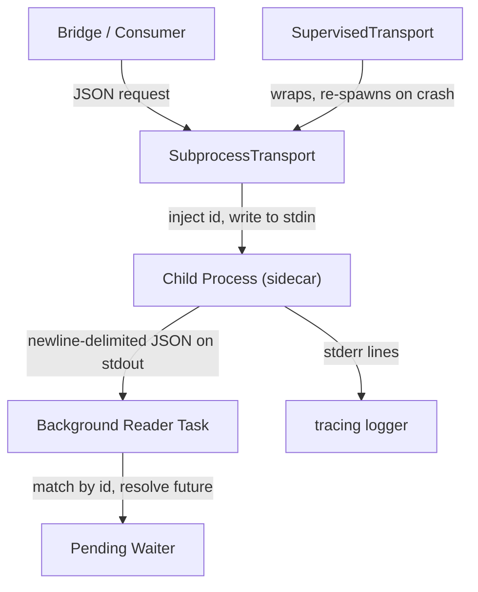

# Other — librefang-subprocess

# librefang-subprocess

Persistent JSON-over-stdio subprocess transport shared by LibreFang's sidecar bridges.

## Overview

Every sidecar bridge in LibreFang needs to do the same thing: spawn a long-lived child process, send it JSON requests over stdin, read JSON replies from stdout, match each reply to the caller that's waiting for it, and keep stderr draining to the log. `librefang-subprocess` extracts that shared logic into a reusable transport layer so each bridge only needs to concern itself with its domain-specific message types.

The transport is responsible for:

- **Spawning** a child process and holding its stdio handles
- **Injecting** a unique `id` into every outgoing JSON request
- **Writing** newline-delimited JSON to the child's stdin, with a configurable size bound
- **Reading** newline-delimited JSON replies on a background tokio task, matching each `{"id": N, ...}` to the pending caller
- **Draining** stderr lines to `tracing` so the child's diagnostic output isn't lost
- **Reaping** the child process on drop

The caller supplies an arbitrary JSON value. The transport wraps it as `{"id": N, ...}`, writes it, and resolves the future with the matching reply (`{"id": N, "ok": ...}` or `{"id": N, "error": ...}`).

## Architecture



## Two Layers

### `SubprocessTransport`

The raw, single-lifetime transport. One child process, one connection. Once the child exits—whether cleanly or by crashing—the transport is dead and all pending waiters receive an error.

Use this when you want full control over the child lifecycle or when the sidecar is expected to run for the entire duration of the parent.

### `SupervisedTransport`

A resilience wrapper around `SubprocessTransport`. It:

1. **Spawns lazily** — the child is not started until the first request.
2. **Re-spawns on failure** — if the child crashes, the next request triggers a fresh spawn (after a configurable cooldown period to avoid tight restart loops).
3. **Degrades gracefully** — a transient sidecar crash fails the in-flight request but does not permanently disable the transport.

Use this for sidecars that may crash or need to be restarted without taking down the parent daemon.

## Protocol

Communication uses newline-delimited JSON over stdio:

**Request** (parent → child):
```json
{"id": 1, ...caller_fields...}
```

**Reply** (child → parent):
```json
{"id": 1, "ok": ...}
```
or
```json
{"id": 1, "error": "..."}
```

The `id` field is injected by the transport. Callers never set it.

## Size Bounds

Both the outbound write size and the inbound reply-line size are bounded. Any line exceeding the configured maximum is treated as an error, preventing a misbehaving child from consuming unbounded memory.

## Position in the Dependency Graph

`librefang-subprocess` lives below `librefang-channels` and `librefang-runtime` — those higher-level crates depend on this transport, not the other way around. This crate has **no** `librefang-*` dependencies; it only relies on:

| Dependency | Purpose |
|---|---|
| `tokio` | Async runtime, child process management, background tasks |
| `serde_json` | JSON serialization/deserialization |
| `tracing` | Structured logging (stderr drain, lifecycle events) |
| `thiserror` | Error type definitions |
| `metrics` | Instrumentation counters/histograms |

## In-Tree Consumers

- **Context engine** (`docs/architecture/sidecar-context-engine.md`)
- **Proactive-memory extractor**

Both use `SupervisedTransport` to communicate with their respective sidecar processes, benefiting from automatic respawn on transient failures.

## Error Handling

Errors are expressed via `thiserror`-derived types covering:

- Child process spawn failures
- Stdin write errors (broken pipe, size exceeded)
- Stdout read errors (EOF, malformed JSON, size exceeded)
- Child exit during an active request (all pending waiters are resolved with an error)

## Testing

Dev-dependencies include `tempfile` for tests that need to exercise the transport against a real (if trivial) child process.