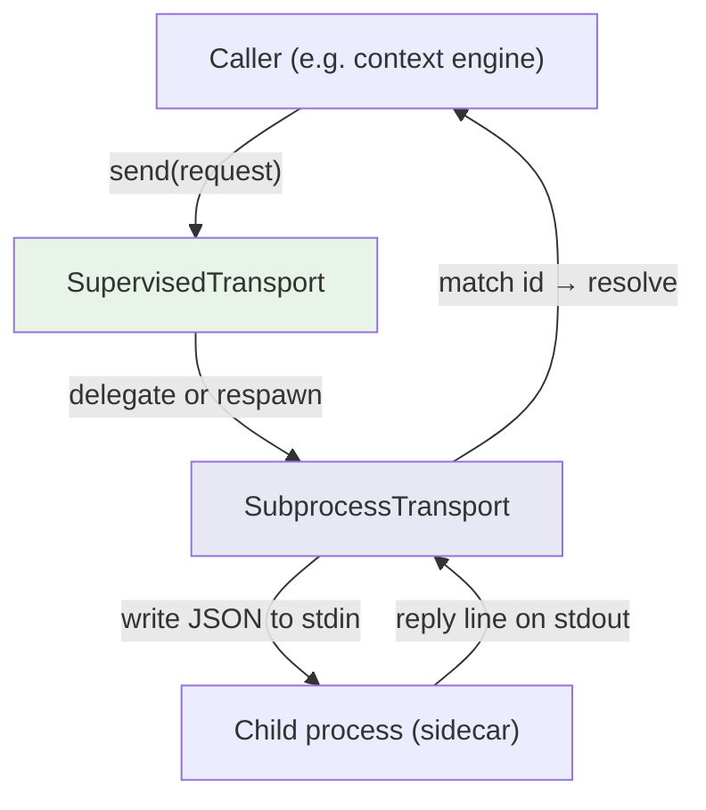

# Other — librefang-subprocess

# librefang-subprocess

Persistent JSON-over-stdio subprocess transport, shared by LibreFang's sidecar bridges.

## Purpose

Every sidecar bridge in LibreFang was reimplementing the same boilerplate: spawn a long-lived child process, write JSON requests to its stdin, read JSON replies from its stdout, match replies back to callers by ID, drain stderr to the log, and reap the child on shutdown. This crate extracts that shared logic into a single, reusable transport layer.

The caller supplies a JSON request object. The transport injects an `id` field, writes `{"id": N, …}\n` to the child's stdin, and resolves the pending call when a matching reply (`{"id": N, "ok": …}` or `{"id": N, "error": …}`) arrives on stdout.

This crate lives below `librefang-channels` and `librefang-runtime` in the dependency graph. It depends on **no** `librefang-*` crate. In-tree consumers include the context engine (`docs/architecture/sidecar-context-engine.md`) and the proactive-memory extractor.

## Architecture



Two layers are exposed, one building on the other:

- **`SubprocessTransport`** — the raw, id-matched transport. Owns exactly one child process. If the child exits, the transport is dead and must be replaced.
- **`SupervisedTransport`** — wraps `SubprocessTransport` for callers that want resilience. Spawns the child lazily on first use and re-spawns after a crash, rate-limited by a respawn cooldown so a transient sidecar failure degrades a single call rather than the daemon's whole lifetime.

## Protocol

All communication uses newline-delimited JSON over the child's stdin/stdout.

### Request

The caller provides an arbitrary JSON object. The transport injects a numeric `id` before writing:

```json
{"id": 42, "method": "evaluate", "params": {...}}
```

### Reply

The child must respond with a JSON line containing the same `id` and either an `ok` or `error` field:

```json
{"id": 42, "ok": {"result": true}}
```

```json
{"id": 42, "error": "something went wrong"}
```

The background reader task matches on `id` to resolve the corresponding pending future.

## Key Responsibilities

The transport handles several concerns that every bridge would otherwise need to duplicate:

| Concern | Detail |
|---|---|
| **Process lifecycle** | Spawns the child, reaps it on drop. |
| **ID matching** | Assigns a monotonic ID to each request, maintains a wait map, resolves the correct future when the reply arrives. |
| **Write bounding** | Enforces a maximum size on the serialized request written to stdin. |
| **Reply-line bounding** | Enforces a maximum size on each line read from stdout to prevent unbounded memory growth from a misbehaving child. |
| **Background reading** | A tokio task continuously reads stdout lines and dispatches them to waiters. |
| **Stderr draining** | Forwards child stderr output to the `tracing` log so sidecar diagnostics are visible. |
| **Supervision** (`SupervisedTransport` only) | Detects child exit, rate-limits respawns via a cooldown, and retries on the next call. |

## Error Handling

Errors are reported through the `thiserror`-derived error type. Broad categories:

- **Spawn failures** — the child binary could not be started.
- **Write failures** — the request exceeded the write bound or the child's stdin was closed.
- **Read failures** — a reply line exceeded the line bound or stdout closed unexpectedly.
- **Child exit** — the child process terminated before replying.
- **Respawn cooldown** (`SupervisedTransport`) — the child crashed too recently; the call fails immediately rather than hammering the system.

All errors are instrumented with `tracing` spans so they appear in structured logs with context.

## Observability

The crate integrates with the `metrics` facade. Key metrics you can expect (names are defined in the source):

- Request/response counts
- In-flight request gauges
- Respawn counts (supervised transport)
- Child exit reasons

Stderr output from the child is forwarded to `tracing` at an appropriate level, preserving the sidecar's diagnostic output in the host process's log stream.

## Usage Patterns

### Basic: `SubprocessTransport`

For scenarios where the child is expected to outlive the transport (or where the caller manages restarts itself):

1. Construct a `SubprocessTransport` with the child binary path and any arguments.
2. Call a method that sends a JSON request and await the response future.
3. The transport assigns an `id`, writes to stdin, and resolves the future when the matching reply arrives.
4. On drop, the child is reaped.

### Resilient: `SupervisedTransport`

For long-running daemons where a crashed sidecar should not be fatal:

1. Construct a `SupervisedTransport` with the binary path and a respawn cooldown duration.
2. Send requests as normal. The first call lazily spawns the child.
3. If the child crashes mid-flight, that call fails — but the next call triggers a respawn (subject to the cooldown).
4. The transport remains usable across multiple child lifetimes.

## Dependencies

| Crate | Role |
|---|---|
| `tokio` | Async runtime, child process management, background tasks |
| `serde_json` | JSON serialization and deserialization |
| `tracing` | Structured logging and diagnostic spans |
| `thiserror` | Ergonomic error type derivation |
| `metrics` | Request/response and lifecycle counters |

No `librefang-*` crates appear as dependencies, keeping the transport fully self-contained and reusable.

## Testing

The dev-dependency on `tempfile` supports integration tests that spawn a real child process (often a small helper script or the test binary itself in a special mode) to exercise the full stdin/stdout round-trip path.