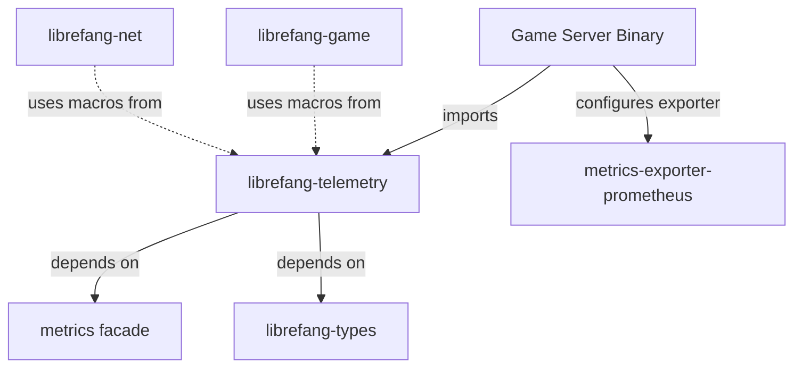

# Other — librefang-telemetry

# librefang-telemetry

OpenTelemetry + Prometheus metrics instrumentation for LibreFang.

## Purpose

This module serves as the central metrics definition and instrumentation layer for the LibreFang system. It provides a dedicated home for metric definitions, labels, and telemetry helpers that other crates consume to report operational data.

By isolating telemetry concerns into their own crate, metric names, label keys, and instrumentation patterns stay consistent across the entire codebase without creating circular dependencies.

## Dependencies

| Crate | Role |
|---|---|
| `metrics` | Facade crate for recording counters, gauges, and histograms. Provides the `metrics::counter!`, `metrics::gauge!`, and `metrics::histogram!` macros used throughout the codebase. |
| `librefang-types` | Shared domain types (game events, player states, room identifiers, etc.) used as metric label values. |

The `metrics` crate is a facade — it defines the API for recording metrics but delegates actual export to a backend (such as `metrics-exporter-prometheus`) configured at the binary level. This means `librefang-telemetry` remains backend-agnostic.

## How It Fits Into The Architecture



Other library crates in the workspace reference `librefang-telemetry` to call into the metrics macros with standardized metric names and labels. The final binary crate wires up an exporter (Prometheus, OpenTelemetry, etc.) that collects everything recorded through the facade.

## Usage Patterns

### Recording Metrics From Other Crates

Modules throughout the workspace use the `metrics` facade macros directly. `librefang-telemetry`'s role is to own shared metric name constants, label definitions, and any helper functions that encapsulate recurring instrumentation patterns.

```rust
use metrics::counter;

counter!("connections.total", "protocol" => "tcp").increment(1);
counter!("messages.received", "type" => "chat").increment(1);
```

### Exporter Configuration (Binary Level)

The binary crate that assembles the final server executable is responsible for installing a metrics exporter. This is intentionally not part of `librefang-telemetry` so that different deployment targets can choose different backends.

## Current Status

This module is in an early state. The dependency declarations are in place and the architectural boundary is established, but the call graph shows no internal execution flows yet. As the codebase grows, expect this crate to accumulate:

- **Metric name constants** — static strings for every metric exposed by the system.
- **Label key constants** — consistent label names (`"room_id"`, `"player_id"`, `"event_type"`) so there are no typos or naming drift.
- **Helper functions** — wrappers around common instrumentation patterns (e.g., timing a future and recording a histogram, or counting a classified error).

## Contributing

When adding new instrumentation:

1. **Define the metric name here** if it will be used from more than one crate.
2. **Use the `metrics` facade macros** (`counter!`, `gauge!`, `histogram!`) rather than reaching for any exporter-specific API.
3. **Keep labels low-cardinality** — avoid putting unique identifiers (session IDs, raw message content) into label values, as this explodes series cardinality in Prometheus.
4. **Document the metric** in this crate so that operators know what to expect in dashboards and alerts.