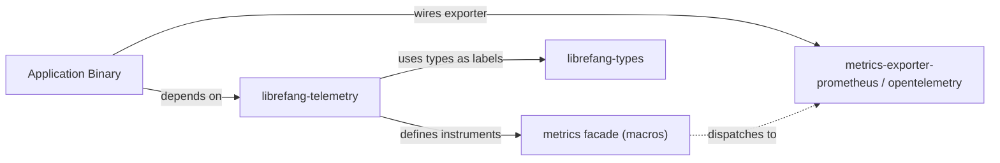

# Other — librefang-telemetry

# librefang-telemetry

OpenTelemetry + Prometheus metrics instrumentation for LibreFang.

## Overview

`librefang-telemetry` provides the metrics layer for the LibreFang system. It is a thin library crate that defines the application-level metrics used throughout the codebase — counters, gauges, histograms, and labeled instruments — using the [`metrics`](https://docs.rs/metrics) facade crate.

Because it depends on the `metrics` facade rather than a concrete exporter, the actual backend (Prometheus, OpenTelemetry, etc.) is selected at the binary level. This crate's job is to **declare** what gets measured; the application binary wires up the exporter.

## Dependencies

| Crate | Purpose |
|---|---|
| `metrics` (workspace) | Metrics facade — provides macros like `counter!`, `gauge!`, `histogram!`, and the `Metrics` trait for custom instrumentation |
| `librefang-types` | Shared domain types used as labels or keys in metrics (e.g., game identifiers, session types) |

## Architecture



The crate itself has no runtime behavior. It contains no `main`, no async runtime, and no side effects. It exists solely to:

1. **Centralize metric definitions** so that metric names, labels, and units are consistent across all LibreFang components.
2. **Depend on `librefang-types`** so that domain types can be used as metric labels without duplicating definitions.

## Usage

Other crates in the workspace import `librefang-telemetry` and call into the `metrics` macros it exposes or wraps. The concrete exporter is configured in the final binary (e.g., `librefang-server`).

### Wiring up the exporter (binary level)

The binary crate selects and installs a metrics exporter. For example, with a Prometheus exporter:

```rust
// In the application binary — not in this crate
use metrics_exporter_prometheus::PrometheusBuilder;

let recorder = PrometheusBuilder::new().build_recorder();
metrics::set_boxed_recorder(Box::new(recorder)).unwrap();
```

### Recording metrics (library level)

Components throughout the codebase call the `metrics` macros directly or via helpers defined in this crate:

```rust
use metrics::counter;

counter!("connections_total", "protocol" => "tcp").increment(1);
```

Because `librefang-telemetry` centralizes the metric naming conventions, prefer importing from this crate when it re-exports or wraps the `metrics` macros, ensuring namespacing stays consistent.

## Metric Naming Conventions

All metrics in LibreFang should follow these conventions to ensure uniformity:

- **Prefix**: Metrics are prefixed with a namespace (e.g., `librefang_`) to avoid collisions when exported.
- **Suffixes**: Use standard suffixes — `_total` for counters, `_seconds` for time-based histograms, `_bytes` for size-based instruments.
- **Labels**: Use types from `librefang-types` where applicable to keep label values consistent and type-safe.

## Role in the Workspace

This crate sits in the "other" category — it is not a service or a core domain crate. It is a shared utility that any crate needing observability can depend on without pulling in a concrete metrics backend.

| Aspect | Detail |
|---|---|
| **Layer** | Cross-cutting / infrastructure |
| **Depends on** | `librefang-types`, `metrics` |
| **Depended on by** | Any workspace crate that emits metrics |
| **Runtime** | None — compile-time definitions only |

## Contributing

When adding new metrics:

1. Add the metric definition in this crate to keep naming centralized.
2. Use types from `librefang-types` for labels where possible.
3. Document the metric's purpose, unit, and expected labels.
4. Do **not** add a dependency on a specific exporter in this crate — that belongs in the binary.