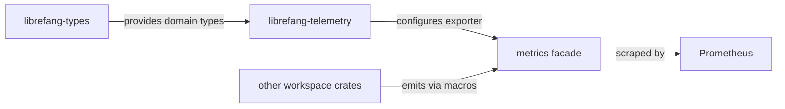

# Other — librefang-telemetry

# librefang-telemetry

OpenTelemetry + Prometheus metrics instrumentation for LibreFang.

## Purpose

This crate provides the observability layer for LibreFang. It wraps the `metrics` facade and exposes helpers for recording, labeling, and exporting application telemetry — primarily targeting Prometheus-compatible scraping.

## Dependencies

| Dependency | Role |
|---|---|
| `metrics` | The underlying metrics facade. Provides the `counter!`, `gauge!`, `histogram!`, and related macros used throughout the codebase. |
| `librefang-types` | Shared domain types. Metrics labels and values are derived from these types (e.g., event variants, connection states) so instrumentation stays consistent with the rest of the codebase. |
| `tokio-test` *(dev)* | Used only in tests for async runtime support. |

## How It Fits In

`librefang-telemetry` is a **leaf library crate** — it has no outgoing calls to other LibreFang crates and nothing in the workspace calls into it directly at compile time (modules use the `metrics` macros instead). Its role is:

1. **Initializing** the metrics exporter/pipeline at application startup.
2. **Defining helper functions or constants** for metric names, labels, and default dimensions so they aren't scattered across the codebase.
3. **Optionally re-exporting** the `metrics` macros so downstream crates only need one dependency.

Other crates in the workspace emit metrics via the `metrics` facade macros. At runtime, whatever exporter this crate configures receives those emissions.

## Usage

Add to your crate's `Cargo.toml`:

```toml
[dependencies]
librefang-telemetry = { path = "../librefang-telemetry" }
```

Initialize early in your application's `main` or `tokio::main`, before spawning any workers that would emit metrics:

```rust
librefang_telemetry::init();
```

From that point on, any `metrics::counter!()`, `metrics::histogram!()`, or `metrics::gauge!()` call anywhere in the process is captured by the configured exporter.

## Architecture



The crate sits between the shared type definitions and the runtime metrics pipeline. Other crates remain decoupled from the telemetry implementation — they only depend on the `metrics` macros, while this crate owns the plumbing.