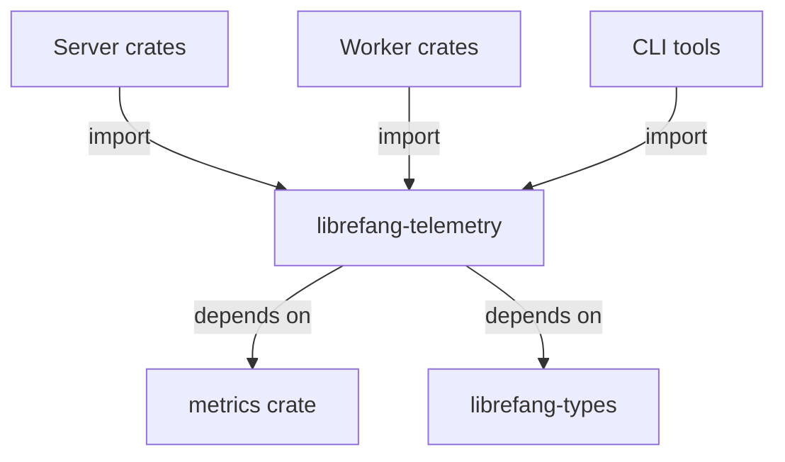

# Other — librefang-telemetry

# librefang-telemetry

OpenTelemetry + Prometheus metrics instrumentation for LibreFang.

## Purpose

This crate provides the centralized metrics and telemetry layer for LibreFang. It wraps the `metrics` facade crate and exposes a consistent set of counters, gauges, and histograms that other LibreFang components use to report operational data. By consolidating metric definitions here, every service in the workspace references the same names and labels, preventing drift and typos across the codebase.

## Architecture

The crate sits between the `metrics` ecosystem and the rest of LibreFang. Downstream crates—servers, background workers, CLI tools—depend on `librefang-telemetry` rather than calling into `metrics` directly. This indirection means metric key naming, label conventions, and recorder initialization all live in one place.

## Dependencies

| Dependency | Purpose |
|---|---|
| `metrics` | Facade crate providing macros (`counter!`, `gauge!`, `histogram!`, etc.). Does not impose an exporter—callers choose the backend at runtime. |
| `librefang-types` | Shared domain types. Used when metric labels or values reference domain concepts (e.g., queue names, job statuses). |

**Dev dependency:** `tokio-test` supports async unit tests for any initialization or registration logic that depends on a Tokio runtime.

## Design Decisions

### Metrics Facade Pattern

The `metrics` crate acts as a front-end similar to `log`. Code calls macros to record data; a separate recorder (such as `metrics-exporter-prometheus`) is installed at application startup. This crate does **not** select or configure an exporter—that responsibility belongs to the final binary. `librefang-telemetry` defines *what* to measure; the binary decides *where* to send it.

### No Outgoing or Incoming Calls

The call graph for this module is flat: it exports functions and macro wrappers but does not itself call into other LibreFang crates at runtime. This keeps the telemetry layer free of side effects and circular dependencies. It is purely a definition and utility module.

## Integration Points

To use this crate in another LibreFang workspace member:

1. Add `librefang-telemetry` as a dependency in `Cargo.toml`.
2. Call the exported initialization or setup functions early in your application's `main` or `tokio::spawn` setup.
3. Use the provided metric helpers (or the `metrics` macros directly) at the points in your code where you want to record data.
4. In the final binary, install a recorder/exporter (e.g., `metrics-exporter-prometheus`) before calling into any metric-producing code.

## Testing

Tests use `tokio-test` to provide a minimal async runtime. Because the `metrics` facade is a no-op when no recorder is installed, tests can call metric functions without setting up a full exporter—recorded values simply drop. If tests need to assert specific metric values, install a test recorder before the test body runs.