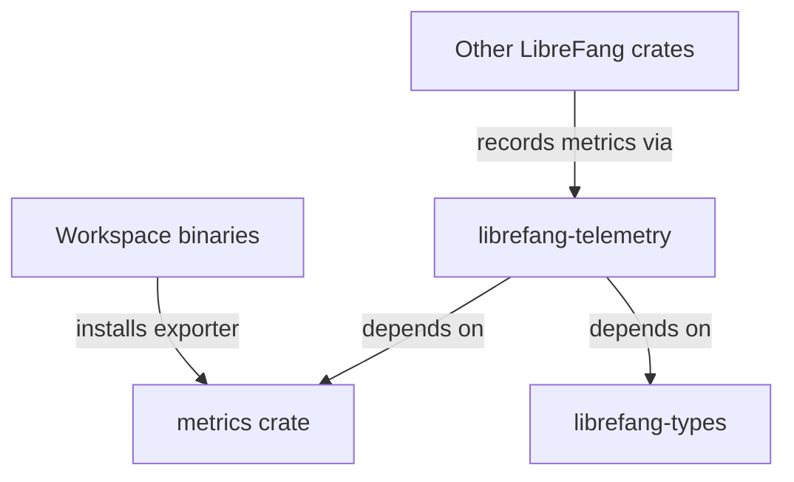

# Other — librefang-telemetry

# librefang-telemetry

OpenTelemetry and Prometheus metrics instrumentation for the LibreFang project.

## Overview

`librefang-telemetry` provides a centralized metrics layer for the LibreFang ecosystem. It wraps the `metrics` crate and exposes a consistent instrumentation surface that other LibreFang crates can depend on without each one needing to configure exporters or metric sinks independently.

## Dependencies

| Dependency | Purpose |
|---|---|
| `metrics` | Core metrics facade — provides counters, gauges, histograms, and the macro interface for recording values |
| `librefang-types` | Shared type definitions across the LibreFang workspace |

**Dev dependencies:**

| Dependency | Purpose |
|---|---|
| `tokio-test` | Async test utilities for validating telemetry under simulated runtime conditions |

## Role in the Workspace

This crate sits at the foundation of the LibreFang observability stack. Other workspace members import `librefang-telemetry` to record metrics, while the top-level binary (or a dedicated telemetry initializer) is responsible for installing the actual exporter backend (e.g., Prometheus scrape endpoint).



## Usage

### Recording metrics from other crates

Add `librefang-telemetry` as a dependency in your crate's `Cargo.toml`:

```toml
[dependencies]
librefang-telemetry = { path = "../librefang-telemetry" }
```

Then use the `metrics` macros or the re-exported helpers provided by this crate to instrument your code.

### Setting up the exporter (binary side)

The application binary is responsible for initializing a metrics exporter before any measurements are recorded. This separation keeps library crates free of exporter-specific configuration.

## Architecture Notes

- **No internal call graph.** This crate is a leaf dependency — it does not call into other LibreFang modules at runtime. It re-exports or wraps the `metrics` facade and may define shared metric name constants or helper functions.
- **No incoming calls detected in static analysis.** Other crates consume this module through the `metrics` macro layer, which is resolved at compile time rather than through direct function calls, making the dependency invisible to a simple call-graph trace.
- The `librefang-types` dependency suggests that metric labels or identifiers may be derived from domain types shared across the project (e.g., player identifiers, game states, room codes).

## Testing

Tests use `tokio-test` to simulate asynchronous contexts. Run the test suite with:

```sh
cargo test -p librefang-telemetry
```