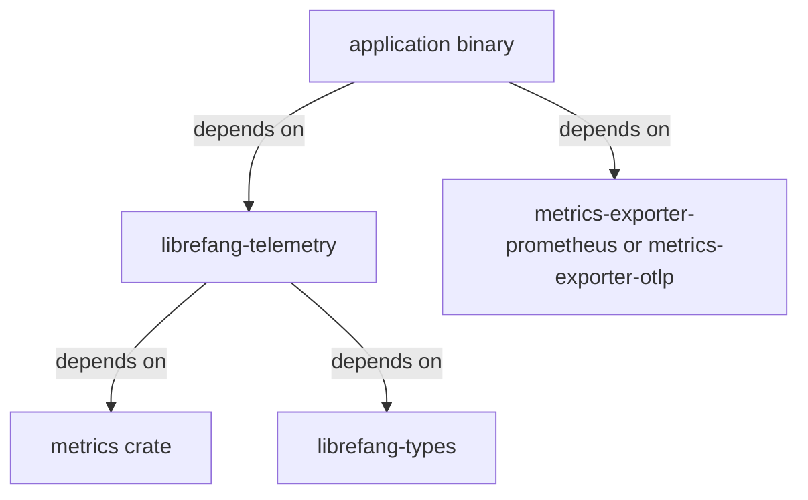

# Other — librefang-telemetry

# librefang-telemetry

OpenTelemetry + Prometheus metrics instrumentation for LibreFang.

## Overview

`librefang-telemetry` provides the centralised metrics layer for the LibreFang project. It builds on the [`metrics`](https://docs.rs/metrics) facade crate, exposing a consistent set of counters, gauges, and histograms that the rest of the codebase records, while leaving the choice of exporter (Prometheus pull, OTLP push, etc.) to the final binary.

Because it depends on `librefang-types`, metric names and labels can stay in sync with the domain types used throughout the project.

## Role in the Architecture


```mermaid
graph TD
    A[librefang-telemetry] -->|depends on| B[metrics crate]
    A -->|depends on| C[librefang-types]
    D[application binary] -->|depends on| A
    D -->|depends on| E[metrics-exporter-prometheus or metrics-exporter-otlp]
```

Other LibreFang crates record metrics by calling into the `metrics` façade directly; this crate is responsible for:

1. **Defining metric identifiers** — constant names and label keys so that every crate uses the same strings.
2. **Registering and initialising metrics** — setting up counters, gauges, and histograms with the correct units and descriptions at startup.
3. **Providing helper functions** — convenience wrappers around `metrics::counter!`, `metrics::gauge!`, and `metrics::histogram!` that encode the agreed-upon labels.

The actual exporter (Prometheus, OpenTelemetry, or a no-op for tests) is wired in by the top-level binary crate, not here.

## Dependencies

| Crate | Purpose |
|---|---|
| `metrics` | Lightweight metrics façade. Provides the `counter!`, `gauge!`, `histogram!` macros. |
| `librefang-types` | Shared domain types. Used so that label values and metric names remain type-safe and consistent. |

## Integration Guide

### Recording metrics from other crates

Any crate that wants to record telemetry should depend on `librefang-telemetry` and call its helper functions. The underlying `metrics` macros are re-exported so consumers don't need a direct dependency on the `metrics` crate.

```rust
use librefang_telemetry::record_request;

record_request("bind", "eth0");
```

### Initialising in the binary

At application startup, call the initialisation function provided by this crate **after** installing an exporter:

```rust
use metrics_exporter_prometheus::PrometheusBuilder;
use librefang_telemetry::init_metrics;

// Install exporter first
let recorder = PrometheusBuilder::new().build_recorder();
metrics::set_boxed_recorder(Box::new(recorder)).unwrap();

// Then register all known metrics
init_metrics();
```

This two-step approach keeps the telemetry crate agnostic to which exporter is in use.

## Contributing

When adding a new metric:

1. Add a constant for the metric name and any new label keys in this crate.
2. Register the metric in the `init_metrics` function so it appears with correct metadata (description, unit) in Prometheus/OTLP output.
3. Optionally add a typed helper function so callers don't need to remember label ordering.
4. Keep metric names lower-case, dot-separated, and prefixed with a namespace (e.g. `librefang.dhcp.leases.active`).