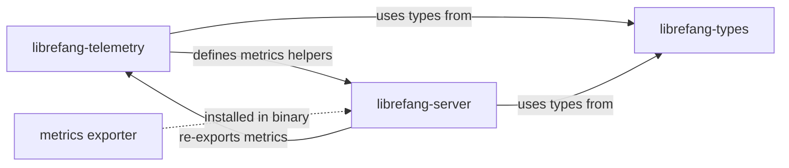

# Other — librefang-telemetry

# librefang-telemetry

OpenTelemetry + Prometheus metrics instrumentation for LibreFang.

## Purpose

This crate centralizes all metrics definitions and telemetry helpers for the LibreFang project. It depends on the [`metrics`](https://docs.rs/metrics) facade crate, which provides a vendor-agnostic API for recording counters, gauges, and histograms. Downstream crates consume the types and helper functions defined here, while the actual metrics sink (Prometheus exporter, OpenTelemetry OTLP, etc.) is configured at the binary level.

## Dependencies

| Crate | Why |
|---|---|
| `metrics` | Facade for recording metrics without committing to a specific exporter. |
| `librefang-types` | Shared domain types (game events, player state, etc.) used as labels or to derive metric values. |

## Relationship to the Workspace

```mermaid
graph LR
    A[librefang-telemetry] -->|defines metrics helpers| B[librefang-server]
    A -->|uses types from| C[librefang-types]
    B -->|uses types from| C
    B -->|re-exports metrics| A
    D[metrics exporter] -.->|installed in binary| B
```

- **librefang-telemetry** is a library-only crate. It does not start an HTTP endpoint or push metrics anywhere on its own.
- The binary crate (typically `librefang-server`) is responsible for installing a `metrics` exporter (e.g., `metrics-exporter-prometheus`) and calling into the helpers defined here.
- All metric names, labels, and recording logic live in this crate so they are consistent across the codebase.

## Usage Patterns

### Recording Metrics

Downstream code should call into helpers defined in this crate rather than using the `metrics` facade directly. This ensures metric names and label keys are centralized and consistent.

### Adding New Metrics

1. Define the metric name as a constant in this crate.
2. Create a helper function that records the metric with the correct labels, accepting strongly-typed arguments from `librefang-types` where appropriate.
3. Call the helper from game logic in `librefang-server` or other consumer crates.

### Exporter Setup (Binary Crate)

The exporter is not configured here. In the binary crate, install the desired exporter before any metrics are recorded. For example, a Prometheus exporter would expose an HTTP scrape endpoint and wire itself into the global `metrics` recorder.

## Design Notes

- **No outgoing or incoming calls detected** — this crate is purely declarative. It defines constants and helper functions; it does not subscribe to events or call into other workspace crates at runtime.
- **Zero async runtime dependency** — the `metrics` facade is synchronous, so this crate adds no async overhead.
- **Workspace lints** are inherited from the root `Cargo.toml` via the `[lints]` table, ensuring consistent style across the monorepo.