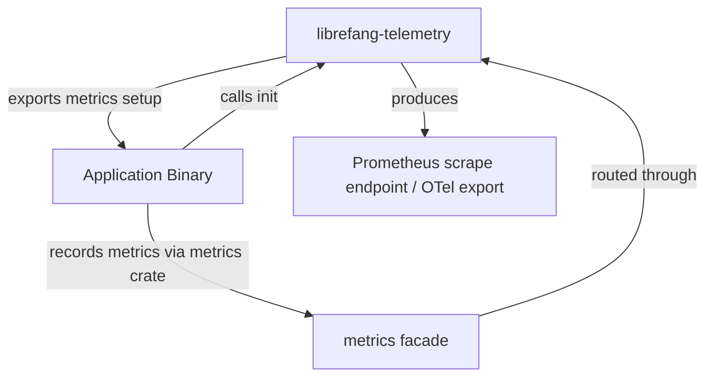

# Other — librefang-telemetry

# librefang-telemetry

OpenTelemetry and Prometheus metrics instrumentation for the LibreFang project.

## Purpose

This crate centralizes all telemetry configuration and metric definitions for LibreFang. It provides a single, shared setup for metrics collection so that other crates in the workspace don't need to duplicate exporter configuration or depend directly on telemetry implementation details.

## Dependencies

| Crate | Role |
|---|---|
| `metrics` | Facade crate that provides a universal metrics API (counters, gauges, histograms). Actual exporters are wired up here. |
| `librefang-types` | Shared domain types. Metric labels and values are derived from these types to ensure consistency across the codebase. |

## How It Fits In


```mermaid
graph TD
    A[librefang-telemetry] -->|exports metrics setup| B[Application Binary]
    B -->|calls init| A
    B -->|records metrics via metrics crate| C[metrics facade]
    C -->|routed through| A
    A -->|produces| D[Prometheus scrape endpoint / OTel export]
```

The application binary calls into this crate at startup to initialize the metrics pipeline. Once initialized, any crate in the workspace can record metrics using the `metrics` crate's macros (`counter!`, `gauge!`, `histogram!`, etc.) without knowing about the underlying exporter.

## Architecture

This crate has **no inbound or outbound internal call edges** — it is a leaf dependency that other crates rely on at init time. This is by design: telemetry is infrastructure, not business logic, and should not call into domain crates (beyond reading shared types for label values).

Key responsibilities:

- **Exporter initialization** — Sets up the Prometheus or OpenTelemetry exporter with the correct listen address, default labels, and naming conventions.
- **Metric naming conventions** — Defines the prefix and naming strategy so that all emitted metrics are consistent and discoverable.
- **Shared label constants** — Label keys used across services are defined here to avoid string duplication and typos.

## Usage

### Initialization (in your binary)

Call the setup function early in `main`, before spawning any workers that might emit metrics:

```rust
librefang_telemetry::init()?;
```

This installs a global metrics exporter. After this call, the `metrics` macros work everywhere in the process.

### Recording Metrics (in any crate)

Once the exporter is installed, any workspace crate can record metrics directly through the `metrics` facade — no direct dependency on `librefang-telemetry` is needed at the call site:

```rust
use metrics::counter;

counter!("connections_total", "protocol" => "ssh").increment(1);
```

### Adding New Metrics

1. Define the metric name as a constant in this crate if it will be used from multiple locations.
2. Use `librefang-types` values for label content wherever possible — this keeps metric labels consistent with the domain model.
3. Document the metric's unit, type (counter / gauge / histogram), and intended labels in this crate's module docs.

## Build Configuration

The crate inherits workspace-level lint settings via `[lints] workspace = true`, ensuring it follows the same code quality standards as the rest of the monorepo.