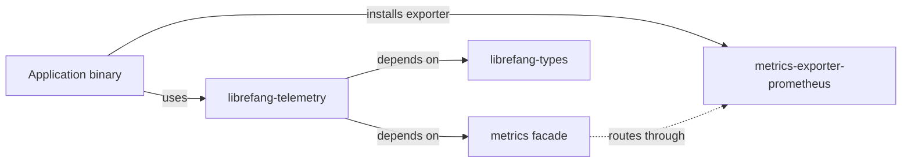

# Other — librefang-telemetry

# librefang-telemetry

OpenTelemetry + Prometheus metrics instrumentation for LibreFang.

## Purpose

This module serves as the centralized metrics definitions and instrumentation layer for the LibreFang system. It depends on the [`metrics`](https://docs.rs/metrics) facade crate and `librefang-types`, providing a single place to define counters, gauges, histograms, and labels used across the project.

Because metrics definitions are co-located here rather than scattered throughout business logic, any consumer in the workspace can record telemetry without importing backend-specific crates directly.

## Dependencies

| Crate | Role |
|---|---|
| `metrics` | Vendor-agnostic metrics facade. Provides macros like `counter!`, `gauge!`, `histogram!`, and `increment_counter!` that route to whatever exporter is installed at runtime. |
| `librefang-types` | Shared domain types. Telemetry labels and metric names often reference enums or structs defined in the types crate (e.g., message kinds, connection states). |

## Architecture

```mermaid
graph LR
    A[librefang-telemetry] -->|depends on| B[metrics facade]
    A -->|depends on| C[librefang-types]
    D[Application binary] -->|uses| A
    D -->|installs exporter| E[metrics-exporter-prometheus]
    B -.->|routes through| E
```

The application binary is responsible for installing a concrete exporter (e.g., `metrics-exporter-prometheus`). Once installed, every macro call emitted by code that depends on `librefang-telemetry` is routed to that exporter. This module does **not** itself start an HTTP server or bind a scrape endpoint.

## Usage

Other workspace crates add `librefang-telemetry` as a dependency and call into its metric helpers or re-exported macros. The typical flow:

1. **At startup**, the binary crate installs a Prometheus exporter on a known port.
2. **At runtime**, library crates call metrics functions defined or re-exported here.
3. **At scrape time**, Prometheus hits the exporter's endpoint and collects aggregated values.

## Integration Notes

- **No execution flows originate here.** This is a pure definition/utility module with no side effects of its own. It exposes constants, helper functions, and/or macros that other crates call.
- **Adding new metrics:** Define new metric names and label constants in this crate so they remain discoverable and consistent.
- **Testing:** Because `metrics` is a facade, tests can run without a real exporter installed—recorded values are simply no-ops unless an exporter is explicitly set up in the test harness.