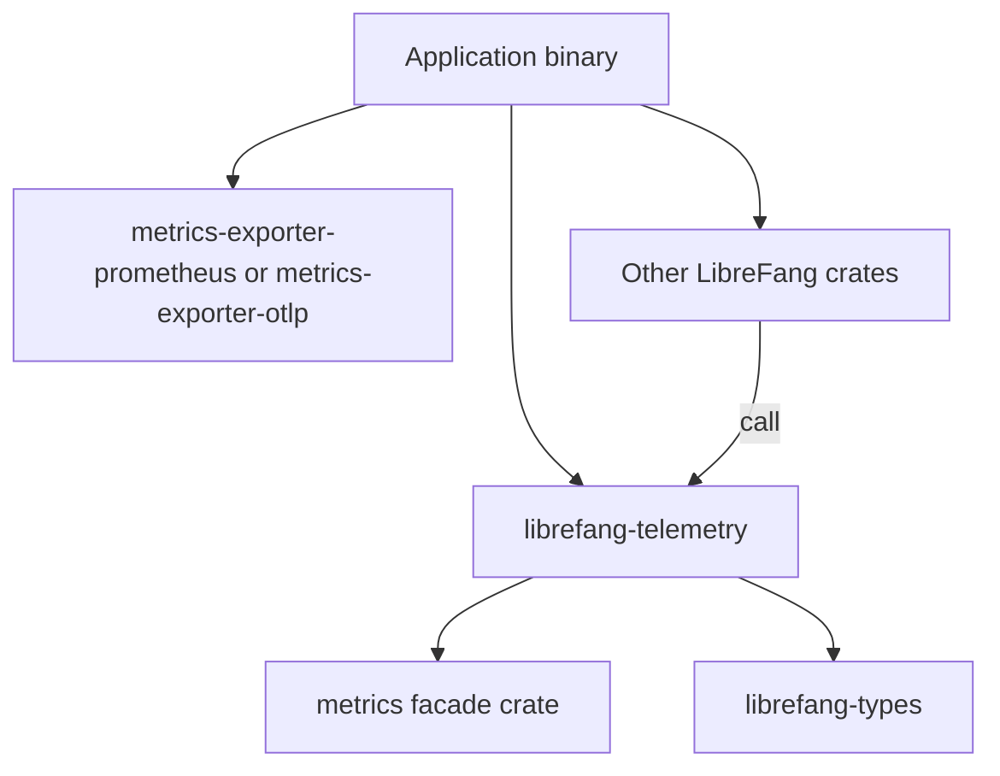

# Other — librefang-telemetry

# librefang-telemetry

OpenTelemetry + Prometheus metrics instrumentation for LibreFang.

## Purpose

This crate centralizes all metrics definitions and telemetry helpers for the LibreFang project. It depends on the [`metrics`](https://docs.rs/metrics) facade crate, which decouples metric recording from the exporter backend — allowing the same instrumented code to emit to Prometheus, OpenTelemetry, or any compatible backend chosen at application startup.

## Role in the Architecture

```mermaid
graph TD
    A[librefang-telemetry] --> B[metrics facade crate]
    A --> C[librefang-types]
    D[Application binary] --> A
    D --> E[metrics-exporter-prometheus or metrics-exporter-otlp]
    D --> F[Other LibreFang crates]
    F -->|call| A
```

`librefang-telemetry` sits between the domain crates (which consume it) and the `metrics` ecosystem. Domain crates import helpers from here rather than depending on `metrics` directly, keeping metric names, label conventions, and recording patterns consistent across the entire project.

The application binary is responsible for wiring up a concrete exporter (e.g., `metrics-exporter-prometheus`) and initializing it at startup.

## Dependencies

| Dependency | Why it's needed |
|---|---|
| `metrics` | Facade for recording counters, gauges, and histograms without coupling to a specific backend. |
| `librefang-types` | Provides domain types (game state enums, player identifiers, etc.) used as metric labels or to derive metric values. |

## Usage Pattern

Other LibreFang crates pull in `librefang-telemetry` and call into it at key points in their logic — for example, when a game starts, a player connects, or a round ends. The helpers in this crate translate those domain events into well-formed metric recordings via the `metrics` facade.

Because the `metrics` crate uses a global recorder, no state needs to be threaded through the call chain. Any crate can record a metric at any time after the recorder is installed.

## Integration Checklist

When adding telemetry to a new subsystem:

1. **Define metrics here.** Add helper functions or constants for metric names and labels in this crate so they remain discoverable and consistent.
2. **Depend on this crate** from the subsystem that needs to record metrics — not on `metrics` directly.
3. **Ensure the application binary** initializes a metrics exporter before any recording occurs. Unrecorded metrics are silently ignored by the `metrics` facade, so nothing panics, but no data will be emitted.

## Backend Selection

This crate is backend-agnostic. The choice of Prometheus vs. OpenTelemetry vs. another exporter is made at the binary level. To switch backends, change the exporter dependency and initialization code in the binary — no changes are needed in this crate or in any crate that depends on it.