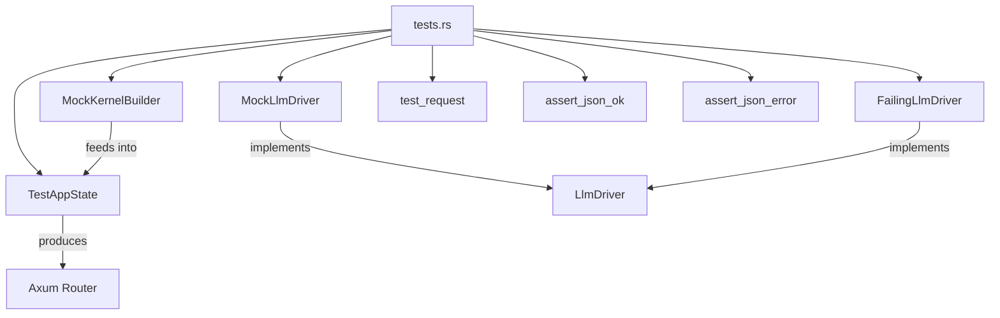

# Other — librefang-testing-src

# librefang-testing — Test Infrastructure and Example Tests

## Purpose

`librefang-testing` is the integration testing crate for the librefang project. It provides reusable test primitives — mock kernels, mock LLM drivers, HTTP request helpers, and response assertions — and contains example tests that demonstrate how to exercise the API layer end-to-end without real external dependencies.

The `tests.rs` file in this module serves a dual role: it validates the API endpoints and documents the testing patterns available to contributors writing new tests.

## Architecture



## Test Infrastructure Components

All helpers are re-exported from the crate root. The tests import them via `use crate::{...}`.

### TestAppState

The central test harness. It constructs a fully wired Axum application with mock dependencies so you can send real HTTP requests through the entire middleware and handler stack.

- **`TestAppState::new()`** — creates a default app with standard mock configuration.
- **`TestAppState::with_builder(builder)`** — creates an app from a custom `MockKernelBuilder`, allowing fine-grained control over the kernel config (language, model defaults, etc.).
- **`app.router()`** — returns an `axum::Router` ready to accept requests via `tower::ServiceExt::oneshot`.

### MockKernelBuilder

Builder for constructing a mock kernel with customized configuration. The primary customization point is `with_config`, which receives a mutable closure over the config struct:

```rust
let app = TestAppState::with_builder(
    MockKernelBuilder::new().with_config(|cfg| {
        cfg.language = "zh".into();
    })
);
```

### HTTP Helpers

- **`test_request(method, path, body) -> Request`** — builds an `axum::http::Request`. `body` is `Option<&str>` containing a JSON string. Returns a `Request<B>` suitable for `oneshot`.
- **`assert_json_ok(response) -> Value`** — asserts the response status is `200 OK`, deserializes the body into `serde_json::Value`, and returns it. Panics on non-200 status or invalid JSON.
- **`assert_json_error(response, expected_status) -> Value`** — asserts the response has the expected error status code, deserializes the JSON body, and returns it.

### Mock LLM Drivers

#### MockLlmDriver

A controllable LLM driver that returns preconfigured responses and records all calls for later inspection.

**Construction patterns:**

```rust
// Returns responses in sequence
let driver = MockLlmDriver::new(vec!["response1".into(), "response2".into()]);

// Single response with builder customization
let driver = MockLlmDriver::with_response("test")
    .with_tokens(200, 100)           // custom input/output token counts
    .with_stop_reason(StopReason::MaxTokens);  // custom stop reason
```

**Recording:**

- `driver.call_count() -> usize` — number of `complete` calls made.
- `driver.recorded_calls() -> &[RecordedCall]` — access to each recorded request, including fields like `model` and `system`.

Responses cycle through the provided vector in order. If there are fewer responses than calls, later calls panic.

#### FailingLlmDriver

A driver that always returns an error. Useful for testing error-handling paths.

```rust
let driver = FailingLlmDriver::new("simulated API error");
let result = driver.complete(request).await;
assert!(result.is_err());
assert!(!driver.is_configured());
```

## Test Categories

### Health and Meta Endpoints

| Test | Endpoint | Validates |
|------|----------|-----------|
| `test_health_endpoint` | `GET /api/health` | Returns 200 with `"status": "ok"` or `"status": "degraded"` |
| `test_version_endpoint` | `GET /api/version` | Returns 200 with a `"version"` field |

### Agent CRUD

| Test | Endpoint | Validates |
|------|----------|-----------|
| `test_list_agents` | `GET /api/agents` | Returns `{"items": [...], "total": N}` with `items` as array and `total` as u64 |
| `test_get_agent_invalid_id` | `GET /api/agents/{bad-id}` | Returns 400 with `"error"` field |
| `test_get_agent_not_found` | `GET /api/agents/{valid-uuid}` | Returns 404 with `"error"` field for nonexistent agent |
| `test_spawn_agent_post` | `POST /api/agents` | Accepts `manifest_toml` body, returns 200 or 201 |
| `test_delete_agent_not_found` | `DELETE /api/agents/{uuid}` | Returns 404 for nonexistent agent |
| `test_set_model_not_found` | `PUT /api/agents/{uuid}/model` | Returns 4xx/5xx for nonexistent agent |
| `test_send_message_agent_not_found` | `POST /api/agents/{uuid}/message` | Returns 400 or 404 for nonexistent agent |
| `test_patch_agent_not_found` | `PATCH /api/agents/{uuid}` | Returns 400 or 404 for nonexistent agent |

### Mock Driver Behavior

| Test | Validates |
|------|-----------|
| `test_mock_llm_driver_recording` | Sequential responses are returned in order, `call_count` and `recorded_calls` capture request details |
| `test_mock_llm_driver_custom_tokens_and_stop_reason` | Builder methods `with_tokens` and `with_stop_reason` propagate into `CompletionResponse` |
| `test_failing_llm_driver` | Always errors, error message contains custom text, `is_configured()` returns false |

### Configuration

| Test | Validates |
|------|-----------|
| `test_custom_config_kernel` | `MockKernelBuilder::with_config` propagates settings into the kernel; `app.state.kernel.config_ref()` reflects changes |

## Writing a New Test

Follow the established pattern:

```rust
#[tokio::test(flavor = "multi_thread")]
async fn test_my_new_endpoint() {
    let app = TestAppState::new();
    let router = app.router();

    let body = serde_json::json!({ "key": "value" }).to_string();
    let req = test_request(Method::POST, "/api/something", Some(&body));
    let resp = router.oneshot(req).await.expect("request failed");

    let json = assert_json_ok(resp).await;
    assert!(json.get("expected_field").is_some());
}
```

For error cases, use `assert_json_error` with the expected `StatusCode`:

```rust
let json = assert_json_error(resp, StatusCode::UNPROCESSABLE_ENTITY).await;
assert!(json.get("error").is_some());
```

For tests that need custom mock state (specific config, pre-seeded drivers), construct `TestAppState` with `MockKernelBuilder`:

```rust
let app = TestAppState::with_builder(
    MockKernelBuilder::new().with_config(|cfg| {
        cfg.language = "en".into();
    })
);
```

## Async Runtime

All HTTP-layer tests use `#[tokio::test(flavor = "multi_thread")]` because the Axum router requires a multi-threaded runtime. Pure mock-driver unit tests (no router involvement) can use the default `#[tokio::test]` flavor.