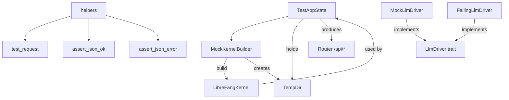

# Other — librefang-testing-src

# librefang-testing — Test Infrastructure

## Overview

`librefang-testing` provides reusable mock infrastructure for testing LibreFang API routes, runtime components, and kernel behavior **without starting a full daemon**. It creates isolated, ephemeral environments using in-memory SQLite databases and temporary directories, enabling fast, deterministic unit and integration tests across the entire crate graph.

## Architecture



## Public Exports

The crate re-exports its primary types and functions from the root:

```rust
use librefang_testing::{
    test_request, assert_json_ok, assert_json_error,  // helpers
    MockLlmDriver, FailingLlmDriver,                  // mock drivers
    MockKernelBuilder,                                 // kernel builder
    TestAppState,                                      // app state builder
};
```

---

## Components

### test_request — HTTP Request Builder

Defined in `helpers.rs`. Constructs an `axum::http::Request<Body>` suitable for use with `tower::ServiceExt::oneshot`.

```rust
pub fn test_request(method: Method, path: &str, body: Option<&str>) -> Request<Body>
```

**Behavior:**
- When `body` is `Some(_)`, automatically sets the `content-type: application/json` header.
- When `body` is `None`, sends an empty body with no content-type header.

**Usage:**

```rust
let req = test_request(Method::GET, "/api/health", None);

let body = serde_json::json!({ "message": "hello" }).to_string();
let req = test_request(Method::POST, "/api/agents/123/message", Some(&body));
```

### assert_json_ok / assert_json_error — Response Assertions

Defined in `helpers.rs`. These async functions read the full response body, assert the status code, and parse the body as JSON. They **panic** with descriptive messages on failure, including the raw response body for debugging.

```rust
pub async fn assert_json_ok(response: Response<Body>) -> serde_json::Value
pub async fn assert_json_error(response: Response<Body>, expected_status: StatusCode) -> serde_json::Value
```

- `assert_json_ok` — asserts status `200 OK`.
- `assert_json_error` — asserts an arbitrary expected error status.

Both return the parsed `serde_json::Value` for further assertions.

**Typical pattern:**

```rust
let resp = router.oneshot(req).await.expect("request failed");
let json = assert_json_ok(resp).await;
assert!(json.get("items").is_some());
```

---

### MockLlmDriver — Configurable Fake LLM Provider

Defined in `mock_driver.rs`. Implements the `LlmDriver` trait from `librefang_runtime::llm_driver`. Returns canned responses in sequence and records all calls for post-hoc assertions.

#### Construction

```rust
// Multiple sequential responses
let driver = MockLlmDriver::new(vec!["First response".into(), "Second response".into()]);

// Single repeating response
let driver = MockLlmDriver::with_response("Always this");
```

When the response list is exhausted, the driver wraps around to the **last** response for all subsequent calls. At least one response is required (panics otherwise).

#### Builder Methods

| Method | Default | Description |
|--------|---------|-------------|
| `with_tokens(input, output)` | `input=10, output=5` | Overrides token usage in the response |
| `with_stop_reason(reason)` | `StopReason::EndTurn` | Overrides the stop reason |

#### Call Recording

Every call to `complete` records a `RecordedCall`:

```rust
pub struct RecordedCall {
    pub model: String,
    pub message_count: usize,
    pub tool_count: usize,
    pub system: Option<String>,
}
```

Retrieve recordings:

```rust
let calls = driver.recorded_calls();  // Vec<RecordedCall>
let count = driver.call_count();       // usize
```

#### Streaming Support

`MockLlmDriver::stream` internally calls `complete`, then emits a `StreamEvent::TextDelta` followed by `StreamEvent::ContentComplete` on the provided channel. This simulates a minimal streaming response.

#### FailingLlmDriver

A separate struct that **always** returns an `LlmError::Api` on every `complete` call. Use it for testing error-handling paths:

```rust
let driver = FailingLlmDriver::new("simulated API failure");
let result = driver.complete(request).await;
assert!(result.is_err());
assert!(!driver.is_configured());  // always returns false
```

---

### MockKernelBuilder — Minimal Kernel Construction

Defined in `mock_kernel.rs`. Builds a real `LibreFangKernel` instance using `LibreFangKernel::boot_with_config` with an in-memory-friendly configuration:

- **Database**: SQLite file inside a temp directory (`<tmp>/data/test.db`)
- **Networking**: Disabled (`network_enabled = false`)
- **Directories**: Temp directories for `home`, `data`, `skills`, and agent/hAND workspaces
- **Heavy services**: OFP, cron, and network listeners are skipped

#### API

```rust
// Default minimal kernel
let (kernel, _tmp) = MockKernelBuilder::new().build();

// Custom configuration
let (kernel, _tmp) = MockKernelBuilder::new()
    .with_config(|cfg| {
        cfg.language = "zh".into();
        cfg.default_model.provider = "test".into();
    })
    .build();

// Convenience function (equivalent to new().build())
let (kernel, _tmp) = test_kernel();
```

**Critical:** The caller **must hold onto the returned `TempDir`** for the lifetime of the kernel. Dropping it deletes the temp directory, invalidating any file paths the kernel references.

#### Where It's Used Across the Codebase

`MockKernelBuilder::build` is the primary entry point for creating test kernels across the entire project. Modules that depend on it include:

- `librefang-http` — proxy configuration tests
- `librefang-runtime` — provider health probes, model catalog, web fetch, web search, plugin management, tool execution
- `librefang-runtime-mcp` — MCP connection and OAuth metadata discovery
- `librefang-runtime-oauth` — device flow OAuth
- `librefang-skills` — ClawHub, SkillHub, marketplace
- `librefang-cli` — daemon discovery, MCP backend creation
- `librefang-desktop` — build script
- `librefang-runtime-wasm` — host function network access

---

### TestAppState — Full API Router for Testing

Defined in `test_app.rs`. Combines `MockKernelBuilder` with `AppState` construction to produce a fully-wired `axum::Router` for testing API endpoints end-to-end.

#### Construction

```rust
// Default
let app = TestAppState::new();

// Custom kernel builder
let app = TestAppState::with_builder(
    MockKernelBuilder::new().with_config(|cfg| { /* ... */ })
);

// From an existing kernel
let (kernel, tmp) = MockKernelBuilder::new().build();
let app = TestAppState::from_kernel(kernel, tmp);
```

#### Getting a Router

```rust
let router = app.router();
```

This produces an `axum::Router` with all API routes nested under `/api`, mirroring the production setup. The router covers:

| Category | Routes |
|----------|--------|
| System | `health`, `health/detail`, `status`, `version`, `metrics` |
| Agents | CRUD, `message`, `stop`, `model`, `mode`, `session(s)`, `tools`, `skills`, `logs` |
| Profiles | `list`, `get` |
| Skills | `list`, `create` |
| Config | `get`, `schema`, `set`, `reload` |
| Memory | `search`, `stats` |
| Usage | `stats`, `summary` |
| Tools/Commands | `list`, `get` |
| Models/Providers | `list` |
| Sessions | `list` |

#### Sending Requests

Use `tower::ServiceExt::oneshot` with the router:

```rust
use tower::ServiceExt;

let app = TestAppState::new();
let router = app.router();

let req = test_request(Method::GET, "/api/agents", None);
let resp = router.oneshot(req).await.expect("request failed");
let json = assert_json_ok(resp).await;
assert!(json["items"].is_array());
```

#### Accessing State Directly

```rust
let state: Arc<AppState> = app.app_state();
let state: Arc<AppState> = app.state.clone();  // equivalent via pub field
```

The `AppState` is the same production type from `librefang_api::routes`, with kernel, channels config, caches, and all other fields populated. Some fields (like `peer_registry`, `prometheus_handle`) are set to `None` since they aren't needed for most route tests.

---

## Typical Test Patterns

### Pattern 1: Testing a GET Endpoint

```rust
#[tokio::test(flavor = "multi_thread")]
async fn test_my_endpoint() {
    let app = TestAppState::new();
    let router = app.router();

    let req = test_request(Method::GET, "/api/skills", None);
    let resp = router.oneshot(req).await.unwrap();
    let json = assert_json_ok(resp).await;

    assert!(json["items"].is_array());
}
```

### Pattern 2: Testing Error Responses

```rust
#[tokio::test(flavor = "multi_thread")]
async fn test_not_found() {
    let app = TestAppState::new();
    let router = app.router();

    let req = test_request(Method::GET, "/api/agents/nonexistent-uuid", None);
    let resp = router.oneshot(req).await.unwrap();
    let json = assert_json_error(resp, StatusCode::NOT_FOUND).await;

    assert!(json.get("error").is_some());
}
```

### Pattern 3: POST with JSON Body

```rust
#[tokio::test(flavor = "multi_thread")]
async fn test_create_resource() {
    let app = TestAppState::new();
    let router = app.router();

    let body = serde_json::json!({ "name": "test" }).to_string();
    let req = test_request(Method::POST, "/api/agents", Some(&body));
    let resp = router.oneshot(req).await.unwrap();
    assert!(resp.status() == StatusCode::OK || resp.status() == StatusCode::CREATED);
}
```

### Pattern 4: Mocking LLM Responses

```rust
#[tokio::test]
async fn test_with_mock_llm() {
    let driver = MockLlmDriver::with_response("Hello world")
        .with_tokens(50, 20)
        .with_stop_reason(StopReason::EndTurn);

    let resp = driver.complete(request).await.unwrap();
    assert_eq!(resp.text(), "Hello world");
    assert_eq!(driver.call_count(), 1);
}
```

### Pattern 5: Kernel-Only Tests (No HTTP)

For components that need a kernel but not an HTTP router:

```rust
let (kernel, _tmp) = MockKernelBuilder::new()
    .with_config(|cfg| cfg.network_enabled = false)
    .build();

// Use kernel.registry, kernel.memory, etc. directly
```

---

## Runtime Requirements

- Tests using `TestAppState` or `MockKernelBuilder::build` require `#[tokio::test(flavor = "multi_thread")]` because the kernel boots async runtime services internally.
- Tests using only `MockLlmDriver` or `FailingLlmDriver` can use standard `#[tokio::test]`.
- The `multi_thread` flavor is necessary because `boot_with_config` spawns background tasks and uses `tokio::sync` primitives that require a multi-threaded runtime.

## Internal Utility

The `read_body` function in `helpers.rs` is a private async helper that consumes a `Response<Body>` and returns the full body as a `String`, panicking on collection or UTF-8 decoding errors.