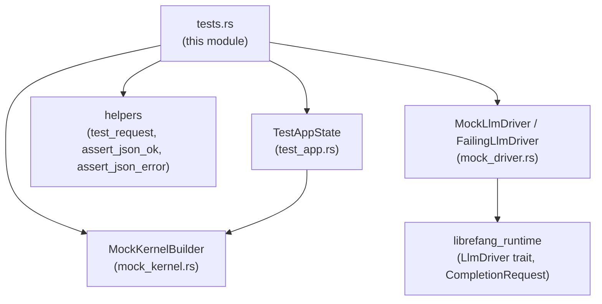

# Other — librefang-testing-src

# librefang-testing — Test Suite

## Purpose

The `tests.rs` module within `librefang-testing` serves a dual role: it **validates** the test infrastructure itself and **demonstrates** how to write integration tests against the librefang API. Every test in this file uses the crate's own public helpers, making them executable reference examples for anyone writing tests against the librefang HTTP API or runtime components.

## Test Infrastructure Dependencies



## Common Test Pattern

Almost every API-level test follows the same structure:

```rust
#[tokio::test(flavor = "multi_thread")]
async fn test_something() {
    // 1. Create an isolated test application
    let app = TestAppState::new();
    let router = app.router();

    // 2. Build a request using the helper
    let req = test_request(Method::GET, "/api/some-endpoint", None);

    // 3. Execute the request via oneshot (no running server needed)
    let resp = router.oneshot(req).await.expect("request failed");

    // 4. Assert on the response
    let json = assert_json_ok(resp).await;
    // ... inspect json ...
}
```

For error cases, replace step 4 with `assert_json_error(resp, StatusCode::BAD_REQUEST)`.

> **Note:** API tests use `flavor = "multi_thread"` because the router internally requires a multi-threaded Tokio runtime.

## Test Categories

### Health and Version Endpoints

| Test | Endpoint | Purpose |
|------|----------|---------|
| `test_health_endpoint` | `GET /api/health` | Returns 200 with `{"status": "ok" \| "degraded"}` |
| `test_version_endpoint` | `GET /api/version` | Returns 200 with a `version` field |

These are the simplest tests — no request body, no path parameters. They verify that basic infrastructure wiring works.

### Agent CRUD Operations

| Test | Endpoint | Expected Status |
|------|----------|----------------|
| `test_list_agents` | `GET /api/agents` | 200 — returns `{items: [...], total: N, offset: 0}` |
| `test_get_agent_invalid_id` | `GET /api/agents/not-a-valid-uuid` | 400 — rejects malformed UUID |
| `test_get_agent_not_found` | `GET /api/agents/{uuid}` | 404 — valid UUID, nonexistent agent |
| `test_spawn_agent_post` | `POST /api/agents` | 200 or 201 — creates agent from TOML manifest |
| `test_delete_agent_not_found` | `DELETE /api/agents/{uuid}` | 404 — nonexistent agent |
| `test_set_model_not_found` | `PUT /api/agents/{uuid}/model` | 4xx/5xx — nonexistent agent |
| `test_send_message_agent_not_found` | `POST /api/agents/{uuid}/message` | 400 or 404 |
| `test_patch_agent_not_found` | `PATCH /api/agents/{uuid}` | 400 or 404 |

The not-found tests all generate a random UUID via `uuid::Uuid::new_v4()` to ensure the ID does not collide with any seeded data.

For POST/PUT/PATCH tests that carry a body, pass the JSON string as the third argument to `test_request`:

```rust
let body = serde_json::json!({ "manifest_toml": manifest }).to_string();
let req = test_request(Method::POST, "/api/agents", Some(&body));
```

### Custom Kernel Configuration

`test_custom_config_kernel` demonstrates how to build a `TestAppState` with modified configuration using the builder pattern:

```rust
let app = TestAppState::with_builder(
    MockKernelBuilder::new().with_config(|cfg| {
        cfg.language = "zh".into();
    })
);
// Verify the config was applied
assert_eq!(app.state.kernel.config_ref().language, "zh");
```

This test does **not** make HTTP requests — it validates that `MockKernelBuilder::with_config` correctly propagates configuration into the kernel. Use this pattern when your test needs specific config values (language, model defaults, timeouts, etc.) rather than the defaults from `TestAppState::new()`.

### Mock LLM Driver

Two mock driver implementations are tested:

#### `MockLlmDriver` — Returns preconfigured responses

`test_mock_llm_driver_recording` validates:
- **Queued responses**: The driver is constructed with `MockLlmDriver::new(vec!["回复1".into(), "回复2".into()])` and returns them in order via `complete()`.
- **Call recording**: After calls, `driver.call_count()` returns `2` and `driver.recorded_calls()` exposes the full `CompletionRequest` for each call, allowing assertions on model name, system prompt, etc.

`test_mock_llm_driver_custom_tokens_and_stop_reason` validates the builder pattern for customizing response metadata:

```rust
let driver = MockLlmDriver::with_response("test")
    .with_tokens(200, 100)                    // input_tokens, output_tokens
    .with_stop_reason(StopReason::MaxTokens);
```

This does **not** require a multi-threaded runtime — plain `#[tokio::test]` suffices since no HTTP router is involved.

#### `FailingLlmDriver` — Always errors

`test_failing_llm_driver` validates:
- `complete()` always returns `Err` containing the configured message.
- `is_configured()` returns `false`.

Use `FailingLlmDriver` when testing error-handling paths (retry logic, fallback behavior, user-facing error messages).

## Helper Reference

These are the core utilities imported from the crate root and used throughout the tests:

| Helper | Signature | Returns |
|--------|-----------|---------|
| `test_request` | `(method, path, body: Option<&str>) → Request<String>` | A ready-to-send Axum request |
| `assert_json_ok` | `(response) → Value` | Parses body as JSON, asserts status 200 |
| `assert_json_error` | `(response, expected_status) → Value` | Parses body as JSON, asserts the given error status |

## Writing a New Test

To add a test for a new or existing endpoint:

1. Decide if you need a standard or customized `TestAppState`. Use `TestAppState::new()` for defaults, or `TestAppState::with_builder(...)` for custom kernel config or mock driver setup.
2. Build the request with `test_request(method, path, optional_body)`.
3. Call `router.oneshot(req).await` to execute without spawning a real server.
4. Assert success with `assert_json_ok(resp)` or failure with `assert_json_error(resp, status)`.
5. Inspect the returned `serde_json::Value` for domain-specific assertions.

All tests in this module are self-contained and independent — `TestAppState::new()` creates a fresh, isolated application state with no shared mutable state between tests.