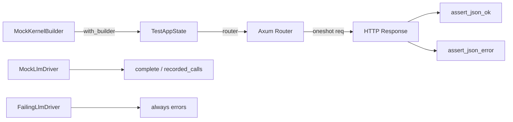

# Other — librefang-testing-src

# librefang-testing — Test Suite (`tests.rs`)

## Purpose

This file contains **example integration tests** that demonstrate how to use the `librefang-testing` test infrastructure. It validates API endpoints and mock driver behavior, and serves as a reference for writing additional tests against the application.

## Test Infrastructure Overview

Every test in this file follows the same general pattern:

```
TestAppState  →  router()  →  test_request()  →  oneshot()  →  assert_json_ok / assert_json_error
```



### Key Helpers

| Import | Source | Purpose |
|--------|--------|---------|
| `TestAppState` | `test_app.rs` | Creates a fully wired app with a mock kernel |
| `MockKernelBuilder` | `mock_kernel.rs` | Builds a kernel with custom configuration |
| `test_request` | `helpers.rs` | Constructs an `axum::http::Request` with method, path, and optional body |
| `assert_json_ok` | `helpers.rs` | Asserts status 200 and deserializes the body into `serde_json::Value` |
| `assert_json_error` | `helpers.rs` | Asserts a specific error status code and deserializes the error body |
| `MockLlmDriver` | `mock_driver.rs` | Returns canned responses and records all calls |
| `FailingLlmDriver` | `mock_driver.rs` | Always returns an error; used for error-handling tests |

## Test Categories

### 1. Health & Version Endpoints

| Test | Endpoint | Assertion |
|------|----------|-----------|
| `test_health_endpoint` | `GET /api/health` | Returns `"status": "ok"` or `"status": "degraded"` |
| `test_version_endpoint` | `GET /api/version` | Returns a `"version"` field |

### 2. Agent CRUD Operations

Tests exercising the agent registry through HTTP:

| Test | Method & Endpoint | Expected Status | Notes |
|------|-------------------|-----------------|-------|
| `test_list_agents` | `GET /api/agents` | 200 | Response contains `items` (array) and `total` (u64) |
| `test_get_agent_invalid_id` | `GET /api/agents/not-a-valid-uuid` | 400 | Invalid UUID format |
| `test_get_agent_not_found` | `GET /api/agents/{fake_uuid}` | 404 | Valid UUID, nonexistent agent |
| `test_spawn_agent_post` | `POST /api/agents` | 200 or 201 | Body contains `manifest_toml` |
| `test_delete_nonexistent_agent_is_idempotent` | `DELETE /api/agents/{fake_uuid}` | 200 | Returns `{"status": "already-deleted"}` — idempotent by design |
| `test_patch_agent_not_found` | `PATCH /api/agents/{fake_uuid}` | 404/400 | Nonexistent agent update |
| `test_set_model_not_found` | `PUT /api/agents/{fake_uuid}/model` | 4xx/5xx | Setting model for missing agent |
| `test_send_message_agent_not_found` | `POST /api/agents/{fake_uuid}/message` | 404/400 | Messaging a missing agent |

**Design note on DELETE idempotency**: Deleting a valid but nonexistent agent returns `200 OK` with `{"status": "already-deleted"}` rather than `404`. The `404` status is reserved for malformed UUIDs. This ensures retries from network blips or dashboard double-clicks don't surface phantom errors.

### 3. MockLlmDriver

Two tests validate the mock LLM driver used across the test suite:

**`test_mock_llm_driver_recording`** — Verifies that:
- `MockLlmDriver::new(vec![...])` returns responses in order
- `call_count()` increments with each `complete()` call
- `recorded_calls()` captures request fields (`model`, `system`)

**`test_mock_llm_driver_custom_tokens_and_stop_reason`** — Verifies builder chain:
- `MockLlmDriver::with_response("text")` creates a driver with a default response
- `.with_tokens(200, 100)` sets custom `input_tokens` and `output_tokens`
- `.with_stop_reason(StopReason::MaxTokens)` overrides the stop reason

### 4. FailingLlmDriver

**`test_failing_llm_driver`** — Confirms that:
- `FailingLlmDriver::new("message")` always returns `Err` from `complete()`
- The error message contains the configured string
- `is_configured()` returns `false`

### 5. Custom Kernel Configuration

**`test_custom_config_kernel`** — Demonstrates using `MockKernelBuilder` to override defaults:

```rust
let app = TestAppState::with_builder(
    MockKernelBuilder::new().with_config(|cfg| {
        cfg.language = "zh".into();
    })
);
assert_eq!(app.state.kernel.config_ref().language, "zh");
```

## Common Patterns for Writing New Tests

### Testing a GET endpoint

```rust
#[tokio::test(flavor = "multi_thread")]
async fn test_my_endpoint() {
    let app = TestAppState::new();
    let router = app.router();

    let req = test_request(Method::GET, "/api/something", None);
    let resp = router.oneshot(req).await.expect("request failed");
    let json = assert_json_ok(resp).await;

    assert!(json.get("expected_field").is_some());
}
```

### Testing an error response

```rust
let resp = router.oneshot(req).await.expect("request failed");
let json = assert_json_error(resp, StatusCode::BAD_REQUEST).await;
assert!(json.get("error").is_some());
```

### Testing with request body

```rust
let body = serde_json::json!({ "key": "value" }).to_string();
let req = test_request(Method::POST, "/api/resource", Some(&body));
```

### Runtime requirement

Tests that go through the full axum router stack require `multi_thread` flavor because the underlying runtime services need multi-threaded tokio support:

```rust
#[tokio::test(flavor = "multi_thread")]  // Required for router tests
```

Tests that only exercise mock drivers (no router) can use the default single-thread flavor:

```rust
#[tokio::test]  // Sufficient for isolated driver tests
```