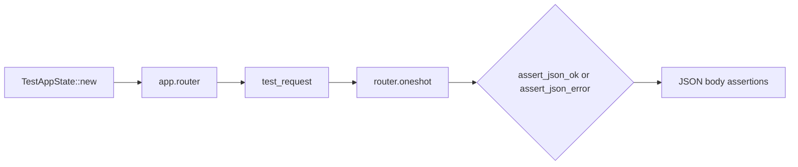

# Other — librefang-testing-src

# librefang-testing — Test Suite (`tests.rs`)

This file contains integration and unit tests that both validate the application's API surface and serve as executable documentation for the `librefang-testing` crate's test infrastructure.

## Purpose

The tests exercise three distinct concerns:

1. **HTTP API correctness** — Verifies routing, status codes, and response shapes for all agent-related endpoints.
2. **Mock driver behavior** — Confirms that `MockLlmDriver` and `FailingLlmDriver` behave as advertised (call recording, custom token counts, forced errors).
3. **Custom kernel configuration** — Demonstrates how to inject configuration overrides into the test kernel.

## Test Execution Model



Every HTTP-level test follows the same sequence: construct a `TestAppState`, extract the Axum `Router`, build a request with `test_request`, dispatch it via `oneshot`, and assert on the response using `assert_json_ok` (for 2xx) or `assert_json_error` (for error status codes).

## HTTP API Tests

All HTTP tests use `#[tokio::test(flavor = "multi_thread")]` because the router and underlying kernel require a multi-threaded Tokio runtime.

### Read Endpoints

| Test | Method & Path | Expected Status | What It Validates |
|---|---|---|---|
| `test_health_endpoint` | `GET /api/health` | 200 | Response contains `"status": "ok"` or `"status": "degraded"` |
| `test_version_endpoint` | `GET /api/version` | 200 | Response contains a `version` field |
| `test_list_agents` | `GET /api/agents` | 200 | Response shape is `{items: [...], total: N}` |
| `test_get_agent_invalid_id` | `GET /api/agents/not-a-valid-uuid` | 400 | Malformed UUID is rejected with an `error` field |
| `test_get_agent_not_found` | `GET /api/agents/{uuid}` | 404 | Valid but nonexistent UUID returns `error` field |

### Mutation Endpoints

| Test | Method & Path | Expected Status | What It Validates |
|---|---|---|---|
| `test_spawn_agent_post` | `POST /api/agents` | 200 or 201 | Accepts a `manifest_toml` body and creates an agent |
| `test_delete_agent_not_found` | `DELETE /api/agents/{uuid}` | 404 | Deleting a nonexistent agent returns an error |
| `test_set_model_not_found` | `PUT /api/agents/{uuid}/model` | 4xx/5xx | Setting model on a nonexistent agent fails |
| `test_send_message_agent_not_found` | `POST /api/agents/{uuid}/message` | 404/400 | Messaging a nonexistent agent fails |
| `test_patch_agent_not_found` | `PATCH /api/agents/{uuid}` | 404/400 | Patching a nonexistent agent fails |

### Common Patterns for Writing New API Tests

**Happy-path test:**
```rust
let app = TestAppState::new();
let router = app.router();
let req = test_request(Method::GET, "/api/some-endpoint", None);
let resp = router.oneshot(req).await.expect("request failed");
let json = assert_json_ok(resp).await;
// assert on json fields...
```

**Error-path test:**
```rust
let app = TestAppState::new();
let router = app.router();
let req = test_request(Method::GET, "/api/agents/bad-id", None);
let resp = router.oneshot(req).await.expect("request failed");
let json = assert_json_error(resp, StatusCode::BAD_REQUEST).await;
// assert on json["error"]...
```

**Request with a JSON body:**
```rust
let body = serde_json::json!({ "key": "value" }).to_string();
let req = test_request(Method::POST, "/api/endpoint", Some(&body));
```

## Mock Driver Tests

These tests run as plain `#[tokio::test]` (no multi-thread requirement) since they don't touch the Axum router.

### MockLlmDriver

`test_mock_llm_driver_recording` — Constructs a `MockLlmDriver` with a queue of responses (`["回复1", "回复2"]`), calls `complete()` twice, and verifies:

- Responses are returned in FIFO order.
- `call_count()` reflects the number of invocations.
- `recorded_calls()` captures the `model` and `system` fields from each request.

`test_mock_llm_driver_custom_tokens_and_stop_reason` — Uses the builder pattern:

```rust
let driver = MockLlmDriver::with_response("test")
    .with_tokens(200, 100)
    .with_stop_reason(StopReason::MaxTokens);
```

This overrides the default token usage (`input_tokens`, `output_tokens`) and the `stop_reason` on the generated `CompletionResponse`.

### FailingLlmDriver

`test_failing_llm_driver` — Validates that:

- Every call to `complete()` returns `Err`.
- The error message contains the string passed to `FailingLlmDriver::new()`.
- `is_configured()` returns `false`.

Use `FailingLlmDriver` when you need to exercise error-handling paths in code that depends on `LlmDriver`.

## Custom Configuration Tests

`test_custom_config_kernel` demonstrates injecting overrides via `MockKernelBuilder`:

```rust
let app = TestAppState::with_builder(
    MockKernelBuilder::new().with_config(|cfg| {
        cfg.language = "zh".into();
    })
);
assert_eq!(app.state.kernel.config_ref().language, "zh");
```

Use `TestAppState::with_builder` (instead of `TestAppState::new`) whenever the test needs specific kernel configuration — custom language, model defaults, feature flags, etc.

## Dependencies on Other Crates

| Crate | What's Used |
|---|---|
| `librefang-runtime` | `CompletionRequest`, `LlmDriver` trait, `StopReason` |
| `librefang-types` | `message::StopReason` enum |
| `axum` | `http::Method`, `http::StatusCode` |
| `tower` | `ServiceExt` (provides `oneshot`) |
| `uuid` | `Uuid::new_v4` for generating nonexistent-agent IDs |

## Conventions

- All HTTP endpoint tests assert on the shape of JSON responses, not on exact values — this keeps tests resilient to minor implementation changes.
- Nonexistent resources use freshly generated UUIDs (`Uuid::new_v4()`) to guarantee they don't collide with seeded data.
- Error responses are expected to include an `"error"` key in the JSON body.