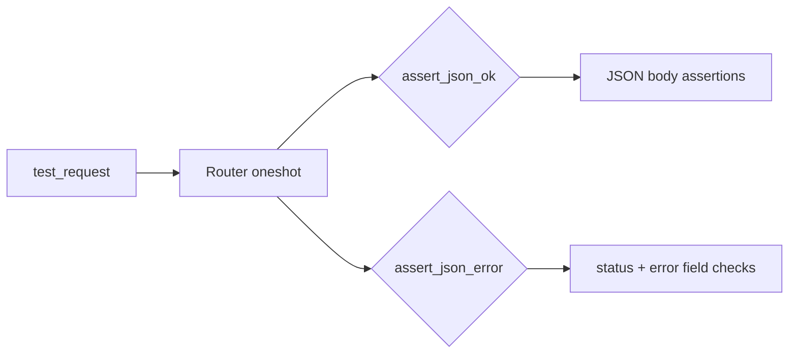

# Other — librefang-testing-src

# librefang-testing — Example Tests (`tests.rs`)

## Purpose

This file contains example integration tests that demonstrate how to use the `librefang-testing` test infrastructure. It serves a dual role:

1. **Functional coverage** — validates core API endpoints (health, agents CRUD, version) and mock driver behavior.
2. **Living documentation** — shows developers the patterns for writing new tests against the test harness.

## Architecture

Every test follows the same three-step pattern:

```
TestAppState → router() → oneshot(request) → assert_json_ok / assert_json_error
```



The tests depend on three layers of the testing crate:

| Dependency | Source file | Role |
|---|---|---|
| `TestAppState` | `test_app.rs` | Assembles the Axum router with a mock kernel |
| `test_request`, `assert_json_ok`, `assert_json_error` | `helpers.rs` | Build HTTP requests and assert on JSON responses |
| `MockLlmDriver`, `FailingLlmDriver` | `mock_driver.rs` | Stand-in LLM backends with call recording |
| `MockKernelBuilder` | `mock_kernel.rs` | Builds a kernel with customizable config |

## Test Categories

### Health & Version Endpoints

| Test | Method | Path | Asserts |
|---|---|---|---|
| `test_health_endpoint` | GET | `/api/health` | Returns `status` field equal to `"ok"` or `"degraded"` |
| `test_version_endpoint` | GET | `/api/version` | Returns a `version` field |

These are the simplest tests and the best starting point for understanding the pattern.

### Agent Listing & Retrieval

| Test | Method | Path | Asserts |
|---|---|---|---|
| `test_list_agents` | GET | `/api/agents` | Returns `items` (array) and `total` (u64) |
| `test_get_agent_invalid_id` | GET | `/api/agents/not-a-valid-uuid` | Returns 400 with `error` field |
| `test_get_agent_not_found` | GET | `/api/agents/{uuid}` | Returns 404 with `error` field |

### Agent Mutation Endpoints

| Test | Method | Path | Asserts |
|---|---|---|---|
| `test_spawn_agent_post` | POST | `/api/agents` | Returns 200 or 201 (accepts `manifest_toml` body) |
| `test_delete_nonexistent_agent_is_idempotent` | DELETE | `/api/agents/{uuid}` | Returns 200 with `status: "already-deleted"` |
| `test_set_model_not_found` | PUT | `/api/agents/{uuid}/model` | Returns a client/server error for missing agent |
| `test_send_message_agent_not_found` | POST | `/api/agents/{uuid}/message` | Returns 404 or 400 for missing agent |
| `test_patch_agent_not_found` | PATCH | `/api/agents/{uuid}` | Returns 404 or 400 for missing agent |

#### Design note — DELETE idempotency

`test_delete_nonexistent_agent_is_idempotent` deliberately asserts 200 (not 404) when deleting a valid UUID that doesn't map to any agent. This matches the API contract where retried deletes (network blips, dashboard double-clicks) must not surface a phantom error. The 404 status is reserved exclusively for malformed UUIDs (see `test_get_agent_invalid_id`).

### Mock Driver Tests

These tests exercise the mock LLM drivers directly, without routing through Axum:

**`test_mock_llm_driver_recording`** — Verifies that `MockLlmDriver`:
- Returns responses in the order provided at construction (`new(vec![...])`)
- Records every call (model, system prompt) accessible via `recorded_calls()`
- Tracks call count via `call_count()`

**`test_mock_llm_driver_custom_tokens_and_stop_reason`** — Verifies the builder API:
- `MockLlmDriver::with_response("test")` creates a single-response driver
- `.with_tokens(200, 100)` overrides input/output token counts
- `.with_stop_reason(StopReason::MaxTokens)` overrides the stop reason

**`test_failing_llm_driver`** — Verifies that `FailingLlmDriver`:
- Always returns `Err` containing the configured message
- Reports `is_configured() == false`

### Configuration Tests

**`test_custom_config_kernel`** — Demonstrates `TestAppState::with_builder`:

```rust
TestAppState::with_builder(
    MockKernelBuilder::new().with_config(|cfg| {
        cfg.language = "zh".into();
    })
)
```

This allows tests to override kernel config before the router is built. The test then asserts directly on `app.state.kernel.config_ref()`.

## How to Add a New Test

Follow the established pattern:

```rust
#[tokio::test(flavor = "multi_thread")]
async fn test_my_new_endpoint() {
    // 1. Create the app (with custom config if needed)
    let app = TestAppState::new();
    let router = app.router();

    // 2. Build the request
    let req = test_request(Method::POST, "/api/thing", Some(&body));

    // 3. Execute and assert
    let resp = router.oneshot(req).await.expect("request failed");
    let json = assert_json_ok(resp).await;       // for 2xx responses
    // or
    let json = assert_json_error(resp, StatusCode::CONFLICT).await;  // for errors

    // 4. Inspect the JSON
    assert!(json.get("field").is_some());
}
```

Key points:
- Use `flavor = "multi_thread"` for tests that involve the full router (database, async runtime).
- Plain `#[tokio::test]` is fine for unit-testing mock drivers in isolation.
- `test_request` accepts `Option<&str>` for the body — pass `None` for bodyless requests.
- Always use `assert_json_ok` / `assert_json_error` rather than manually deserializing — they provide better failure messages.