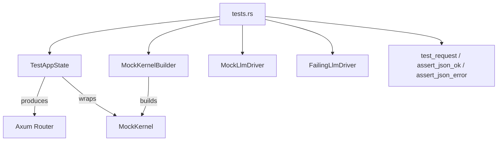

# Other — librefang-testing-src

# librefang-testing — Tests Module

## Overview

`tests.rs` is the **example and integration test suite** for the `librefang-testing` crate. It serves a dual purpose:

1. **Validates** that the crate's test infrastructure (`TestAppState`, `MockKernelBuilder`, `MockLlmDriver`, `FailingLlmDriver`, request helpers) works correctly.
2. **Documents by example** how to write tests against the application's API layer and LLM driver abstractions.

Developers adding new endpoints or driver implementations should use these tests as templates.

## Architecture



## Test Categories

### 1. HTTP Endpoint Tests

These tests spin up an in-memory Axum router via `TestAppState`, fire requests through `test_request`, and validate responses with `assert_json_ok` or `assert_json_error`. They use `tower::ServiceExt::oneshot` — no real HTTP server or network I/O.

| Test | Method & Path | Verifies |
|------|--------------|----------|
| `test_health_endpoint` | `GET /api/health` | Returns 200 with `"status": "ok"` or `"degraded"` |
| `test_version_endpoint` | `GET /api/version` | Returns 200 with a `"version"` field |
| `test_list_agents` | `GET /api/agents` | Returns 200 with `"items"` array and `"total"` u64 |
| `test_get_agent_invalid_id` | `GET /api/agents/not-a-valid-uuid` | Returns 400 with `"error"` field |
| `test_get_agent_not_found` | `GET /api/agents/{random-uuid}` | Returns 404 with `"error"` field |
| `test_spawn_agent_post` | `POST /api/agents` | Returns 200 or 201 when given `manifest_toml` |
| `test_delete_nonexistent_agent_is_idempotent` | `DELETE /api/agents/{random-uuid}` | Returns 200 with `"status": "already-deleted"` (not 404) |
| `test_set_model_not_found` | `PUT /api/agents/{random-uuid}/model` | Returns 4xx/5xx for nonexistent agent |
| `test_send_message_agent_not_found` | `POST /api/agents/{random-uuid}/message` | Returns 404 or 400 for nonexistent agent |
| `test_patch_agent_not_found` | `PATCH /api/agents/{random-uuid}` | Returns 404 or 400 for nonexistent agent |

#### Standard Endpoint Test Pattern

```rust
#[tokio::test(flavor = "multi_thread")]
async fn my_endpoint_test() {
    let app = TestAppState::new();              // default mock kernel
    let router = app.router();                  // Axum router with mock state

    let req = test_request(Method::GET, "/api/some-endpoint", None);
    let resp = router.oneshot(req).await.expect("request failed");

    // For success:
    let json = assert_json_ok(resp).await;
    assert!(json.get("expected_field").is_some());

    // — or for errors:
    // let json = assert_json_error(resp, StatusCode::BAD_REQUEST).await;
}
```

Key details:
- Most endpoint tests use `multi_thread` flavor because the kernel may spawn background tasks.
- `test_request` builds an `axum::http::Request<String>` with the given method, path, and optional JSON body.
- `assert_json_ok` asserts status 200 and parses the body into `serde_json::Value`.
- `assert_json_error` takes an expected `StatusCode` and asserts the response matches it.

### 2. Mock Driver Tests

These test the mock LLM driver abstractions directly, without routing through Axum.

#### `MockLlmDriver`

A configurable stub that returns canned responses in sequence and records every call.

| Test | What it verifies |
|------|-----------------|
| `test_mock_llm_driver_recording` | Responses cycle in order; `call_count()` and `recorded_calls()` capture model, system prompt, etc. |
| `test_mock_llm_driver_custom_tokens_and_stop_reason` | Builder methods `with_tokens(input, output)` and `with_stop_reason(...)` propagate into `CompletionResponse.usage` and `.stop_reason`. |

**Usage patterns demonstrated:**

```rust
// Pre-loaded response queue
let driver = MockLlmDriver::new(vec!["first".into(), "second".into()]);

// Single-response builder with custom usage
let driver = MockLlmDriver::with_response("text")
    .with_tokens(200, 100)
    .with_stop_reason(StopReason::MaxTokens);
```

Both constructors produce an `LlmDriver` trait object. Each call to `complete()` pops the next response. Recorded calls are accessible via `recorded_calls()` and include the full `CompletionRequest` metadata (model, system prompt, messages, etc.).

#### `FailingLlmDriver`

A driver that always errors. Used to exercise error-handling paths.

| Test | What it verifies |
|------|-----------------|
| `test_failing_llm_driver` | `complete()` returns `Err` containing the configured message; `is_configured()` returns `false`. |

```rust
let driver = FailingLlmDriver::new("simulated API error");
let result = driver.complete(request).await;
assert!(result.is_err());
assert!(!driver.is_configured());
```

### 3. Kernel Configuration Test

`test_custom_config_kernel` demonstrates how to create a `TestAppState` with a non-default configuration via `MockKernelBuilder`:

```rust
let app = TestAppState::with_builder(
    MockKernelBuilder::new().with_config(|cfg| {
        cfg.language = "zh".into();
    })
);
// The kernel inside the app now reflects the custom config
assert_eq!(app.state.kernel.config_ref().language, "zh");
```

This pattern is essential for testing locale-dependent behavior, feature flags, or any kernel-level configuration without modifying global state.

## API Contracts Demonstrated

Several tests encode important API design decisions:

- **DELETE idempotency**: Deleting a nonexistent-but-valid UUID returns `200 OK` with `{"status": "already-deleted"}`, not `404`. The 404 status is reserved for malformed UUIDs only. This avoids spurious errors from retried requests (network blips, dashboard double-clicks).
- **Agent list shape**: `GET /api/agents` returns `{"items": [...], "total": N}` where `total` is always a `u64`.
- **Health status values**: Only `"ok"` or `"degraded"` are valid.

## Relationship to Other Modules

```
librefang-testing/
├── src/lib.rs           — re-exports the public test API
├── src/test_app.rs      — TestAppState, router() construction
├── src/mock_kernel.rs   — MockKernelBuilder, with_config()
├── src/mock_driver.rs   — MockLlmDriver, FailingLlmDriver
├── src/helpers.rs       — test_request(), assert_json_ok(), assert_json_error()
└── src/tests.rs         — this file (consumes all of the above)
```

The tests have **no outgoing dependencies** beyond the crate's own test infrastructure and the `librefang_runtime::llm_driver` trait definitions. They do not touch real databases, network services, or external LLM APIs.