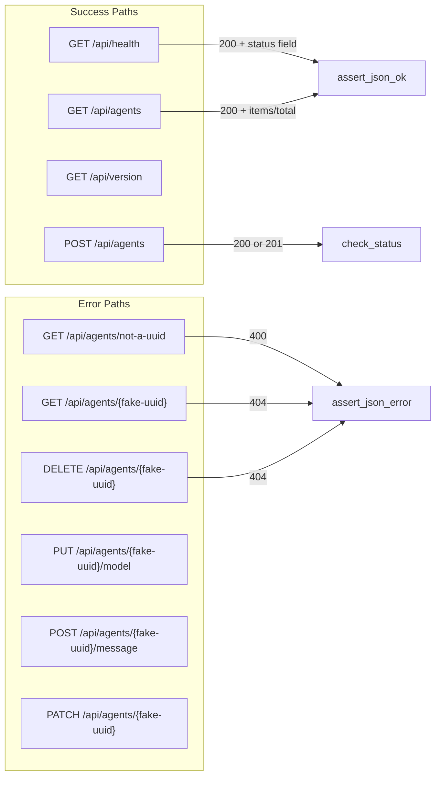

# Other — librefang-testing-src

# `librefang-testing` — Example Tests (`tests.rs`)

## Purpose

This file contains example integration tests that exercise the librefang API endpoints and mock infrastructure. It serves two roles:

1. **Validation** — verifies that core HTTP endpoints behave correctly under both success and error conditions.
2. **Reference** — demonstrates the testing patterns and utilities that the `librefang-testing` crate provides, so contributors can follow the same approach when writing new tests.

## Testing Patterns

All tests follow a consistent three-step structure:

```
build app → construct request → assert response
```

```rust
let app = TestAppState::new();
let router = app.router();

let req = test_request(Method::GET, "/api/health", None);
let resp = router.oneshot(req).await.expect("request failed");
let json = assert_json_ok(resp).await;
```

### Key utilities used

| Utility | Source | Purpose |
|---|---|---|
| `TestAppState::new()` | `test_app.rs` | Creates a fully-wired app with default mock dependencies |
| `TestAppState::with_builder(...)` | `test_app.rs` | Creates an app with a custom `MockKernelBuilder` |
| `app.router()` | `test_app.rs` | Returns an Axum `Router` ready for `oneshot` calls |
| `test_request(method, path, body)` | `helpers.rs` | Builds an `axum::http::Request` with optional JSON body |
| `assert_json_ok(resp)` | `helpers.rs` | Asserts HTTP 200, deserialises body into `serde_json::Value` |
| `assert_json_error(resp, status)` | `helpers.rs` | Asserts a specific error status code, returns JSON body |
| `MockLlmDriver` | `mock_driver.rs` | Returns preconfigured completions, records all calls |
| `FailingLlmDriver` | `mock_driver.rs` | Always errors — for testing failure paths |
| `MockKernelBuilder` | `mock_kernel.rs` | Builds a kernel with custom configuration overrides |

Requests are dispatched via `tower::ServiceExt::oneshot`, which sends a single request through the full middleware/handler stack without binding to a network port.

## Test Coverage

### API Endpoint Tests

Tests are grouped by HTTP method, covering both happy paths and error cases.



| Test | Method & Path | Expected Outcome |
|---|---|---|
| `test_health_endpoint` | `GET /api/health` | 200 with `{"status": "ok" \| "degraded"}` |
| `test_list_agents` | `GET /api/agents` | 200 with `{"items": [...], "total": N}` |
| `test_version_endpoint` | `GET /api/version` | 200 with `{"version": ...}` |
| `test_spawn_agent_post` | `POST /api/agents` | 200 or 201 (manifest_toml body) |
| `test_get_agent_invalid_id` | `GET /api/agents/not-a-valid-uuid` | 400 with error field |
| `test_get_agent_not_found` | `GET /api/agents/{uuid}` | 404 with error field |
| `test_delete_agent_not_found` | `DELETE /api/agents/{uuid}` | 404 with error field |
| `test_set_model_not_found` | `PUT /api/agents/{uuid}/model` | 4xx/5xx status |
| `test_send_message_agent_not_found` | `POST /api/agents/{uuid}/message` | 400 or 404 |
| `test_patch_agent_not_found` | `PATCH /api/agents/{uuid}` | 400 or 404 |

For the "not found" error tests, a fresh `uuid::Uuid::new_v4()` is generated each time to guarantee the ID doesn't collide with any real agent.

### Mock Infrastructure Tests

These tests validate the mock drivers themselves rather than HTTP endpoints.

#### `test_mock_llm_driver_recording`

Demonstrates the core `MockLlmDriver` lifecycle:

1. **Construction** — `MockLlmDriver::new(vec!["回复1", "回复2"])` preloads sequential responses.
2. **Invocation** — each `complete()` call consumes the next response.
3. **Assertion** — `driver.call_count()` and `driver.recorded_calls()` verify that calls were recorded with the correct parameters (model, system prompt, etc.).

```rust
let driver = MockLlmDriver::new(vec!["回复1".into(), "回复2".into()]);
let resp1 = driver.complete(request.clone()).await.unwrap();
assert_eq!(resp1.text(), "回复1");

assert_eq!(driver.call_count(), 2);
assert_eq!(driver.recorded_calls()[0].model, "test-model");
```

#### `test_mock_llm_driver_custom_tokens_and_stop_reason`

Shows the builder pattern for customising response metadata:

```rust
let driver = MockLlmDriver::with_response("test")
    .with_tokens(200, 100)
    .with_stop_reason(StopReason::MaxTokens);
```

This lets tests assert on `resp.usage.input_tokens`, `resp.usage.output_tokens`, and `resp.stop_reason` without relying on defaults.

#### `test_failing_llm_driver`

Validates that `FailingLlmDriver` always returns an error with the configured message and reports `is_configured() == false`:

```rust
let driver = FailingLlmDriver::new("模拟的 API 错误");
let result = driver.complete(request).await;
assert!(result.is_err());
assert!(!driver.is_configured());
```

### Custom Configuration Tests

#### `test_custom_config_kernel`

Demonstrates how to override kernel configuration via `MockKernelBuilder::with_config`:

```rust
let app = TestAppState::with_builder(
    MockKernelBuilder::new().with_config(|cfg| {
        cfg.language = "zh".into();
    })
);
assert_eq!(app.state.kernel.config_ref().language, "zh");
```

This pattern allows tests to validate behaviour under non-default settings without modifying global state.

## Thread Configuration

Most endpoint tests use `#[tokio::test(flavor = "multi_thread")]` because the Axum router and kernel may spawn background tasks. The mock driver tests (`test_mock_llm_driver_recording`, `test_mock_llm_driver_custom_tokens_and_stop_reason`, `test_failing_llm_driver`) use the default single-threaded runtime since they don't exercise the router.

## Adding New Tests

To add a new endpoint test, follow the established pattern:

```rust
#[tokio::test(flavor = "multi_thread")]
async fn test_my_new_endpoint() {
    let app = TestAppState::new();
    let router = app.router();

    let req = test_request(Method::GET, "/api/my-endpoint", None);
    let resp = router.oneshot(req).await.expect("request failed");
    let json = assert_json_ok(resp).await;

    // Your assertions here
    assert!(json.get("expected_field").is_some());
}
```

For error-path tests, use `assert_json_error(resp, StatusCode::EXPECTED_CODE)` and assert on the `error` field in the returned JSON.