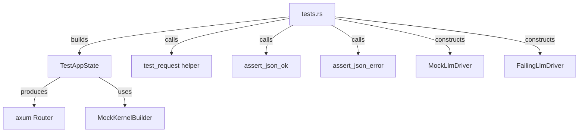

# Other — librefang-testing-src

# librefang-testing/src/tests.rs — Integration & Example Tests

## Purpose

This module contains the primary integration test suite for the librefang API layer. It exercises HTTP endpoints end-to-end by spinning up an in-process router via `TestAppState`, dispatching requests through `tower::oneshot`, and asserting on status codes and JSON response bodies. It also validates the mock driver infrastructure (`MockLlmDriver`, `FailingLlmDriver`) that downstream feature tests rely on.

Because all tests run against the real router with a mock kernel, they catch wiring regressions (missing routes, wrong status codes, serde mismatches) without needing a live LLM backend or database.

## Architecture


```mermaid
graph TD
    TC[tests.rs] -->|builds| TAS[TestAppState]
    TAS -->|produces| R[axum Router]
    TC -->|calls| TR[test_request helper]
    TC -->|calls| AJO[assert_json_ok]
    TC -->|calls| AJE[assert_json_error]
    TC -->|constructs| MLD[MockLlmDriver]
    TC -->|constructs| FLD[FailingLlmDriver]
    TAS -->|uses| MKB[MockKernelBuilder]
```

Every HTTP-level test follows the same three-step pattern: **build** → **dispatch** → **assert**.

## Test Categories

### 1. Read-Only Endpoint Probes

| Test | Endpoint | Validates |
|------|----------|-----------|
| `test_health_endpoint` | `GET /api/health` | Returns 200 with `"status"` field (`"ok"` or `"degraded"`) |
| `test_list_agents` | `GET /api/agents` | Returns `{ "items": […], "total": N }` with `total` as `u64` |
| `test_version_endpoint` | `GET /api/version` | Returns 200 with a `"version"` field |

These tests verify the response shape and basic liveness. They use `assert_json_ok` which checks for `200 OK` and parses the body into `serde_json::Value`.

### 2. Agent CRUD — Error & Edge Cases

| Test | Method / Endpoint | Expected |
|------|-------------------|----------|
| `test_get_agent_invalid_id` | `GET /api/agents/not-a-valid-uuid` | `400 Bad Request` with `"error"` field |
| `test_get_agent_not_found` | `GET /api/agents/{random-uuid}` | `404 Not Found` with `"error"` field |
| `test_spawn_agent_post` | `POST /api/agents` with TOML manifest | `200 OK` or `201 Created` |
| `test_delete_nonexistent_agent_is_idempotent` | `DELETE /api/agents/{random-uuid}` | `200 OK` with `{ "status": "already-deleted" }` |
| `test_set_model_not_found` | `PUT /api/agents/{random-uuid}/model` | `4xx`/`5xx` |
| `test_send_message_agent_not_found` | `POST /api/agents/{random-uuid}/message` | `404` or `400` |
| `test_patch_agent_not_found` | `PATCH /api/agents/{random-uuid}` | `404` or `400` |

#### Design note: Idempotent DELETE

`test_delete_nonexistent_agent_is_idempotent` encodes a deliberate API contract: deleting a valid UUID that doesn't map to an agent returns `200 OK` with `{ "status": "already-deleted" }` rather than `404`. This prevents phantom errors from network retries or dashboard double-clicks. The `404` status is reserved exclusively for malformed UUIDs (see `test_get_agent_invalid_id`).

### 3. MockLlmDriver — Response Playback & Recording

**`test_mock_llm_driver_recording`** — Validates the core mock driver loop:

```
new(["回复1", "回复2"]) → complete() → "回复1" → complete() → "回复2"
```

After exhaustion, asserts `driver.call_count() == 2` and inspects `recorded_calls()` to verify the `model` and `system` fields were captured faithfully.

**`test_mock_llm_driver_custom_tokens_and_stop_reason`** — Exercises the builder API:

```rust
MockLlmDriver::with_response("test")
    .with_tokens(200, 100)
    .with_stop_reason(StopReason::MaxTokens)
```

Confirms that `resp.usage.input_tokens`, `resp.usage.output_tokens`, and `resp.stop_reason` reflect the overridden values rather than defaults.

### 4. FailingLlmDriver

`test_failing_llm_driver` confirms that:

- `FailingLlmDriver::new("模拟的 API 错误")` always returns `Err` from `complete()`.
- The error message contains the configured string.
- `is_configured()` returns `false`.

Use `FailingLlmDriver` when testing error-handling paths (retries, fallbacks, user-facing error messages) without needing a real API failure.

### 5. Custom Kernel Configuration

`test_custom_config_kernel` demonstrates `TestAppState::with_builder`:

```rust
TestAppState::with_builder(
    MockKernelBuilder::new().with_config(|cfg| {
        cfg.language = "zh".into();
    })
);
```

After construction, the test reads back `app.state.kernel.config_ref().language` to confirm the override took effect. Use this pattern whenever a test needs non-default runtime config (language, feature flags, timeout values).

## Common Patterns

### Building and dispatching a request

```rust
let app = TestAppState::new();
let router = app.router();

let req = test_request(Method::GET, "/api/health", None);
let resp = router.oneshot(req).await.expect("request failed");
let json = assert_json_ok(resp).await;
```

For requests with a body, pass the serialized JSON string as the third argument:

```rust
let body = serde_json::json!({ "model": "gpt-4" }).to_string();
let req = test_request(Method::PUT, "/api/agents/{id}/model", Some(&body));
```

### Asserting on error responses

```rust
let json = assert_json_error(resp, StatusCode::BAD_REQUEST).await;
assert!(json.get("error").is_some());
```

`assert_json_error` asserts the HTTP status matches the expected code and parses the body as JSON. All error responses are expected to carry an `"error"` field.

### Constructing CompletionRequest for driver tests

The `CompletionRequest` struct has many fields. When testing driver behaviour, copy the full construction block from existing tests and modify only the fields relevant to your scenario. The standard set uses `temperature: 0.0`, empty messages/tools, and `ReasoningEchoPolicy::default()`.

## Adding New Tests

1. **New endpoint test** — Follow the build → dispatch → assert pattern. Use `assert_json_ok` for success cases and `assert_json_error` for expected failures. Place it in the appropriate section (read-only, CRUD, etc.).
2. **New driver behaviour** — Extend `MockLlmDriver` with the builder method in `mock_driver.rs`, then add a test here validating the new knob end-to-end.
3. **Async runtime** — Use `#[tokio::test(flavor = "multi_thread")]` for tests that call `router()` (which may spawn background tasks). Plain `#[tokio::test]` is sufficient for pure driver tests that never touch the router.

## Dependencies on Other Crates

| Crate | What's used |
|-------|-------------|
| `librefang-runtime` | `CompletionRequest`, `LlmDriver` trait |
| `librefang-types` | `StopReason`, `ReasoningEchoPolicy`, `model_catalog` |
| `librefang-testing` (self) | `TestAppState`, `MockKernelBuilder`, `MockLlmDriver`, `FailingLlmDriver`, `test_request`, `assert_json_ok`, `assert_json_error` |
| `axum` | `http::{Method, StatusCode}` |
| `tower` | `ServiceExt::oneshot` |