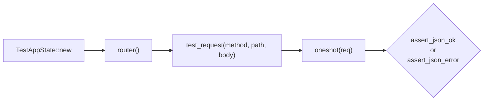

# Other — librefang-testing-src

# librefang-testing — Example Tests (`tests.rs`)

## Purpose

This file contains example integration tests that exercise the `librefang-testing` infrastructure against the application's HTTP API and mock drivers. It serves two roles:

1. **Validation** — confirms that core API routes, mock kernel/driver wiring, and response contracts behave as expected.
2. **Reference** — demonstrates idiomatic use of `TestAppState`, `MockKernelBuilder`, `MockLlmDriver`, `FailingLlmDriver`, and the `assert_json_ok`/`assert_json_error` helpers so contributors can write new tests without guesswork.

---

## Architecture

Every test follows the same lifecycle:


```mermaid
flowchart LR
    A[TestAppState::new] --> B["router()"]
    B --> C["test_request(method, path, body)"]
    C --> D["oneshot(req)"]
    D --> E{"assert_json_ok<br/>or<br/>assert_json_error"}
```

1. **Bootstrap** — `TestAppState::new()` (or `::with_builder(...)`) creates a fully-wired application with mock kernel, drivers, and in-memory state.
2. **Build router** — `.router()` returns an Axum `Router` ready for `oneshot` dispatch.
3. **Construct request** — `test_request(method, path, Some(body))` wraps `axum::http::Request` construction.
4. **Dispatch** — `router.oneshot(req).await` drives the request through middleware, handlers, and mock layers without a live network.
5. **Assert** — helpers deserialize the response body into `serde_json::Value` and verify status codes, letting tests assert on JSON fields directly.

---

## Test Catalog

### Health & Meta Endpoints

| Test | Method | Path | Asserts |
|---|---|---|---|
| `test_health_endpoint` | GET | `/api/health` | 200; `status` field is `"ok"` or `"degraded"` |
| `test_version_endpoint` | GET | `/api/version` | 200; `version` field exists |

### Agent CRUD Routes

| Test | Method | Path | Asserts |
|---|---|---|---|
| `test_list_agents` | GET | `/api/agents` | 200; `items` array and `total` u64 |
| `test_get_agent_invalid_id` | GET | `/api/agents/not-a-valid-uuid` | 400; `error` field present |
| `test_get_agent_not_found` | GET | `/api/agents/{fake_uuid}` | 404; `error` field present |
| `test_spawn_agent_post` | POST | `/api/agents` | 200 or 201; body contains `manifest_toml` |
| `test_delete_nonexistent_agent_is_idempotent` | DELETE | `/api/agents/{fake_uuid}` | 200; `status == "already-deleted"` |
| `test_set_model_not_found` | PUT | `/api/agents/{fake_uuid}/model` | 4xx/5xx for missing agent |
| `test_send_message_agent_not_found` | POST | `/api/agents/{fake_uuid}/message` | 400 or 404 |
| `test_patch_agent_not_found` | PATCH | `/api/agents/{fake_uuid}` | 400 or 404 |

**Design note on delete idempotency:** `test_delete_nonexistent_agent_is_idempotent` verifies that DELETE with a valid but non-existent UUID returns `200 OK` with `{ "status": "already-deleted" }` rather than `404`. This prevents retried deletes (network blips, dashboard double-clicks) from surfacing phantom errors. The 404 status is reserved strictly for malformed UUIDs.

### Kernel Configuration

| Test | What it validates |
|---|---|
| `test_custom_config_kernel` | `MockKernelBuilder::new().with_config(|cfg| { cfg.language = "zh" })` propagates into the running kernel, verifiable via `app.state.kernel.config_ref().language` |

### Mock Driver Behavior

| Test | Driver | Asserts |
|---|---|---|
| `test_mock_llm_driver_recording` | `MockLlmDriver` | Returns queued responses in order (`"回复1"`, `"回复2"`); `call_count() == 2`; `recorded_calls()[0].model` and `.system` are captured |
| `test_mock_llm_driver_custom_tokens_and_stop_reason` | `MockLlmDriver` | `with_tokens(200, 100)` sets `usage.input_tokens`/`output_tokens`; `with_stop_reason(StopReason::MaxTokens)` propagates to response |
| `test_failing_llm_driver` | `FailingLlmDriver` | `complete()` always errors with the configured message (`"模拟的 API 错误"`); `is_configured()` returns `false` |

---

## Key Helpers & How to Use Them

### `TestAppState`

```rust
// Default (all mocks, zero external deps)
let app = TestAppState::new();

// Custom kernel configuration
let app = TestAppState::with_builder(
    MockKernelBuilder::new().with_config(|cfg| {
        cfg.language = "zh".into();
    })
);
```

Call `app.router()` to get a ready-to-use Axum `Router`.

### `test_request`

```rust
// No body
let req = test_request(Method::GET, "/api/agents", None);

// With JSON body (pass &str)
let body = serde_json::json!({ "key": "value" }).to_string();
let req = test_request(Method::POST, "/api/agents", Some(&body));
```

### `assert_json_ok` / `assert_json_error`

```rust
// Asserts status == 200, returns serde_json::Value
let json = assert_json_ok(resp).await;

// Asserts status matches expected error code, returns serde_json::Value
let json = assert_json_error(resp, StatusCode::BAD_REQUEST).await;
```

### `MockLlmDriver`

```rust
// Queue multiple responses
let driver = MockLlmDriver::new(vec!["first".into(), "second".into()]);

// Single response with custom metadata
let driver = MockLlmDriver::with_response("text")
    .with_tokens(200, 100)
    .with_stop_reason(StopReason::MaxTokens);

// Inspect after calls
assert_eq!(driver.call_count(), 2);
let calls = driver.recorded_calls();
```

### `FailingLlmDriver`

```rust
let driver = FailingLlmDriver::new("simulated API error");
let result = driver.complete(request).await;
assert!(result.is_err());
assert!(!driver.is_configured());
```

---

## Runtime Configuration

Tests requiring the full Axum stack use `#[tokio::test(flavor = "multi_thread")]` because the router spawns tasks internally. Pure driver unit tests (no router) use the default `#[tokio::test]`.

---

## Adding New Tests

To add a new integration test:

1. Create `TestAppState` (default or with a custom builder).
2. Call `app.router()` to obtain the router.
3. Build a request with `test_request`.
4. Dispatch with `router.oneshot(req).await`.
5. Assert with `assert_json_ok` (for 2xx) or `assert_json_error` (for errors), then inspect the returned `serde_json::Value`.

For tests that only exercise a mock driver in isolation, construct `MockLlmDriver` or `FailingLlmDriver` directly—no router or `TestAppState` needed.