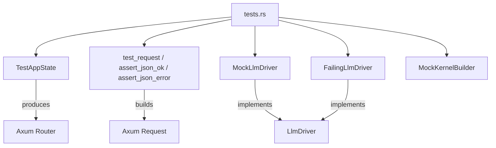

# Other — librefang-testing-src

# librefang-testing — Example Tests (`tests.rs`)

## Purpose

This module contains **example tests** that demonstrate how to use the `librefang-testing` infrastructure. It doubles as a living reference for contributors and a regression suite covering the API surface of the core HTTP endpoints and mock drivers.

Every test here is a template. If you are adding a new endpoint or mock, copy the closest test in this file and adapt it.

---

## Architecture Overview


```mermaid
graph TD
    tests[tests.rs] --> TestAppState
    tests --> helpers[test_request / assert_json_ok / assert_json_error]
    tests --> MockLlmDriver
    tests --> FailingLlmDriver
    tests --> MockKernelBuilder
    TestAppState -->|produces| router[Axum Router]
    helpers -->|builds| axum_req[Axum Request]
    MockLlmDriver -->|implements| LlmDriver
    FailingLlmDriver -->|implements| LlmDriver
```

---

## Test Categories

### 1. HTTP Endpoint Tests

These tests spin up an in-memory Axum application via `TestAppState`, build a `router()`, and fire one-shot requests through it using `tower::ServiceExt::oneshot`. Response assertions use the helper macros `assert_json_ok` and `assert_json_error`.

**Pattern:**

```rust
let app = TestAppState::new();
let router = app.router();

let req = test_request(Method::GET, "/api/health", None);
let resp = router.oneshot(req).await.expect("request failed");
let json = assert_json_ok(resp).await;
// assert on json fields...
```

Covered endpoints:

| Test | Endpoint | Method | Expected status |
|---|---|---|---|
| `test_health_endpoint` | `/api/health` | GET | 200 |
| `test_version_endpoint` | `/api/version` | GET | 200 |
| `test_list_agents` | `/api/agents` | GET | 200 |
| `test_get_agent_invalid_id` | `/api/agents/not-a-valid-uuid` | GET | 400 |
| `test_get_agent_not_found` | `/api/agents/{uuid}` | GET | 404 |
| `test_spawn_agent_post` | `/api/agents` | POST | 200 or 201 |
| `test_delete_nonexistent_agent_is_idempotent` | `/api/agents/{uuid}` | DELETE | 200 |
| `test_set_model_not_found` | `/api/agents/{uuid}/model` | PUT | 4xx/5xx |
| `test_send_message_agent_not_found` | `/api/agents/{uuid}/message` | POST | 404 or 400 |
| `test_patch_agent_not_found` | `/api/agents/{uuid}` | PATCH | 404 or 400 |

### 2. Mock LLM Driver Tests

These test `MockLlmDriver` and `FailingLlmDriver` in isolation — no HTTP stack involved. They construct a `CompletionRequest` directly, call `LlmDriver::complete`, and assert on the response or error.

| Test | Driver | What it verifies |
|---|---|---|
| `test_mock_llm_driver_recording` | `MockLlmDriver` | Returns queued responses in order; records `model`, `system`, and call count via `call_count()` / `recorded_calls()` |
| `test_mock_llm_driver_custom_tokens_and_stop_reason` | `MockLlmDriver` | Builder methods `with_response`, `with_tokens`, `with_stop_reason` propagate into `CompletionResponse.usage` and `CompletionResponse.stop_reason` |
| `test_failing_llm_driver` | `FailingLlmDriver` | Always returns an error with the configured message; `is_configured()` returns `false` |

### 3. Custom Configuration Tests

`test_custom_config_kernel` demonstrates `TestAppState::with_builder` combined with `MockKernelBuilder::with_config` to inject arbitrary config overrides. It verifies the config took effect by reading `kernel.config_ref()` directly.

---

## How to Write a New Test

### For an HTTP endpoint

1. **Create the app.** Use `TestAppState::new()` for defaults, or `TestAppState::with_builder(...)` if you need a custom kernel config.
2. **Build a request.** Call `test_request(method, path, body)`. The `body` argument is `Option<&str>` — pass `Some(json_string)` for POST/PUT/PATCH, `None` for GET/DELETE.
3. **Send it.** `router.oneshot(req).await.expect("...")`.
4. **Assert.** Use `assert_json_ok(resp)` for 2xx (returns a `serde_json::Value`) or `assert_json_error(resp, expected_status)` for error cases.

Most endpoint tests need `#[tokio::test(flavor = "multi_thread")]` because the router internally spawns tasks.

### For a mock driver unit test

1. Construct a `MockLlmDriver` or `FailingLlmDriver`.
2. Build a `CompletionRequest` (the tests here show the full struct — copy and modify fields as needed).
3. Call `.complete(request).await`.
4. Assert on the `CompletionResponse` fields or the error.

These tests can use plain `#[tokio::test]` (no multi_thread required) since they don't run an Axum router.

---

## Key Design Decisions

**Idempotent DELETE.** The test `test_delete_nonexistent_agent_is_idempotent` encodes a contract: deleting a valid UUID that doesn't correspond to an agent returns `200 OK` with `{"status": "already-deleted"}` rather than `404`. This prevents phantom errors on retried deletes (network blips, dashboard double-clicks). The `404` status is reserved exclusively for malformed UUIDs.

**Error response shape.** Both `assert_json_ok` and `assert_json_error` deserialize the response body as JSON. Error responses are expected to carry an `"error"` field. Success responses carry endpoint-specific fields (`"status"`, `"items"`, `"total"`, `"version"`, etc.).