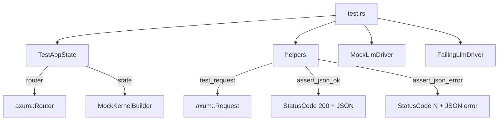

# Other — librefang-testing-src

# `librefang-testing/src/tests.rs` — Example Test Suite

## Purpose

This module is the **reference test suite** for the `librefang-testing` crate. It doubles as:

1. **Living documentation** — each test demonstrates a specific testing pattern (HTTP assertions, mock drivers, custom kernel config).
2. **Regression guard** — exercises the public API surface of the HTTP layer, agent lifecycle, and LLM driver abstractions.

Every test in this file uses *only* public APIs exported from `librefang-testing`, so contributors can copy any test as a starting template.

---

## Test Infrastructure Overview


```mermaid
graph TD
    T[test.rs] --> TA[TestAppState]
    TA -->|router| AX[axum::Router]
    TA -->|state| MK[MockKernelBuilder]
    T --> H[helpers]
    H -->|test_request| REQ[axum::Request]
    H -->|assert_json_ok| OK[StatusCode 200 + JSON]
    H -->|assert_json_error| ERR[StatusCode N + JSON error]
    T --> MD[MockLlmDriver]
    T --> FD[FailingLlmDriver]
```

All tests follow the same three-step rhythm:

```
setup  →  fire request  →  assert response
```

---

## Shared Patterns

### Test Application Setup

```rust
// Default state (zero config)
let app = TestAppState::new();
let router = app.router();

// Custom kernel configuration
let app = TestAppState::with_builder(
    MockKernelBuilder::new().with_config(|cfg| {
        cfg.language = "zh".into();
    })
);
```

`TestAppState::new()` creates a fully-wired application with a mock kernel and default configuration. Use `with_builder` when a test needs specific config values.

### Building Requests

```rust
// GET, no body
let req = test_request(Method::GET, "/api/health", None);

// POST with JSON body
let body = serde_json::json!({ "manifest_toml": toml }).to_string();
let req = test_request(Method::POST, "/api/agents", Some(&body));
```

`test_request` constructs an `axum::http::Request` with the given method, path, and optional string body. The body is sent as `application/json`.

### Asserting Responses

```rust
// Expects 200 OK and returns the parsed serde_json::Value
let json = assert_json_ok(resp).await;

// Expects a specific error status and returns the parsed error JSON
let json = assert_json_error(resp, StatusCode::BAD_REQUEST).await;
```

Both helpers consume the response, validate the status code, parse the JSON body, and return it for further field-level assertions. They panic with a descriptive message on mismatch.

---

## Test Categories

### Health & Version Endpoints

| Test | Method | Path | Validates |
|------|--------|------|-----------|
| `test_health_endpoint` | GET | `/api/health` | Returns `{"status": "ok" \| "degraded"}` |
| `test_version_endpoint` | GET | `/api/version` | Returns a JSON object containing a `"version"` field |

These are the simplest tests and serve as a smoke test for the router wiring.

### Agent CRUD Operations

| Test | Method | Path | Validates |
|------|--------|------|-----------|
| `test_list_agents` | GET | `/api/agents` | Returns `{"items": [...], "total": N}` |
| `test_get_agent_invalid_id` | GET | `/api/agents/not-a-valid-uuid` | Returns 400 with `{"error": ...}` |
| `test_get_agent_not_found` | GET | `/api/agents/{uuid}` | Returns 404 with `{"error": ...}` |
| `test_spawn_agent_post` | POST | `/api/agents` | Returns 200 or 201 |
| `test_delete_nonexistent_agent_is_idempotent` | DELETE | `/api/agents/{uuid}` | Returns 200 with `{"status": "already-deleted"}` |
| `test_set_model_not_found` | PUT | `/api/agents/{uuid}/model` | Returns 4xx/5xx |
| `test_send_message_agent_not_found` | POST | `/api/agents/{uuid}/message` | Returns 400 or 404 |
| `test_patch_agent_not_found` | PATCH | `/api/agents/{uuid}` | Returns 400 or 404 |

#### Idempotent DELETE Contract

`test_delete_nonexistent_agent_is_idempotent` encodes an important API contract: deleting a valid UUID that doesn't map to an existing agent returns `200 OK` with `{"status": "already-deleted"}` rather than `404`. This makes retries safe — a network blip or dashboard double-click won't surface a phantom error. The 404 status code is reserved exclusively for malformed UUIDs (see `test_get_agent_invalid_id`).

### Mock LLM Driver Tests

#### `MockLlmDriver` — Call Recording

```rust
let driver = MockLlmDriver::new(vec!["回复1".into(), "回复2".into()]);
let resp1 = driver.complete(request.clone()).await.unwrap();
assert_eq!(resp1.text(), "回复1");

assert_eq!(driver.call_count(), 2);
let calls = driver.recorded_calls();
assert_eq!(calls[0].model, "test-model");
```

`MockLlmDriver` returns pre-configured responses in order and records every call. Key inspection APIs:

- **`call_count()`** — number of invocations
- **`recorded_calls()`** — slice of recorded `CompletionRequest` snapshots

#### `MockLlmDriver` — Custom Token Counts and Stop Reason

```rust
let driver = MockLlmDriver::with_response("test")
    .with_tokens(200, 100)
    .with_stop_reason(StopReason::MaxTokens);
```

The builder pattern lets you customize usage reporting (`input_tokens`, `output_tokens`) and `stop_reason` without constructing full response objects.

#### `FailingLlmDriver` — Always Errors

```rust
let driver = FailingLlmDriver::new("模拟的 API 错误");
let result = driver.complete(request).await;
assert!(result.is_err());
assert!(!driver.is_configured());
```

Use `FailingLlmDriver` to test error-handling paths. It always returns the configured error message and reports `is_configured() == false`.

### Custom Kernel Configuration

```rust
let app = TestAppState::with_builder(
    MockKernelBuilder::new().with_config(|cfg| {
        cfg.language = "zh".into();
    })
);
assert_eq!(app.state.kernel.config_ref().language, "zh");
```

`MockKernelBuilder::with_config` accepts a closure that mutates the kernel config before construction. This allows tests to verify that configuration flows through to the runtime correctly.

---

## Conventions for Adding New Tests

1. **Use `#[tokio::test(flavor = "multi_thread")]`** for tests that call `TestAppState::router()`. The router may spawn background tasks that require a multi-threaded runtime.
2. **Use `#[tokio::test]`** (single-thread) for unit-style mock driver tests that don't touch the HTTP layer.
3. **Always use `test_request` and `assert_json_*` helpers** — don't hand-roll request construction or status checking. This keeps assertions consistent and error messages actionable.
4. **Use `uuid::Uuid::new_v4()`** for fake agent IDs in not-found tests. Never hard-code a UUID unless you're specifically testing against known seed data.
5. **Assert response shape, not exact payloads** — check that required fields exist and have the right type (`is_array()`, `is_u64()`, etc.) rather than matching against a fixed JSON blob. This makes tests resilient to additive schema changes.