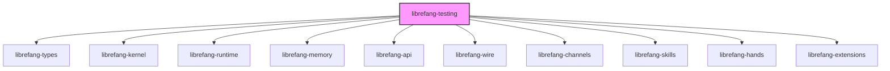

# Other — librefang-testing

# librefang-testing

Test infrastructure crate providing mock implementations and test utilities for the Librefang workspace. This module consolidates shared test fixtures so that integration and unit tests across crates can rely on consistent, reusable mocks rather than each crate rolling its own.

## Purpose

Testing higher-level crates (API routes, skills, hands, extensions) requires substituting real infrastructure—kernel instances, LLM backends, persistent storage—with controllable stand-ins. `librefang-testing` provides:

- **Mock kernel** — a lightweight kernel implementation that satisfies the kernel trait without requiring real hardware or system resources.
- **Mock LLM driver** — a deterministic stand-in for the LLM backend, allowing tests to assert on prompts and control responses.
- **API route test utilities** — helpers for constructing Axum test applications, issuing requests, and inspecting responses without binding to a real network port.

## Workspace Role



This crate sits at the top of the dependency graph as a test-only consumer. It is not published or included in production builds. Other crates reference it from their `[dev-dependencies]` to access mock infrastructure during testing.

## Key Dependencies and Their Role

| Dependency | Reason for inclusion |
|---|---|
| `librefang-kernel` | Implements the mock kernel against the real kernel trait |
| `librefang-runtime` | Provides runtime primitives the mock kernel needs to operate |
| `librefang-memory` | Supplies memory subsystem mocks or in-memory backends |
| `librefang-api` (feature `telemetry`) | Builds test Axum routers with telemetry wiring enabled |
| `librefang-wire` | Constructs wire-format test payloads |
| `librefang-channels` | Creates mock channel endpoints for skill/hand communication |
| `librefang-skills` | Enables skill-layer integration tests |
| `librefang-hands` | Enables hand-layer integration tests |
| `librefang-extensions` | Enables extension integration tests |
| `axum` + `tower` | Assembles test HTTP applications and service layers |
| `http-body-util` | Reads and decodes response bodies in route tests |
| `dashmap` | Tracks mock state (e.g., recorded calls, configured responses) across concurrent test tasks |
| `tempfile` | Creates isolated temporary directories for tests that touch the filesystem |
| `uuid` | Generates deterministic or random UUIDs for test entities |

## Usage Pattern

Add to your crate's `[dev-dependencies]`:

```toml
[dev-dependencies]
librefang-testing = { path = "../librefang-testing" }
```

Then use the mock types in tests:

```rust
use librefang_testing::mock_kernel::MockKernel;
use librefang_testing::mock_llm::MockLlmDriver;
use librefang_testing::api_test_helpers::TestApp;
```

### API Route Testing

The `api_test_helpers` module typically provides a builder or constructor that wires up an Axum `Router` with mock service layers, returning a type that can handle requests via `tower::ServiceExt::oneshot` or `axum::test` helpers. This allows tests to exercise route handlers end-to-end without network I/O.

### Mock Kernel

The mock kernel implements the same trait as `librefang-kernel`'s real type, but backed by in-memory state. This lets tests of skills, hands, and extensions run against a kernel that behaves predictably and records interactions for later assertion.

### Mock LLM Driver

The mock LLM driver accepts configuration for what responses to return and optionally records the prompts it receives. Tests configure expected responses before running a scenario, then assert that the correct prompts were sent.

## Design Notes

- **No production dependency.** This crate must never appear in a non-test `[dependencies]` section. Its mocks are not optimized for performance or correctness in production scenarios.
- **Deterministic by default.** Mocks return predictable values. Tests requiring randomness should explicitly configure it rather than relying on mock internals.
- **Isolation via `tempfile`.** Any test that creates files or directories should use the provided temp-directory helpers to avoid polluting the build tree and to ensure cleanup on test completion regardless of outcome.
- **Concurrency safety.** Because tokio tests run concurrently within a single process, mock state backed by `DashMap` avoids data races without requiring per-test mutex overhead.