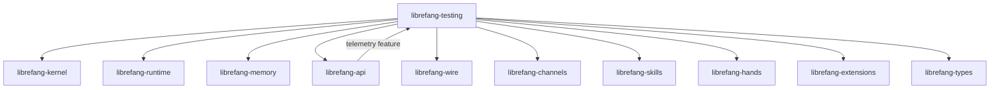

# Other — librefang-testing

# librefang-testing

Test infrastructure for the LibreFang workspace. Provides reusable mock implementations and HTTP test utilities so that integration tests across all crates can run without real kernel hardware, LLM backends, or network services.

## Purpose

Testing a multi-crate system like LibreFang requires consistent, deterministic test doubles. This crate centralizes three categories of test support:

- **Mock kernel** — simulates the kernel interface in-process, allowing tests to exercise runtime, channel, skill, hand, and extension code without hardware or elevated privileges.
- **Mock LLM driver** — returns canned or configurable responses, enabling skill and extension tests to run offline and deterministically.
- **API route test utilities** — helpers for constructing Axum router instances, sending requests through the full middleware stack, and asserting on responses, including telemetry-enabled routes.

Because every other workspace crate can depend on `librefang-testing` in `[dev-dependencies]`, the mock implementations and test helpers serve as the single source of truth for how test environments are configured.

## Position in the Workspace



`librefang-testing` sits at the top of the dependency graph as a consumer, not a library depended upon by production crates. It pulls in nearly every sibling crate so it can wire them together into realistic test scenarios.

## Key Dependencies and Their Roles

| Dependency | Why it's needed |
|---|---|
| `librefang-kernel` | Provides the kernel trait/interface that the mock kernel must implement or wrap. |
| `librefang-runtime` | Test environments need a runtime to execute async tasks under realistic conditions. |
| `librefang-memory` | In-memory storage backends used by mocks to avoid touching disk or external services. |
| `librefang-api` | Imported with `telemetry` feature enabled so route tests can cover the full middleware stack including observability. |
| `librefang-wire` | Wire-protocol types are needed to construct valid request/response payloads in API tests. |
| `librefang-channels`, `librefang-skills`, `librefang-hands`, `librefang-extensions` | Tested components; the mocks and helpers exist to exercise these crates' integration points. |
| `librefang-types` | Shared domain types used throughout assertions and mock response construction. |
| `axum` + `tower` | The API layer is built on Axum; test utilities use `tower::ServiceExt` to call routes without binding a real HTTP listener. |
| `http-body-util` | Body extraction helpers for reading Axum response bodies in tests. |
| `dashmap` | Concurrent map used internally by mocks to track state across async test steps. |
| `tempfile` | Creates temporary directories for tests that need filesystem interaction without polluting the build tree. |
| `uuid` | Generates deterministic or random UUIDs for test entities. |

## Mock Kernel

The mock kernel replaces the real kernel backend with an in-process implementation. This allows tests to:

1. **Boot a simulated environment** without kernel modules or privileged operations.
2. **Inspect submitted commands** — the mock records what was sent so tests can assert on invocation order, arguments, and frequency.
3. **Inject controlled responses** — configure the mock to return specific results, errors, or delays for exercising error paths and timeouts.

State is typically held in `DashMap`-backed structures so that concurrent test tasks (e.g., multiple skills running simultaneously) interact safely with the mock.

## Mock LLM Driver

The mock LLM driver provides offline, deterministic LLM responses. Key capabilities:

- **Pre-configured responses** — register expected prompts and their corresponding completions before the test runs.
- **Verification** — after the test, inspect which prompts were actually sent to confirm skill logic invokes the LLM correctly.
- **Error simulation** — configure the driver to return errors or malformed output to test fallback and retry logic in skills and extensions.

This eliminates network latency, API costs, and non-determinism from LLM-powered test paths.

## API Route Test Utilities

These helpers wrap Axum's testing patterns to reduce boilerplate across the workspace. A typical test flow:

1. Build an application router with the desired routes and middleware, including the telemetry layer from `librefang-api`'s `telemetry` feature.
2. Use `tower::ServiceExt::oneshot` (or similar) to send a constructed request through the router.
3. Use `http_body_util::BodyExt` to collect and deserialize the response body.
4. Assert on status codes, headers, and response payloads.

Because the router is constructed in-process, these tests execute quickly and can be run in CI without port-binding conflicts.

## Usage in Other Crates

Add to `[dev-dependencies]`:

```toml
[dev-dependencies]
librefang-testing = { path = "../librefang-testing" }
```

Then import the mock implementations or test helpers needed for the specific test. Each mock is designed to be constructed inline within a test function, configured for that test's scenario, and dropped at the end — no global state or test ordering requirements.

## Design Principles

- **No shared mutable global state.** Mocks are instantiated per-test, with internal state managed through concurrency-safe containers like `DashMap`.
- **Deterministic by default.** Timestamps, UUIDs, and random values should be controlled or seeded so that test runs are reproducible.
- **Feature parity with production paths.** Mocks implement the same traits as production implementations, ensuring that tests exercise the same code paths that run in production, just with different backends.
- **Minimal test boilerplate.** Common setup patterns (router construction, mock wiring, response deserialization) are extracted into reusable helpers so individual test functions remain focused on assertions.