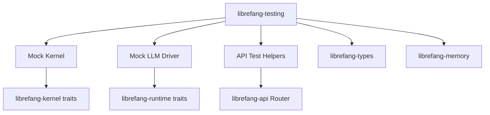

# Other — librefang-testing

# librefang-testing

Test infrastructure crate providing mock implementations and HTTP test utilities for the librefang ecosystem. This crate is **not** published or distributed — it exists solely as a workspace-local dev dependency consumed by integration tests and other crates' test suites.

## Purpose

Testing across the librefang workspace requires deterministic, hermetic substitutes for components that are otherwise non-deterministic (LLM responses), stateful (the kernel), or network-bound (the API layer). This crate consolidates those substitutes in one place so every other crate can depend on a consistent set of fakes without duplicating setup code.

The three major offerings are:

| Component | What it replaces | Why a mock is needed |
|---|---|---|
| **Mock kernel** | `librefang-kernel` | Removes real kernel side-effects; lets tests assert which operations were dispatched |
| **Mock LLM driver** | Real LLM backend | Eliminates network calls, latency, and cost; returns canned responses |
| **API route test helpers** | Live `axum` server | Provides an in-process `Router` with tower `ServiceExt` wrappers for request/response assertions |

## Architecture



## Key Components

### Mock Kernel

Wraps `librefang-kernel` trait implementations with an in-memory backend. Operations that would normally interact with system-level resources are recorded into a `DashMap`-backed log, allowing tests to assert:

- Which kernel operations were invoked and in what order.
- The arguments passed to each operation.
- That no unexpected operations occurred.

The mock kernel is cheap to construct and can be created per-test without shared global state.

### Mock LLM Driver

Implements the same trait/interface that `librefang-runtime` expects from an LLM driver, but returns pre-configured responses instead of making network calls. Tests configure expected responses before exercising the system under test, keeping behavior deterministic and repeatable.

This is particularly important for validating prompt construction and response parsing logic without depending on an external LLM service.

### API Route Test Helpers

Provides utilities for constructing an `axum` `Router` suitable for testing without binding to a real TCP port. This leverages `tower::ServiceExt` and `http-body-util` to drive requests through the full middleware stack (including telemetry, added via the `librefang-api` `telemetry` feature) in-process.

Typical usage pattern:

1. Build a `Router` through the provided helpers, injecting mock kernel and LLM instances.
2. Construct an `axum::body::Body` with the desired request payload.
3. Call the router via `tower::ServiceExt::oneshot` or similar.
4. Assert on the response status, headers, and body using the provided assertion helpers or standard `serde_json` deserialization.

The `tempfile` dependency is used here to create isolated temporary directories for any file-system state the API layer might touch during a test.

## Dependencies

### Workspace crates

- **`librefang-types`** — shared type definitions used in request/response bodies and kernel operations.
- **`librefang-kernel`** — provides the traits the mock kernel must implement.
- **`librefang-runtime`** — provides the LLM driver trait the mock driver implements.
- **`librefang-memory`** — in-memory storage backends used by the mock kernel.
- **`librefang-api`** — the `Router` and route definitions being tested; imported with `default-features = false` and only the `telemetry` feature enabled, keeping the test router close to production configuration without pulling in unnecessary features.

### Notable external crates

| Crate | Role in this crate |
|---|---|
| `dashmap` | Concurrent map backing the operation log in the mock kernel |
| `arc-swap` | Lock-free swapping of shared state (e.g., swapping mock configurations mid-test) |
| `tower` / `axum` / `http-body-util` | In-process HTTP request execution without a live server |
| `tempfile` | Isolated temporary directories for per-test file-system state |
| `toml` | Parsing test fixture configuration files |
| `uuid` | Generating deterministic or random IDs in test contexts |
| `serde_json` | Serializing/deserializing request and response bodies |
| `async-trait` | Implementing async trait interfaces for mocks |

## Usage from other crates

This crate should only appear in `[dev-dependencies]`:

```toml
[dev-dependencies]
librefang-testing = { path = "../librefang-testing" }
```

It is intentionally not given a `lib` crate-type beyond the default `rlib` — it is not meant to be linked into production artifacts.

## Conventions

- **No `#[test]` functions live here.** This crate provides *infrastructure*; actual tests belong in the crates that exercise their own behavior.
- **Mocks are unconstrained by default.** If a test needs to enforce stricter behavior (e.g., "this method must not be called"), the mock should be configured explicitly for that case rather than failing by surprise.
- **All mocks are `Send + Sync`.** They are safe to use across Tokio tasks and with `axum`'s thread pool.