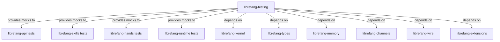

# Other — librefang-testing

# librefang-testing

Test infrastructure crate providing mock implementations and test harness utilities for the librefang workspace. This crate centralizes reusable test fixtures so that integration and unit tests across the codebase share consistent, maintainable mocks rather than each crate rolling its own.

## Purpose

Testing across the librefang system involves several recurring challenges:

- **Kernel-dependent code** needs a kernel-like object that doesn't require real system resources.
- **LLM driver consumers** need deterministic responses without hitting a real language model.
- **API route handlers** need an isolated Axum application with controlled state for HTTP-level testing.

This crate addresses all three by shipping mock implementations and Axum test-harness builders that downstream crates (`librefang-api`, `librefang-skills`, `librefang-hands`, etc.) depend on in their `[dev-dependencies]`.

## Architecture



The crate depends on nearly every other workspace member because its mocks must implement the real traits and produce the real types that production code expects.

## Key Capabilities

### Mock Kernel

Provides a controllable stand-in for the kernel, used anywhere kernel behavior needs to be simulated without real I/O or system calls. This is consumed by tests in crates that interact with the kernel trait but should run deterministically and quickly.

### Mock LLM Driver

Provides a deterministic fake LLM driver that returns canned or programmable responses. This allows skill and agent logic to be tested end-to-end without network calls, rate limits, or non-deterministic model output. Tests can configure expected responses, error conditions, and multi-turn conversation sequences.

### API Route Test Utilities

Builds a fully-wired Axum application suitable for `tower::ServiceExt` or direct HTTP testing. This typically involves:

- Constructing an `axum::Router` with the same route definitions used in production.
- Injecting mock state (mock kernel, mock LLM driver) in place of real service instances.
- Exposing helpers that issue requests and parse JSON responses via `http-body-util` and `serde_json`.

The `tempfile` dependency supports tests that need temporary directories or files (e.g., simulating file uploads or on-disk state) that are automatically cleaned up on drop.

### Shared Test Fixtures

The `dashmap` dependency suggests that some test utilities manage concurrent shared state (for example, tracking which mock endpoints were called, in what order, and with what payloads). The `uuid` dependency supports generating deterministic or random test identifiers.

## Dependencies — Why Each One Exists

| Dependency | Reason |
|---|---|
| `librefang-types` | Mocks produce and consume shared domain types. |
| `librefang-kernel` | The mock kernel must implement the kernel's public trait. |
| `librefang-runtime` | Test harnesses may need to spin up a controlled runtime context. |
| `librefang-memory` | Tests involving memory/channel state need access to memory types. |
| `librefang-api` | Route test utilities reuse the API's route definitions and state types. The `telemetry` feature is enabled; `default-features = false` avoids pulling in real server startup logic. |
| `librefang-wire` | Wire-format types used in API request/response bodies. |
| `librefang-channels` | Mock channel infrastructure for communication tests. |
| `librefang-skills` | Skill-related types needed by higher-level test fixtures. |
| `librefang-hands` | Hand/tool-related types needed by higher-level test fixtures. |
| `librefang-extensions` | Extension types for tests that cover the extension system. |
| `tokio` | Async test runtime (`#[tokio::test]`). |
| `axum` + `tower` | Building and invoking test HTTP applications via `ServiceExt`. |
| `http-body-util` | Reading response bodies in route tests. |
| `serde` / `serde_json` | Serializing request payloads and deserializing response bodies. |
| `dashmap` | Thread-safe shared state for tracking mock call histories. |
| `tempfile` | Temporary directories/files with automatic cleanup. |
| `uuid` | Generating test identifiers. |
| `async-trait` | Implementing async traits for mock objects. |

## Usage Patterns

### Adding to dev-dependencies

In any workspace crate that needs test utilities:

```toml
[dev-dependencies]
librefang-testing = { path = "../librefang-testing" }
```

### Typical route test pattern

Tests generally follow this shape:

1. Build mock state (mock kernel, mock LLM driver) with desired behavior configured.
2. Construct a test `Router` via the harness utility, injecting the mock state.
3. Use `tower::ServiceExt::oneshot` to send a constructed HTTP request.
4. Assert on the response status and parsed body.

### Typical mock LLM test pattern

1. Create the mock LLM driver.
2. Program expected responses for specific prompt patterns.
3. Pass the mock to the system under test.
4. Verify the system handled the responses correctly.
5. Optionally inspect the mock's call history to assert on what was sent.

## Conventions

- This crate is **test-only**. It must never appear in a non-`dev-dependency` section. Production code should have zero dependency on it.
- Mock implementations should be **deterministic by default**. Any randomness must be explicitly opted into by the test author.
- Keep mocks minimal. Implement only the surface area actually needed by tests — do not mirror the full production API unless required.