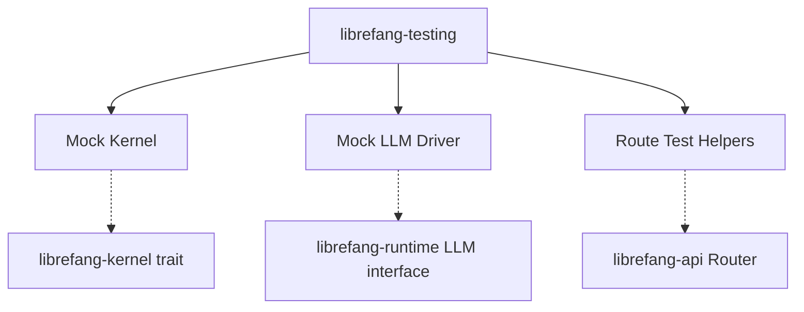

# Other — librefang-testing

# librefang-testing

Test infrastructure crate providing mock implementations and HTTP route test utilities for the Librefang ecosystem.

## Purpose

This crate centralizes all test-only code so that other crates never need to pull in mock-specific dependencies in production builds. It ships three categories of test support:

1. **Mock kernel** — an in-memory stand-in for `librefang-kernel` that skips real I/O.
2. **Mock LLM driver** — a deterministic fake for the LLM backend used by the runtime.
3. **API route test utilities** — helpers for constructing `axum` test requests against `librefang-api` routes without binding a real HTTP listener.

## Dependencies & Integration

| Dependency | Why it's here |
|---|---|
| `librefang-types` | Re-exports shared domain types so tests can construct fixtures. |
| `librefang-kernel` | The real kernel trait/interface that the mock must satisfy. |
| `librefang-runtime` | The runtime under test; tests feed it the mock kernel and mock LLM. |
| `librefang-api` (feature `telemetry`) | Route definitions. Tests build an `axum::Router` from these and fire requests through it. |
| `axum` / `tower` | Used to assemble a one-shot `Service` for route-level HTTP tests. |
| `tokio` | Async test runtime. |
| `serde_json` | JSON body construction and assertion helpers. |
| `dashmap` | Concurrent map used internally by mocks to track state across await points. |
| `tempfile` | Temporary directories for tests that touch the filesystem. |
| `uuid` | Generating deterministic or random test IDs. |
| `http-body-util` | Reading response bodies in route tests. |

## Architecture



Tests in other crates depend on `librefang-testing` as a dev-dependency. The test code instantiates the mocks it needs, wires them into the component under test, and optionally uses the route helpers to exercise HTTP endpoints end-to-end.

## Usage Patterns

### Adding to a crate's dev-dependencies

```toml
[dev-dependencies]
librefang-testing = { path = "../librefang-testing" }
```

### Route-level testing

The route helpers wrap `tower::ServiceExt` to send a request through an `axum::Router` without a live server. A typical test:

1. Build a `Router` from `librefang-api`, injecting the mock kernel and mock LLM via state.
2. Construct an `axum::extract::Request` (or use a convenience builder from this crate).
3. Call `tower::ServiceExt::oneshot(router, request)` and inspect the response.

This keeps tests fast—no TCP, no real LLM, no real kernel I/O—while still exercising the full middleware and handler stack.

### Mock state inspection

Mocks built with `dashmap` allow tests to inspect internal state (e.g., how many times the kernel was called, what arguments were passed) from concurrent test tasks without external synchronization.

## Design Notes

- **No production code depends on this crate.** It is exclusively a `[dev-dependencies]` target.
- The `librefang-api` dependency enables only the `telemetry` feature and uses `default-features = false` to avoid pulling in server-side extras (like real TLS or listener setup) that route tests don't need.
- Because no execution flows originate or terminate here, the mocks are entirely passive—they respond to calls from the runtime and API layers under test.