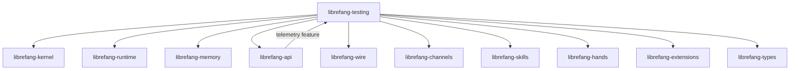

# Other — librefang-testing

# librefang-testing

Test infrastructure for the Librefang workspace: mock kernel, mock LLM driver, and API route test utilities.

This crate is a **dev-only dependency** — it never ships in production builds. It provides reusable fakes, mocks, and harnesses so that other workspace crates can write integration and unit tests without needing real hardware, a live LLM backend, or a running HTTP server.

## Role in the Workspace

`librefang-testing` sits downstream of nearly every other Librefang crate. It imports the kernel, runtime, memory, API, wire protocol, channels, skills, hands, and extensions modules so that test helpers can construct fully-wired (but fake) subsystems.



By pulling in `librefang-api` with only the `telemetry` feature enabled (and `default-features = false`), the crate avoids pulling in real server infrastructure while still gaining access to telemetry types needed for assertions.

## Key Capabilities

### Mock Kernel

Provides a fake implementation of the kernel interface. Tests can instantiate the mock, optionally pre-program responses or record calls, and assert that the system under test interacts with the kernel as expected.

### Mock LLM Driver

Provides a deterministic stand-in for the LLM backend. This allows tests of skills, extensions, and agent logic to run without network calls, with full control over what "completions" the mock returns.

### API Route Test Utilities

Wraps `librefang-api` routes in an in-process `axum` router backed by `tower::ServiceExt`. Tests send requests through the full HTTP stack (serialization, middleware, routing, handlers) without opening a real listener. The `http-body-util` dependency is used for reading response bodies in these tests.

## Usage

Add `librefang-testing` as a **dev-dependency** in the crate you are testing:

```toml
[dev-dependencies]
librefang-testing = { path = "../librefang-testing" }
```

### Typical API Route Test Pattern

```rust
use librefang_testing::TestRouter;

#[tokio::test]
async fn test_my_route() {
    let app = TestRouter::new(/* mock kernel, mock llm, etc. */);

    let response = app
        .oneshot(
            axum::http::Request::builder()
                .method("POST")
                .uri("/some/endpoint")
                .header("content-type", "application/json")
                .body(r#"{"key": "value"}"#.into())
                .unwrap(),
        )
        .await
        .unwrap();

    assert_eq!(response.status(), 200);
}
```

## Dependencies — Why They Exist

| Dependency | Reason |
|---|---|
| `librefang-types` | Shared domain types used in test assertions and fixture construction |
| `librefang-kernel` | Traits to mock |
| `librefang-runtime` | Runtime context fakes |
| `librefang-memory` | In-memory state setups for tests |
| `librefang-api` (telemetry only) | Route handlers and telemetry types for route-level tests |
| `librefang-wire` | Wire-format types for serialization/deserialization tests |
| `librefang-channels` | Channel fakes for testing async message flows |
| `librefang-skills` | Skill types for integration fixtures |
| `librefang-hands` | Hand/action types for integration fixtures |
| `librefang-extensions` | Extension types for integration fixtures |
| `axum`, `tower` | In-process HTTP test harness |
| `dashmap` | Concurrent state inside mocks |
| `tempfile` | Temporary directories for tests that touch the filesystem |
| `uuid` | Generating deterministic or random IDs in fixtures |
| `async-trait` | Implementing async mock traits |
| `http-body-util` | Reading response bodies in route tests |

## Guidelines for Extending

- **Keep mocks minimal.** Only implement the surface area that tests actually exercise. Over-mocking couples tests to implementation details.
- **Prefer determinism.** Mocks should return predictable data by default. If randomness is needed, accept a seed or value explicitly rather than using global RNG.
- **Don't add real I/O.** This crate should never depend on network, disk (beyond `tempfile`), or external services. Tests using this crate must remain fast and hermetic.