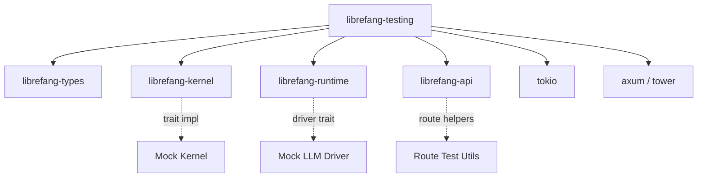

# Other — librefang-testing

# librefang-testing

Test infrastructure crate providing mock implementations and route-level test utilities for the librefang ecosystem.

## Purpose

This crate centralizes reusable test support code so that integration and unit tests across the workspace can share consistent mock implementations rather than each crate building its own. It ships three categories of test helpers:

1. **Mock kernel** — a stand-in for `librefang-kernel` that exercises the same trait boundaries without touching real kernel resources.
2. **Mock LLM driver** — simulates LLM responses for testing reasoning and generation paths without network calls or API keys.
3. **API route test utilities** — helpers for constructing `axum` test requests, wiring up router instances with mock state, and asserting on responses.

## Architecture



The crate sits downstream of the core libraries it mocks. It depends on:

| Dependency | Role in this crate |
|---|---|
| `librefang-types` | Shared domain types used in test assertions and fixture construction. |
| `librefang-kernel` | Provides the traits that the mock kernel implements. |
| `librefang-runtime` | Provides the LLM driver trait that the mock driver implements. |
| `librefang-api` | Router builder and route handlers being tested; imported with only the `telemetry` feature to keep the dependency graph light. |
| `tokio` | Async test runtime (`#[tokio::test]` support). |
| `axum` + `tower` | Building test router instances and invoking them via `tower::ServiceExt`. |
| `serde_json` | Constructing and inspecting JSON request/response bodies. |
| `dashmap` | Concurrent map used internally by mock state to track calls. |
| `tempfile` | Creating ephemeral directories for tests that touch the filesystem. |
| `uuid` | Generating deterministic or random IDs for test fixtures. |
| `http-body-util` | Reading response bodies in route tests. |

## Key Components

### Mock Kernel

A test double implementing the kernel trait(s) from `librefang-kernel`. This allows tests for the API layer and runtime to execute without a real kernel backend. Typical capabilities include:

- Recording method invocations for later assertion (e.g., "was `create_session` called with these arguments?").
- Returning pre-configured responses or errors to exercise success and failure paths.

### Mock LLM Driver

An implementation of the LLM driver trait from `librefang-runtime` that returns canned completions. Use it to test:

- Prompt construction and template rendering without hitting an external API.
- Error handling when the driver returns a failure.
- Token counting and cost-related logic against deterministic outputs.

### API Route Test Utilities

Helpers that reduce boilerplate when testing `axum` routes in isolation:

- **Router construction** — build an `axum::Router` with mock state injected so routes resolve normally.
- **Request helpers** — convenience functions for common HTTP methods with JSON bodies already serialized.
- **Response assertions** — utilities for reading and parsing response bodies via `http-body-util`.

A typical route test follows this pattern:

```
1. Set up mock kernel / mock driver with desired behavior.
2. Build a router, injecting the mock state.
3. Send a request through tower's ServiceExt.
4. Assert on status code and deserialize the response body.
```

## Usage in the Workspace

Other crates depend on `librefang-testing` as a dev-dependency. Because it is a dedicated test-support crate, it should never appear as a runtime dependency. In a consuming crate's `Cargo.toml`:

```toml
[dev-dependencies]
librefang-testing = { path = "../librefang-testing" }
```

Tests then import the mock implementations and helpers they need, construct the desired state, and exercise the system under test.

## Design Notes

- **No production code.** This crate compiles only for test targets. It must not be published or referenced from non-test code.
- **Minimal features on `librefang-api`.** The dependency on `librefang-api` uses `default-features = false` with only `telemetry` enabled, avoiding pulling in unnecessary backend dependencies during test compilation.
- **State isolation.** Mock implementations use `dashmap` internally so that tests running concurrently under tokio do not race on shared mutable state within a single mock instance.