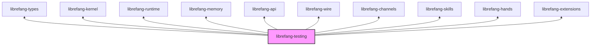

# Other — librefang-testing

# librefang-testing

Test infrastructure providing mock implementations and route-level test utilities for the Librefang system.

## Overview

This crate centralizes all test-only code so that downstream crates (and integration tests) can share consistent fakes, mocks, and helpers instead of each rolling their own. It is never compiled into production binaries — it exists purely as a `dev-dependency` or test-time companion.

Three broad categories of support are offered:

| Category | What it provides |
|---|---|
| **Mock kernel** | A lightweight, in-process stand-in for the real kernel that mirrors its trait surface without touching hardware or real subsystems. |
| **Mock LLM driver** | A deterministic fake for the LLM backend that returns canned (or programmable) responses, enabling repeatable tests of prompt pipelines and skill execution. |
| **API route test utilities** | Helpers that construct an `axum` test server with the full middleware stack (including telemetry) and expose ergonomic request builders for endpoint tests. |

## Relationship to other crates



The crate depends on nearly every sibling crate so it can:

1. Implement the same traits defined in `librefang-kernel`, `librefang-runtime`, etc.
2. Construct realistic API routers via `librefang-api` (with the `telemetry` feature enabled).
3. Wire up channels, skills, hands, and extensions against the mocks to exercise integration paths end-to-end.

## Key components

### Mock Kernel

A test-double implementing the kernel trait(s) from `librefang-kernel`. It holds state in plain `DashMap`/`HashMap` collections rather than real hardware registers or shared memory, making assertions on observed state straightforward.

Typical uses:

- Verifying that a skill or hand correctly invokes kernel operations.
- Simulating error conditions by programming the mock to return specific errors.

### Mock LLM Driver

A deterministic replacement for the production LLM driver. Supports:

- **Fixed responses** — always return a pre-configured `String` or structured output.
- **Programmable responses** — callers can push a queue of responses that are consumed in order, enabling multi-turn test scenarios.
- **Inspection** — records every prompt received so tests can assert on prompt content, order, and frequency.

This is built against the types in `librefang-types` and the driver trait expected by `librefang-runtime`.

### API Route Test Utilities

Wraps `axum::Router` construction from `librefang-api` and layers on `tower` middleware to replicate the production request pipeline. Each test gets its own router backed by mock services, avoiding shared mutable state between test cases.

Convenience functions handle:

- Spinning up a test server with `tower::ServiceExt`.
- Serializing request bodies with `serde_json`.
- Reading and deserializing response bodies via `http_body_util`.
- Managing temporary directories (`tempfile`) when tests need isolated filesystem state.

## Usage patterns

### Adding to your crate

```toml
# In your crate's Cargo.toml
[dev-dependencies]
librefang-testing = { path = "../librefang-testing" }
```

### Testing an API route

```rust
use librefang_testing::api::TestRouter;

#[tokio::test]
async fn create_session_returns_201() {
    let router = TestRouter::new(/* mock kernel, mock llm */).await;
    let response = router
        .post("/api/sessions")
        .json(&serde_json::json!({ "name": "test-session" }))
        .send()
        .await;

    assert_eq!(response.status(), 201);
}
```

### Asserting on LLM interactions

```rust
use librefang_testing::llm::MockLlmDriver;

#[tokio::test]
async fn skill_sends_correct_prompt() {
    let mut llm = MockLlmDriver::new();
    llm.push_response("expected output".to_string());

    // ... exercise the skill with llm injected ...

    let prompts = llm.drain_prompts();
    assert_eq!(prompts.len(), 1);
    assert!(prompts[0].contains("key phrase"));
}
```

## Design notes

- **No production code path.** This crate should never appear in a non-`dev-dependency` slot. Its symbols are compiled away from release builds.
- **Deterministic by default.** The mocks intentionally avoid `tokio::time::sleep`, random values, or network calls. When non-determinism is needed (e.g., UUID generation), prefer injecting a fixed seed or known value via the mock's configuration.
- **Isolation via `tempfile`.** Tests that touch the filesystem use the `tempfile` crate to create scoped temporary directories that are cleaned up on drop, preventing test pollution.
- **Telemetry-inclusive API tests.** The `librefang-api` dependency is pulled in with `features = ["telemetry"]` and `default-features = false`, ensuring route tests observe the same middleware ordering and header injection as production without pulling in unnecessary default features.