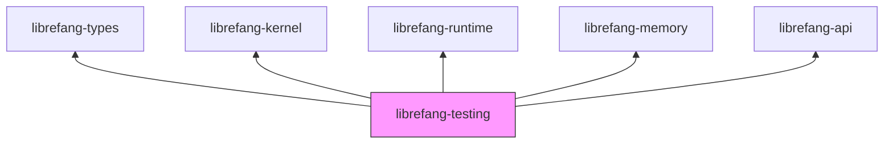

# Other — librefang-testing

# librefang-testing

Test infrastructure crate providing mock implementations and route-level test utilities for the Librefang system.

## Purpose

Integration and unit tests across the workspace need deterministic, fast, and hermetic replacements for heavyweight subsystems—the kernel, the LLM driver, and live HTTP infrastructure. This crate centralises those test doubles so every other crate can depend on them without duplicating harness code.

## What's Inside

Based on its dependency surface, the crate is organised around three concerns:

| Concern | Replaces | Key dependencies that hint at the implementation |
|---|---|---|
| **Mock kernel** | `librefang-kernel` | `librefang-kernel`, `librefang-runtime`, `librefang-memory`, `dashmap`, `arc-swap` |
| **Mock LLM driver** | A real language-model backend | `librefang-types`, `async-trait` |
| **API route test utilities** | A live HTTP listener / reverse proxy | `librefang-api`, `axum`, `tower`, `http-body-util`, `serde_json` |

### Mock Kernel

A lightweight kernel stand-in that satisfies the same trait(s) the real kernel exposes. The dependency on `dashmap` and `arc-swap` indicates it keeps shared mutable state (process tables, memory maps, registers) behind lock-free concurrent containers, letting tests inspect and manipulate kernel-visible state from multiple `tokio` tasks without deadlocking.

`librefang-runtime` and `librefang-memory` are pulled in so the mock can construct realistic runtime handles and address-space objects, giving tests confidence that the code under test is interacting with the *shape* of real data structures.

### Mock LLM Driver

Provides a deterministic stand-in for the LLM backend. Tests can preset responses, assert on prompts that were submitted, and avoid network latency or API rate-limits. The `async-trait` dependency suggests it implements a shared async trait defined in `librefang-types`, allowing it to be injected wherever the real driver would go.

### API Route Test Utilities

A thin layer over `axum` + `tower` that spins up an in-process router (no TCP socket) and lets tests send requests and assert on responses. By using `tower::ServiceExt` and `http-body-util`, the helper code can call the router as a plain `Service<Request>`, collect the full response body, and deserialise JSON payloads with `serde_json`.

The `librefang-api` dependency is imported with `default-features = false` and only the `telemetry` feature, meaning the test harness deliberately avoids pulling in full server machinery—just enough to construct a router and optionally emit trace spans during tests.

`tempfile` and `toml` are included for tests that need to write out ephemeral configuration files on disk.

## Relationship to Other Crates



All arrows represent `path` dependencies in `Cargo.toml`. Every other crate in the workspace that needs to run integration tests adds `librefang-testing` as a **dev-dependency**—it is never part of a production build.

## Usage Patterns

### Bringing the Mock Kernel into a Test

In a crate that depends on the kernel at runtime:

```toml
# Cargo.toml (of the crate being tested)
[dev-dependencies]
librefang-testing = { path = "../librefang-testing" }
```

The test then constructs the mock kernel, injects it wherever a kernel handle is expected, and proceeds to exercise the system under test.

### Exercising API Routes

```rust
use axum::body::Body;
use http_body_util::BodyExt;
use tower::ServiceExt;

// router is assembled via librefang-api, using the mock kernel
let app = librefang_testing::test_router(/* … */);

let response = app
    .oneshot(request)
    .await
    .unwrap();

let body = response.into_body()
    .collect()
    .await
    .unwrap()
    .to_bytes();

let parsed: serde_json::Value = serde_json::from_slice(&body).unwrap();
```

(Exact constructor signatures live in the crate's public API; the pattern above illustrates the `tower`-based in-process call that avoids binding a port.)

## Design Notes

- **No network I/O.** Every test double is in-process. The mock LLM driver returns immediately; the API test helper calls the router through `tower`'s `Service` trait.
- **Shared mutable state is lock-free.** `dashmap` and `arc-swap` let tests running under `tokio::spawn` read and write mock kernel state without blocking the runtime.
- **Feature gating.** `librefang-api` is consumed with `default-features = false` to keep compile times down and avoid optional heavy dependencies that tests don't need.
- **Ephemeral config.** `tempfile` + `toml` support writing throwaway configuration files that are cleaned up when the temp directory is dropped at test end.