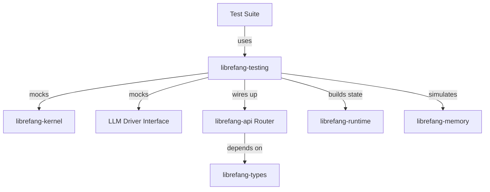

# Other — librefang-testing

# librefang-testing

Test infrastructure providing mock implementations of kernel and LLM subsystems, plus utilities for exercising API routes in isolation.

## Purpose

This crate centralises all test-facing abstractions so that integration tests across the workspace share a consistent, deterministic environment instead of hitting real hardware or external services. Every other crate in the workspace can depend on `librefang-testing` without pulling in production-only side effects.

## What It Provides

Based on its declared scope and dependency footprint, the module delivers three categories of test support:

### Mock Kernel

A lightweight stand-in for `librefang-kernel` that satisfies the same trait or interface contracts without requiring actual kernel-level operations. It depends on `librefang-kernel` directly, so the mock can implement the real kernel trait and be swapped in wherever the production kernel is expected.

### Mock LLM Driver

A deterministic replacement for the LLM backend. Tests that exercise prompt construction, response parsing, or conversation flow can use this mock to return pre-canned responses or programmable behaviour without network calls or model inference latency.

### API Route Test Utilities

Helpers that wire up an `axum` router (from `librefang-api`) in a test context, allowing direct in-process request/response testing. These utilities typically handle:

- Building a test application state with mock dependencies injected
- Constructing an `axum::Router` with the same route definitions used in production
- Providing convenience functions for sending requests and asserting on responses

The dependency on `tower` and `http-body-util` supports the HTTP-layer plumbing needed to invoke handlers without a live listener.

## Dependency Rationale

| Dependency | Role in Testing |
|---|---|
| `librefang-types` | Access to shared domain types used in assertions and test data construction |
| `librefang-kernel` | The trait/interface definitions that the mock kernel implements |
| `librefang-runtime` | Runtime primitives the test harness needs to stand up |
| `librefang-memory` | Memory subsystem types the mocks may need to simulate |
| `librefang-api` | Route definitions and application state types reused in route tests |
| `axum` / `tower` | HTTP test infrastructure for route-level testing |
| `tokio` | Async runtime for tests |
| `serde_json` | Building and asserting on JSON request/response bodies |
| `dashmap` | Concurrent state tracking inside mocks (thread-safe test fixtures) |
| `arc-swap` | Atomic swapping of mock state, mirroring production patterns |
| `tempfile` | Temporary directories for tests that touch the filesystem |
| `toml` | Loading or constructing test configuration |
| `uuid` | Generating deterministic or random identifiers in test data |

## Architecture

The testing crate sits between the test suites and the production crates, providing fake implementations that satisfy real interfaces.

## Usage Patterns

### Injecting the Mock Kernel

Tests construct the mock kernel, configure it as needed, and pass it into whatever function or system expects a kernel instance. Because the mock implements the same trait as the production kernel, no code changes are required in the system under test.

### Testing API Routes

The route test utilities typically follow this pattern:

1. Build mock instances of all required dependencies (kernel, LLM driver, etc.)
2. Assemble them into an application state matching what `librefang-api` expects
3. Construct the router from that state
4. Use `tower::ServiceExt` or similar to send requests directly to the router
5. Assert on response status, headers, and body content

This avoids binding to a port and keeps tests fast and deterministic.

### Filesystem Isolation

When a test needs to exercise configuration loading or file-based behaviour, `tempfile` provides scoped temporary directories that are cleaned up automatically on test completion.

## Conventions

- All public items in this crate are intended exclusively for `#[cfg(test)]` or test-binary contexts. Do not use them in production code paths.
- Mocks should default to the simplest possible behaviour (e.g., returning `Ok(())` or empty data) and expose configuration methods for tests that need specific responses.
- Prefer deterministic test data. When randomness is needed (e.g., UUIDs), use fixed seeds or explicit values to keep tests reproducible.

## Adding New Mocks

When a new subsystem is extracted into its own crate with a trait-based interface:

1. Add the new crate as a dependency of `librefang-testing`
2. Implement the mock in this crate, following the same pattern as existing mocks
3. Export the mock type and any helper constructors from the crate root
4. Update the API route test utilities to accept the new mock as part of application state construction