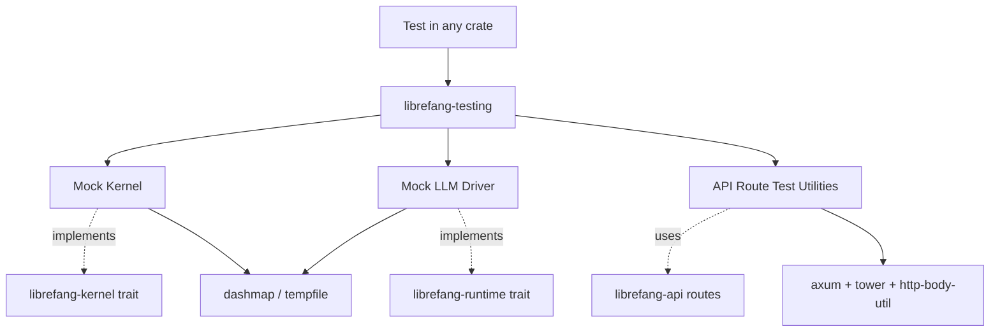

# Other — librefang-testing

# librefang-testing

Test infrastructure providing mock implementations of core system components and utilities for testing API routes.

## Purpose

This crate centralizes test-only tooling used across the `librefang` workspace. Rather than each crate shipping its own ad-hoc mocks and test helpers, `librefang-testing` provides:

- **Mock kernel** — a deterministic, in-memory stand-in for the real kernel, used in integration and unit tests that need kernel semantics without side effects.
- **Mock LLM driver** — a fake LLM backend that returns canned or configurable responses, allowing API and runtime logic to be tested without network calls or API keys.
- **API route test utilities** — helpers for constructing and invoking Axum routes in isolation, including request building, response body parsing, and test-state management.

## Dependencies & Rationale

| Dependency | Role in this crate |
|---|---|
| `librefang-types` | Shared domain types used in assertions and request/response construction. |
| `librefang-kernel` | Provides the trait/interface that the mock kernel implements. |
| `librefang-runtime` | Runtime abstractions the mock LLM driver satisfies. |
| `librefang-api` | Route definitions and handlers being tested; pulled with `telemetry` feature but without default features to keep the test dependency graph lean. |
| `axum`, `tower`, `http-body-util` | Building lightweight test servers, layering middleware, and reading response bodies without spinning up a real HTTP listener. |
| `dashmap` | Concurrent map used internally by mocks to track state across async calls. |
| `tempfile` | Creating ephemeral directories/files for tests that touch the filesystem. |
| `toml`, `serde_json` | Serializing/deserializing configuration and request/response payloads in tests. |
| `uuid` | Generating deterministic or random identifiers within mocks. |
| `async-trait` | Implementing async trait methods on mock structs. |
| `tokio` | Async test runtime (`#[tokio::test]`). |

## Architecture

The mock kernel and mock LLM driver implement the same traits defined in `librefang-kernel` and `librefang-runtime` respectively. This allows tests to substitute the real implementations by simply swapping the dependency injection, keeping production code completely unaware of test infrastructure.

The API route utilities leverage Axum's `tower::ServiceExt` pattern—calling `.oneshot(request)` on a constructed router—so tests exercise the full middleware and handler stack without binding to a network port.

## Usage Patterns

### Using the Mock Kernel

Tests inject the mock kernel wherever the kernel trait is expected. The mock maintains state in memory (backed by `DashMap`), so successive calls reflect prior mutations—writes are visible to subsequent reads within the same test. Any temporary file or directory needs are handled via `tempfile`, which cleans up on drop.

### Using the Mock LLM Driver

The mock LLM driver implements the same async interface as production drivers. It can be pre-configured with specific responses, allowing tests to assert how the system handles various LLM outputs (valid responses, empty responses, errors) without network traffic or latency.

### Testing API Routes

The route test utilities handle the boilerplate of:

1. Constructing an Axum `Router` with the desired routes and middleware.
2. Building HTTP requests with appropriate headers, query parameters, and JSON bodies via `serde_json`.
3. Executing the request through the router using `tower::ServiceExt::oneshot`.
4. Reading and deserializing the response body with `http-body-util`.

This gives tests full coverage of request parsing, handler logic, middleware, and response serialization in a single function call.

## Relationship to Other Crates

`librefang-testing` is a **dev-only dependency**—it is never included in production builds. Other workspace crates reference it in their `[dev-dependencies]` to access mocks and utilities during `cargo test`. Because it depends on `librefang-api`, `librefang-kernel`, and `librefang-runtime`, it stays in sync with their interfaces: if a trait signature changes, the mocks must be updated, and compilation catches the mismatch immediately.