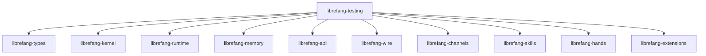

# Other — librefang-testing

# librefang-testing

Test infrastructure providing mock implementations and route-level test utilities for the LibreFang workspace.

## Purpose

This crate centralizes all test-facing infrastructure so that downstream crates can write integration and unit tests without reaching for real kernel interfaces, live LLM backends, or a running HTTP server. Everything lives behind deterministic, in-process fakes that can be inspected and controlled from test code.

Three categories of support are provided:

| Category | What it gives you |
|---|---|
| **Mock kernel** | An in-memory kernel stand-in that records invocations and returns caller-configured responses |
| **Mock LLM driver** | A fake LLM backend that skips network I/O and produces scripted completions |
| **API route test helpers** | Axum `Router` bootstrapping, request construction, and response body helpers |

## Workspace role

`librefang-testing` is a **dev-only dependency** — it is never compiled into production binaries. It sits at the top of the dependency graph, referencing almost every other workspace crate so that it can assemble fully-wired subsystems in isolation:



Because it pulls in the full stack, individual test suites can choose how much to mock. A test for an API route handler, for example, can swap in the mock LLM driver while still exercising the real kernel and memory subsystems.

## Key dependencies and why they matter

| Dependency | Role in this crate |
|---|---|
| `axum` / `tower` / `http-body-util` | Building an in-process `Router`, sending test requests, and reading response bodies without a live HTTP listener |
| `tokio` | Async runtime for all test helpers |
| `dashmap` | Concurrent map used internally by mocks to track call history across concurrent test tasks |
| `tempfile` | Creating temporary directories when a test needs an isolated filesystem root |
| `async-trait` | Defining mock implementations of async traits from `librefang-kernel` and `librefang-skills` |
| `serde` / `serde_json` | Serializing/deserializing fixture data and response bodies |

The `librefang-api` dependency is imported with `default-features = false` and only the `telemetry` feature, keeping the test helper lean while still supporting the tracing/span infrastructure the API layer expects.

## Usage patterns

### Consuming from another crate

Add the crate as a **dev-dependency** in the consumer's `Cargo.toml`:

```toml
[dev-dependencies]
librefang-testing = { path = "../librefang-testing" }
```

### Mock kernel

The mock kernel implements the same trait defined in `librefang-kernel` but operates entirely in memory. Tests configure expected return values before exercising the system under test, then assert against recorded call history to verify correct sequencing.

### Mock LLM driver

The mock LLM driver replaces the real driver from `librefang-skills` (or `librefang-extensions`). It accepts a pre-scripted sequence of completions and returns them in order, making prompt-generation logic fully deterministic.

### API route tests

Route-level helpers handle the boilerplate of constructing an `axum::Router` with the appropriate state, converting it into a `tower::Service`, and issuing requests via `http-body-util`. A typical test:

1. Builds a `Router` with test-appropriate state (mock kernel, mock LLM, etc.)
2. Constructs an HTTP request with the desired method, path, and body
3. Calls the router via `tower::ServiceExt::oneshot`
4. Reads and deserializes the response body

This avoids binding to a real TCP port and keeps tests fast and isolated.

## Guidelines for contributors

- **Do not add production code here.** This crate must never appear in a non-dev `[dependencies]` section.
- **Keep mocks minimal.** Only implement the surface area that current tests actually exercise. Unused mock methods should panic with a clear message so missing coverage is immediately visible.
- **Prefer deterministic defaults.** Mocks should return sensible zero-values or empty collections when no explicit expectation is configured, rather than panicking, unless the test explicitly opts into strict mode.
- **Reuse, don't re-create.** If multiple crates need the same fixture or helper, move it into this crate rather than duplicating it in each crate's `tests/` directory.