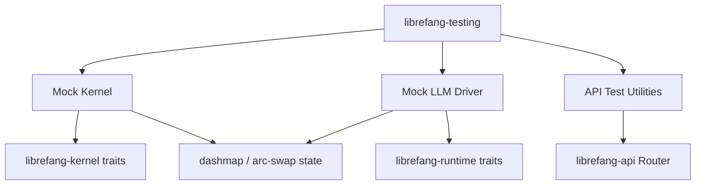

# Other — librefang-testing

# librefang-testing

Test infrastructure crate providing mock implementations and API route test utilities for the LibreFang workspace.

## Purpose

This crate centralizes all test doubles and testing helpers used across the LibreFang workspace. Rather than each crate defining its own ad-hoc mocks, `librefang-testing` provides canonical implementations of:

- **Mock kernel** — a deterministic stand-in for `librefang-kernel` that replaces I/O-heavy or nondeterministic behavior with controllable responses.
- **Mock LLM driver** — a fake LLM backend for testing prompt submission, response parsing, and error handling without network calls.
- **API route test utilities** — helpers for constructing test requests against `librefang-api` routes, including app construction, request sending, and response assertion.

Shipping these as a dedicated crate keeps test infrastructure versioned alongside the code it tests and avoids circular dependency issues.

## Dependencies

| Dependency | Role in this crate |
|---|---|
| `librefang-types` | Shared domain types used in test assertions and mock data construction |
| `librefang-kernel` | Traits to mock; the mock kernel implements kernel-facing trait objects |
| `librefang-runtime` | Runtime abstractions that the mock kernel or mock LLM may implement |
| `librefang-memory` | In-memory state helpers used by mocks to track calls and responses |
| `librefang-api` | Router and route definitions under test; pulled with `telemetry` feature enabled but without default features |
| `axum`, `tower` | HTTP test harness: builds a test `Router` and sends requests through the full Tower service stack |
| `tokio` | Async test runtime (`#[tokio::test]`) |
| `serde_json` | Constructing and inspecting JSON request/response bodies |
| `http-body-util` | Reading response bodies in tests |
| `dashmap` | Thread-safe interior-mutable state inside mocks (e.g., call counters, stored responses) |
| `arc-swap` | Atomically swapping mock behavior/responses between test cases |
| `tempfile` | Creating temporary directories for tests that touch the filesystem |
| `toml` | Generating TOML config fixtures |
| `uuid` | Generating deterministic or random UUIDs for test entities |

## Architecture



The three major components are independent but share a common pattern: each wraps a `DashMap` or `ArcSwap`-backed interior to allow tests to inspect what happened (call counts, received arguments) and control what happens next (preset responses, injected errors).

## Usage

Other crates depend on `librefang-testing` as a **dev-dependency**:

```toml
[dev-dependencies]
librefang-testing = { path = "../librefang-testing" }
```

Tests then import the mock they need and wire it into the component under test. The mock kernel and mock LLM driver implement the same trait objects as their production counterparts, so they can be injected through the same dependency paths.

The API route test utilities typically wrap `tower::ServiceExt` to send `axum::http::Request` objects through a fully composed router, letting tests exercise middleware, extractors, and handlers as a unit without binding a real TCP listener.

## Workspace Linting

This crate inherits workspace-level lints via `[lints] workspace = true`, keeping its style consistent with the rest of the monorepo.