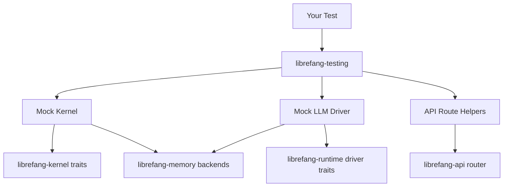

# Other — librefang-testing

# librefang-testing

Test infrastructure crate providing mock implementations and utilities for integration and unit tests across the librefang workspace.

## Purpose

This crate centralizes reusable test support code so that other crates don't each build their own mock implementations. It provides three categories of test infrastructure:

- **Mock kernel** — a stand-in for `librefang-kernel` that allows tests to drive execution without a real kernel backend.
- **Mock LLM driver** — simulates LLM responses for tests that exercise prompt construction, response parsing, or multi-turn interactions.
- **API route test utilities** — helpers for constructing `axum` test requests, wiring up router state, and asserting on responses.

## Dependency Rationale

| Dependency | Role in testing |
|---|---|
| `librefang-types` | Shared domain types used in test assertions and fixture construction |
| `librefang-kernel` | Traits/interfaces that the mock kernel implements |
| `librefang-runtime` | Runtime types needed to configure test environments |
| `librefang-memory` | In-memory backends used as lightweight substitutes in tests |
| `librefang-api` (feature `telemetry`) | Route handlers and router construction under test |
| `axum` + `tower` | Building and invoking HTTP routes without a live server |
| `http-body-util` | Reading response bodies in route tests |
| `tokio` | Async test runtime |
| `dashmap` | Concurrent state inside mocks (safe across `&self` + `Send` bounds) |
| `arc-swap` | Atomic swapping of mock behavior/state between test steps |
| `tempfile` | Temporary directories for tests that touch the filesystem |
| `toml` | Parsing inline TOML fixtures |
| `uuid` | Generating deterministic or random UUIDs for test entities |
| `serde_json` | JSON construction and assertion helpers |

## Architecture


```mermaid
graph TD
    A[Your Test] --> B[librefang-testing]
    B --> C[Mock Kernel]
    B --> D[Mock LLM Driver]
    B --> E[API Route Helpers]
    C --> F[librefang-kernel traits]
    D --> G[librefang-runtime driver traits]
    E --> H[librefang-api router]
    C --> I[librefang-memory backends]
    D --> I
```

Tests depend on this crate as a `dev-dependency`. The mock implementations satisfy the same traits as their production counterparts, so tests inject mocks at the boundary and exercise the system under test in isolation.

## Usage in Workspace Crates

Reference this crate as a dev-dependency:

```toml
[dev-dependencies]
librefang-testing = { path = "../librefang-testing" }
```

The crate is intentionally not published — it has no production consumers and exists solely to support the workspace's test suite.

## Notes

- Because this crate pulls in `librefang-api` with the `telemetry` feature (but `default-features = false`), route tests get observability wiring without pulling in unrelated default features of the API crate.
- The use of `arc-swap` and `dashmap` in mocks means tests can reconfigure mock behavior mid-test (e.g., switching from "return success" to "return error" between requests) without requiring `&mut` access, which is essential when the mock is shared across concurrent tasks.