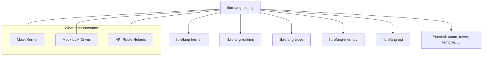

# Other — librefang-testing

# librefang-testing

Shared test infrastructure for the LibreFang workspace. Provides reusable mocks, helpers, and utilities so that integration and unit tests across crates can exercise real logic without requiring a live kernel, LLM backend, or HTTP server.

## Purpose

Testing in a multi-crate project tends to duplicate boilerplate: building mock implementations, spinning up ephemeral Axum routers, constructing fixture data, and so on. `librefang-testing` centralises that machinery. Other crates depend on it as a dev-dependency and get immediate access to:

- **A mock kernel** that satisfies `librefang-kernel` traits without touching hardware or a real kernel process.
- **A mock LLM driver** that satisfies the runtime's LLM abstraction, returning canned responses.
- **Axum route test utilities** for constructing test routers, sending requests, and inspecting responses without network I/O.

## Architecture


```mermaid
graph TD
    T[librefang-testing] --> KT[librefang-kernel]
    T --> RT[librefang-runtime]
    T --> TY[librefang-types]
    T --> MEM[librefang-memory]
    T --> API[librefang-api]
    T --> EXT[External: axum, tower, tempfile, ...]

    subgraph "What tests consume"
        MK[Mock Kernel]
        ML[Mock LLM Driver]
        AR[API Route Helpers]
    end

    T --- MK
    T --- ML
    T --- AR
```

## Key Components

### Mock Kernel

Implements the kernel traits defined in `librefang-kernel`, backed by in-memory state (via `dashmap` and `arc-swap`) instead of a real kernel interface. Tests can:

- Pre-load state that the kernel would normally derive from hardware or system configuration.
- Assert which kernel operations were invoked and with what arguments.
- Simulate error conditions by configuring the mock to return specific failures.

This allows `librefang-kernel`, `librefang-runtime`, and any consumer that depends on the kernel to be tested end-to-end without a real kernel present.

### Mock LLM Driver

Implements the LLM driver trait from `librefang-runtime`. Rather than making network calls to an LLM provider, it returns deterministic, pre-configured responses. This gives tests:

- Predictable output for assertion-based testing.
- Control over latency and error injection (simulate timeouts, malformed responses, rate limits).
- Zero external dependency — tests run offline and fast.

### API Route Test Utilities

Wraps `axum`, `tower`, and `http-body-util` to provide a lightweight harness for testing HTTP route handlers:

- **Router construction** — Build an Axum `Router` with the same middleware and state used in production, but backed by mock kernel/LLM instances.
- **Request helpers** — Send requests through the Tower service stack directly (no TCP), parse JSON bodies, and inspect status codes and response payloads.
- **State injection** — Pass test-specific state (including mock implementations) into the router so handlers exercise real logic against fake dependencies.

## Dependencies

| Crate | Role in this module |
|---|---|
| `librefang-kernel` | Provides traits the mock kernel implements. |
| `librefang-runtime` | Provides the LLM driver trait the mock satisfies. |
| `librefang-api` | Route definitions and shared API state types; pulled with `telemetry` feature enabled. |
| `librefang-types` | Shared domain types used across all mocks and fixtures. |
| `librefang-memory` | Memory abstractions used when constructing in-memory test state. |
| `dashmap` | Concurrent map used internally by mocks for thread-safe state tracking. |
| `arc-swap` | Atomic swapping of shared state, mirroring patterns used in production code. |
| `tempfile` | Temporary directories and files for tests that touch the filesystem. |
| `toml` | Parsing inline TOML configuration for test fixtures. |
| `uuid` | Generating deterministic or random UUIDs for test entities. |
| `http-body-util` | Body comprehension helpers for inspecting Axum response bodies. |

## Usage

Add to a crate's `Cargo.toml` as a dev-dependency:

```toml
[dev-dependencies]
librefang-testing = { path = "../librefang-testing" }
```

Then use the re-exported mocks and helpers in test modules. The mock types implement the same traits as their production counterparts, so they can be passed directly into any function or constructor that expects a kernel, LLM driver, or API state object.

## Conventions

- **No test execution of its own.** This crate contains no `#[test]` functions. It is purely a library for other crates' tests.
- **No side effects on import.** Constructing mock instances allocates only in-memory state. Nothing touches the network, filesystem (unless you explicitly use `tempfile` helpers), or external services.
- **Thread-safe by default.** All mock state uses `dashmap` or `arc-swap`, so tests can exercise concurrent code paths without data races.