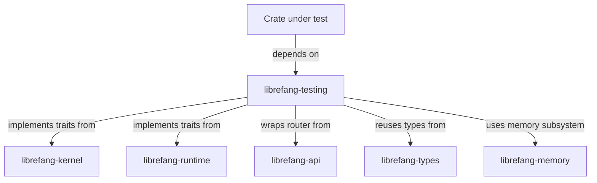

# Other — librefang-testing

# librefang-testing

Test infrastructure providing mock implementations of kernel and LLM driver interfaces, along with utilities for testing API routes in isolation.

## Purpose

This crate centralises all test-only code so that downstream crates can write integration and unit tests without depending on real hardware, external LLM services, or live network endpoints. It ships three building blocks:

| Component | Replaces | Primary consumers |
|---|---|---|
| Mock kernel | Real kernel back-end (`librefang-kernel`) | Runtime tests, memory tests |
| Mock LLM driver | External LLM API calls (`librefang-runtime`) | Prompt/response pipeline tests |
| API route test helpers | Live HTTP server / network stack | `librefang-api` route handlers |

## Architecture


```mermaid
graph TD
    A["Crate under test"] -->|depends on| B[librefang-testing]
    B -->|implements traits from| C[librefang-kernel]
    B -->|implements traits from| D[librefang-runtime]
    B -->|wraps router from| E[librefang-api]
    B -->|reuses types from| F[librefang-types]
    B -->|uses memory subsystem| G[librefang-memory]
```

The mock implementations satisfy the same trait contracts that the real crates expose, allowing dependency injection in test setups.

## Key Dependencies and Their Roles

| Dependency | Role in this crate |
|---|---|
| `librefang-kernel` | Provides the traits the mock kernel must implement. |
| `librefang-runtime` | Provides the LLM driver trait the mock driver implements. |
| `librefang-api` | Supplies the Axum `Router` and route handlers; imported with the `telemetry` feature enabled so tests can exercise observability paths. |
| `librefang-types` / `librefang-memory` | Shared domain types and memory abstractions used in test fixtures and assertions. |
| `axum` + `tower` | Used to construct a test-only HTTP service layer for invoking route handlers without binding a real TCP listener. |
| `http-body-util` | Enables reading and asserting on full response bodies returned by the test service. |
| `tokio` | Async runtime for `#[tokio::test]`-style tests. |
| `dashmap` + `arc-swap` | Thread-safe interior mutability inside mock state so multiple concurrent test tasks can inspect or mutate shared mock data. |
| `tempfile` | Creates isolated temporary directories for tests that touch the filesystem (e.g., snapshot storage, config loading). |
| `toml` | Parsing inline or fixture TOML configuration in tests. |
| `uuid` | Generating deterministic or random identifiers for test entities. |
| `serde_json` | Constructing and comparing JSON payloads in API route tests. |

## Usage Patterns

### Mock Kernel

The mock kernel implements the kernel trait from `librefang-kernel` with canned responses or recorded call history. Inject it wherever a kernel handle is expected:

```rust
// Inside a test in another crate
use librefang_testing::MockKernel;

let kernel = MockKernel::new(/* configuration */);
// Pass `kernel` to the code under test
```

Because state is backed by `DashMap` and `ArcSwap`, tests can mutate mock behaviour mid-test (e.g., inject a fault) and verify call order or arguments after the fact.

### Mock LLM Driver

The mock LLM driver satisfies the driver trait from `librefang-runtime`. It returns pre-configured responses without making network calls, enabling deterministic testing of prompt construction, response parsing, and error-handling paths.

### API Route Test Helpers

These utilities build an in-process Axum `Router` (using `tower::ServiceExt`) so you can send synthetic HTTP requests and assert on status codes, headers, and body content:

```rust
use librefang_testing::api_test_helpers::*;   // illustrative import path

let app = build_test_router();
let response = app.oneshot(request).await.unwrap();
assert_eq!(response.status(), StatusCode::OK);
```

Helpers may also provide convenience functions for constructing authenticated requests, seeding database state, or parsing response bodies via `http-body-util` and `serde_json`.

## Relationship to the Rest of the Workspace

`librefang-testing` is a **dev-only** dependency — it is never included in production builds. Other workspace crates reference it through `[dev-dependencies]` to keep their test suites hermetic and fast. Because it consumes public APIs from `librefang-kernel`, `librefang-runtime`, `librefang-api`, `librefang-types`, and `librefang-memory`, it also acts as an integration surface: if a public trait changes, compilation errors here surface immediately.