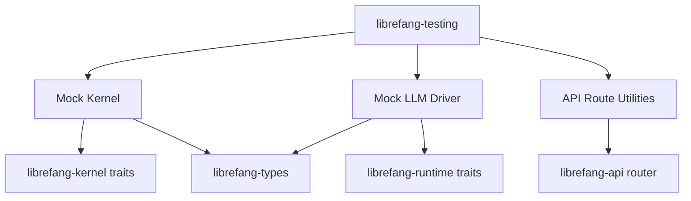

# Other — librefang-testing

# librefang-testing

Test infrastructure for the LibreFang project. Provides reusable mock implementations and test harnesses that allow integration and unit tests to run without real hardware, a live kernel, or an external LLM service.

## Purpose

Testing across the LibreFang stack would otherwise require:

- A running kernel exposing syscalls and device interfaces
- A live LLM API endpoint with valid credentials
- A fully wired HTTP server with real state

This crate eliminates those requirements by shipping mock implementations and lightweight test utilities. Other crates depend on `librefang-testing` only in `[dev-dependencies]` and get deterministic, fast, isolated test runs.

## Key Components

### Mock Kernel

A stand-in for `librefang-kernel` that simulates kernel responses without requiring actual hardware or a kernel process. Tests using the mock kernel get predictable behavior and can assert on interactions that would be difficult or dangerous to reproduce against a real kernel.

Depends on: `librefang-kernel`, `librefang-types`

### Mock LLM Driver

Simulates the LLM backend so that API route handlers and runtime code can be tested end-to-end without network calls or API keys. The mock can be configured to return specific responses, delays, or errors as test scenarios demand.

Depends on: `librefang-runtime`, `async-trait`

### API Route Test Utilities

Helpers for constructing test requests against `librefang-api` route handlers. These utilities handle the boilerplate of wiring up an `axum` router with test-appropriate state, making requests, and inspecting responses.

Depends on: `librefang-api` (with `telemetry` feature), `axum`, `tower`, `http-body-util`, `serde_json`

## Dependency Rationale

| Dependency | Role in this crate |
|---|---|
| `librefang-types` | Shared type definitions used across mocks |
| `librefang-kernel` | Traits and types that the mock kernel implements |
| `librefang-runtime` | Runtime traits that the mock LLM driver implements |
| `librefang-memory` | Memory abstractions needed by mock kernel or test fixtures |
| `librefang-api` | Router construction and route handler types for test utilities |
| `axum` / `tower` | HTTP test infrastructure — building test routers, sending requests |
| `http-body-util` | Body extraction from HTTP responses in assertions |
| `serde_json` | Serializing/deserializing request and response payloads |
| `tokio` | Async runtime for tests (`#[tokio::test]`) |
| `async-trait` | Async trait implementations for mock drivers |
| `arc-swap` | Shared mutable state in mock implementations |
| `dashmap` | Concurrent map for tracking mock call histories or state |
| `tempfile` | Temporary directories for tests that touch the filesystem |
| `toml` | Parsing/generating config TOML for test setups |
| `uuid` | Generating test identifiers |

## Usage

Add to `[dev-dependencies]` in any workspace crate that needs test infrastructure:

```toml
[dev-dependencies]
librefang-testing = { path = "../librefang-testing" }
```

Because the crate pulls in `axum`, `tower`, and `tokio`, it is intentionally kept out of regular dependencies to avoid bloating production builds.

## Architecture


```mermaid
graph TD
    T[librefang-testing] --> MK[Mock Kernel]
    T --> ML[Mock LLM Driver]
    T --> AU[API Route Utilities]
    MK --> KT[librefang-kernel traits]
    ML --> RT[librefang-runtime traits]
    AU --> AP[librefang-api router]
    MK --> TY[librefang-types]
    ML --> TY
```

Each mock component implements the same traits as its production counterpart, so tests can swap in the mock via dependency injection or test-specific state construction without changing the code under test.

## Linting

The crate inherits workspace-level lints via `[lints] workspace = true`, ensuring consistent style and correctness checks across the project.