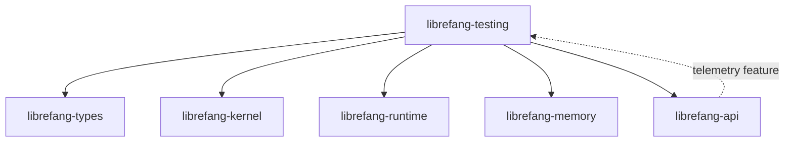

# Other — librefang-testing

# librefang-testing

Test infrastructure crate providing mock implementations and API route testing utilities for the librefang workspace.

## Purpose

This crate centralizes all test-only code so that downstream crates can share consistent, reusable mocks instead of each crate rolling its own. It provides three categories of test support:

- **Mock kernel** — a stand-in for `librefang-kernel` that eliminates the need for real kernel resources during tests.
- **Mock LLM driver** — simulates LLM interactions without hitting external services.
- **API route test utilities** — helpers for constructing Axum router instances and issuing HTTP requests against them in isolation.

## Dependencies & Relationships


```mermaid
graph TD
    T[librefang-testing]
    T --> KT[librefang-types]
    T --> KK[librefang-kernel]
    T --> KR[librefang-runtime]
    T --> KM[librefang-memory]
    T --> KA[librefang-api]
    KA -.->|telemetry feature| T
```

The crate depends on nearly every sibling library in the workspace, which allows it to construct realistic test environments. The dependency on `librefang-api` is notable because it enables only the `telemetry` feature (with `default-features = false`), avoiding pulling in unnecessary production defaults while still allowing tests to observe telemetry data.

### External crate rationale

| Crate | Why it's here |
|---|---|
| `axum` + `tower` | Build test routers and service middleware stacks for route tests |
| `http-body-util` | Read and inspect HTTP response bodies in assertions |
| `tokio` | Async test runtime |
| `dashmap` | Thread-safe state inside mocks (e.g., recording call histories) |
| `arc-swap` | Atomic swapping of mock configurations mid-test |
| `tempfile` | Create temporary directories/files for tests that touch the filesystem |
| `toml` | Parse or generate TOML config fixtures |
| `serde_json` | Construct and compare JSON in API responses |
| `uuid` | Generate deterministic or random UUIDs for test entities |

## Usage

Add the crate as a **dev-dependency** in the crate under test:

```toml
[dev-dependencies]
librefang-testing = { path = "../librefang-testing" }
```

Because this is a test-only crate, it should never appear in `[dependencies]` of a published binary or library.

## Design Notes

- **No production call graph.** This crate has no incoming or outgoing runtime calls in the normal execution flow. It exists exclusively on the test compilation target, so it does not contribute to binary size or compile times of production builds.
- **Shared mocks reduce drift.** By keeping all mock implementations here, changes to `librefang-kernel` or `librefang-api` interfaces only require updating one set of mocks rather than scattered per-crate test helpers.
- **Telemetry-enabled API dep.** The `librefang-api` dependency uses only the `telemetry` feature so tests can assert on emitted telemetry without enabling heavier default features.