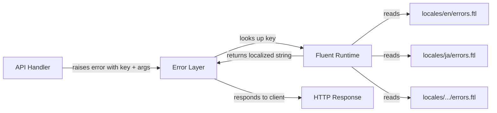

# Other — librefang-types-locales

# librefang-types-locales

Fluent (FTL) localization resources for LibreFang API error messages. This module provides translated error strings consumed at runtime by the Fluent localization system, with English (`en`) as the canonical/complete source and additional locales shipping partial or full translations.

## Directory Layout

```
librefang-types/locales/
├── de/errors.ftl       # German
├── en/errors.ftl       # English (canonical — most complete)
├── es/errors.ftl       # Spanish
├── fr/errors.ftl       # French
├── ja/errors.ftl       # Japanese
└── zh-CN/errors.ftl    # Simplified Chinese
```

Each file contains a single Fluent message group: `errors.ftl`. Additional FTL files can be added alongside `errors.ftl` within a locale directory as the application grows.

## Fluent Message Format

Messages use [Project Fluent](https://projectfluent.org/) syntax:

```ftl
# Simple message
api-error-agent-not-found = Agent not found

# Message with interpolation variable
api-error-message-delivery-failed = Message delivery failed: { $reason }

# Comments denote domain sections
# Agent errors
# Message errors
# ...
```

Variables in curly braces (`{ $reason }`, `{ $name }`, `{ $error }`, `{ $id }`, `{ $step }`, etc.) are passed in at the call site when the error is raised.

## Error Message Namespacing

All message identifiers follow the pattern `api-error-<domain>-<detail>`:

| Prefix | Domain |
|---|---|
| `api-error-agent-*` | Agent lifecycle and execution |
| `api-error-message-*` | Inter-agent messaging |
| `api-error-template-*` | Template management |
| `api-error-manifest-*` | Manifest parsing and verification |
| `api-error-auth-*` | Authentication / API keys |
| `api-error-session-*` | Session management |
| `api-error-workflow-*` | Workflow orchestration |
| `api-error-trigger-*` | Event triggers |
| `api-error-budget-*` | Cost/token budgets |
| `api-error-config-*` | Configuration read/write |
| `api-error-profile-*` | Agent profiles |
| `api-error-cron-*` | Scheduled (cron) jobs |
| `api-error-goal-*` | Goal tracking |
| `api-error-memory-*` | Proactive memory / KV store |
| `api-error-network-*` | Peer networking / A2A |
| `api-error-plugin-*` | Plugin installation |
| `api-error-channel-*` | Inter-agent channels |
| `api-error-provider-*` | LLM provider management |
| `api-error-skill-*` | Skill creation and installation |
| `api-error-hand-*` | Hand (capability) system |
| `api-error-mcp-*` | MCP server configuration |
| `api-error-integration-*` / `api-error-extension-*` | Integrations and extensions |
| `api-error-system-*` | System-level errors |
| `api-error-kv-*` | Structured key-value memory |
| `api-error-approval-*` | Approval workflow |
| `api-error-webhook-*` | Webhook triggers |
| `api-error-backup-*` | Backup creation and restore |
| `api-error-schedule-*` | Scheduled tasks |
| `api-error-job-*` / `api-error-task-*` | Async job/task tracking |
| `api-error-pairing-*` | Device pairing |
| `api-error-binding-*` | Binding index |
| `api-error-command-*` | Command dispatch |
| `api-error-file-*` | File upload and workspace access |
| `api-error-tool-*` | Tool invocation and allowlisting |
| `api-error-validation-*` | Input validation |
| `api-error-*` (unprefixed) | General catch-alls |

## Locale Completeness

English (`en`) is the authoritative locale with the full set of messages. Other locales vary in coverage:

| Locale | Coverage | Notes |
|---|---|---|
| `en` | Full | All domains including goal, memory, network, provider, skill, webhook, backup, schedule, file, tool, etc. |
| `ja` | Full | Parity with English |
| `de`, `es`, `fr`, `zh-CN` | Partial | Core domains (agent, message, template, manifest, auth, session, workflow, trigger, budget, config, profile, cron, general). Missing newer domains. |

When a key is missing from a non-English locale, the Fluent system falls back to the English message. This means partial translations are safe to ship — untranslated errors will render in English rather than crashing.

## Interpolation Variables

These are the variables referenced across messages. Call sites must supply them:

| Variable | Used in | Example |
|---|---|---|
| `$reason` | `message-delivery-failed`, `bad-request`, `network-connection-failed`, `network-task-post-failed`, `webhook-url-unreachable` | Human-readable failure reason |
| `$error` | `template-parse-failed`, `manifest-invalid`, `config-parse-failed`, `config-write-failed`, `agent-execution-failed`, `agent-clone-spawn-failed`, `cron-create-failed`, `schedule-save-failed`, `backup-dir-create-failed`, `skill-dir-create-failed`, etc. | Error detail or inner message |
| `$name` | `template-not-found`, `profile-not-found`, `provider-alias-not-found`, `skill-missing-name`, `tool-not-found`, `command-not-found`, `webhook-unknown-event` | Resource identifier |
| `$id` | `agent-not-found-with-id`, `goal-not-found-with-id`, `hand-not-found`, `provider-model-not-found`, `integration-not-found`, `extension-not-found` | Resource ID |
| `$step` | `workflow-step-needs-agent` | Workflow step name |
| `$alias` | `provider-alias-exists`, `provider-alias-not-found` | Provider alias |
| `$url` | `network-a2a-not-found`, `network-missing-url` | URL parameter |
| `$status` | `network-auth-failed` | HTTP status code |
| `$field` | `agent-invalid-sort`, `cron-invalid-expression-detail` | Field name |
| `$valid` | `agent-invalid-sort`, `webhook-unknown-event` | List of valid values |
| `$max` | `skill-description-too-long`, `file-too-large` | Maximum allowed value |
| `$provider` | `provider-model-exists` | Provider name |
| `$event` | `webhook-unknown-event` | Event type string |

## Adding a New Error Message

1. **Add to `en/errors.ftl` first** — this is the source of truth. Follow the naming convention and include a section comment:

   ```ftl
   # NewDomain errors
   api-error-newdomain-example-failed = Example operation failed: { $detail }
   ```

2. **Add to other locale files** as translations become available. Until then, the English fallback is used automatically.

3. **Use kebab-case** for the identifier suffix and keep it descriptive. Avoid abbreviations that are unclear outside the API layer.

## Adding a New Locale

Create a new directory under `locales/` using the appropriate language tag:

```
locales/pt-BR/errors.ftl
```

Start by translating the general errors and the most common domain messages (agent, message, auth, session). The Fluent system handles missing-key fallback, so a partial translation is functional immediately.

## Architecture Context



This module is purely declarative — it contains no executable code. It is consumed by the Fluent localization runtime at the API error-handling layer. The runtime resolves a message identifier (e.g., `api-error-agent-not-found`) plus any interpolation arguments to a translated string for the current request locale.