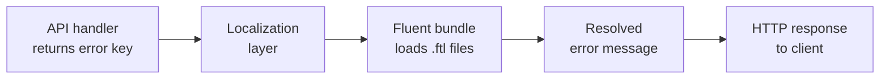

# Other — librefang-types-locales

# librefang-types/locales — API Error Message Localizations

## Overview

This module contains localized API error messages for the LibreFang platform, stored as [Fluent](https://projectfluent.org/) (`.ftl`) resource files. Every user-facing error returned by the API is defined here, keyed by a stable message identifier, with translations provided across six locales. Consuming code resolves these keys at runtime via a Fluent localization framework to return error text in the caller's preferred language.

## Directory Structure

```
librefang-types/locales/
├── de/errors.ftl       # German
├── en/errors.ftl       # English (canonical — most complete)
├── es/errors.ftl       # Spanish
├── fr/errors.ftl       # French
├── ja/errors.ftl       # Japanese
└── zh-CN/errors.ftl    # Simplified Chinese
```

Each locale directory follows the standard `<language-tag>/errors.ftl` layout expected by Fluent's locale resolver. Only one resource file (`errors.ftl`) exists per locale currently, covering all API error messages.

## Fluent Message Format

Messages use standard Fluent syntax. Simple messages are plain key-value pairs:

```fluent
api-error-agent-not-found = Agent not found
```

Parameterized messages use Fluent placeables to inject dynamic values:

```fluent
api-error-message-delivery-failed = Message delivery failed: { $reason }
api-error-template-not-found = Template '{ $name }' not found
api-error-cron-create-failed = Failed to create cron job: { $error }
```

Parameters used across messages include `$reason`, `$error`, `$name`, `$id`, `$step`, `$field`, `$valid`, `$url`, `$status`, `$alias`, `$provider`, `$max`, and `$event`. When adding or updating messages, ensure all locales that translate a message include the same set of parameters.

## Message Naming Convention

All message identifiers follow the pattern:

```
api-error-<domain>-<detail>
```

Where `<domain>` is a hyphen-separated subsystem name and `<detail>` describes the specific condition. For example:

| Identifier | Domain | Detail |
|---|---|---|
| `api-error-agent-not-found` | agent | not-found |
| `api-error-workflow-missing-steps` | workflow | missing-steps |
| `api-error-provider-alias-exists` | provider | alias-exists |
| `api-error-webhook-url-unreachable` | webhook | url-unreachable |

## Error Domains

The English locale (`en/errors.ftl`) is the canonical source and defines the full set of error domains. The domains are:

| Domain | Description |
|---|---|
| `agent` | Agent lifecycle — spawn, lookup, workspace, cloning, sorting |
| `message` | Inter-agent messaging — size limits, delivery, streaming |
| `template` | Agent templates — parsing, lookup, manifest requirements |
| `manifest` | Template manifests — size, format, signature verification |
| `auth` | API key authentication — missing/invalid keys and headers |
| `session` | Conversational sessions — load, lookup, cleanup |
| `workflow` | Multi-step workflows — step validation, execution |
| `trigger` | Event triggers — pattern validation, registration |
| `budget` | Cost budgets — amount validation, updates |
| `config` | Runtime configuration — parse, write, save, remove |
| `profile` | Named profiles — lookup |
| `cron` | Scheduled tasks (cron) — expression validation, CRUD |
| `goal` | Goal tracking — titles, hierarchy, status, CRUD |
| `memory` | Agent memory — export/import, KV store operations |
| `network` | Peer networking / A2A — connections, auth, task posting |
| `plugin` | Plugin installation — source validation, required fields |
| `channel` | Inter-agent channels — agent ID validation |
| `provider` | LLM providers — aliases, models, API keys, URLs, secrets |
| `skill` | Agent skills — naming, creation, installation |
| `hand` | Hand management — definitions and instances |
| `mcp` | MCP server configuration — transport, validation |
| `integration` / `extension` | Integrations and extensions — lookup |
| `system` | System-level — CLI availability |
| `kv` | Structured KV memory — fields, values, paths |
| `approval` | Human-approval workflow — ID validation, lookup |
| `webhook` | Webhook triggers — URL validation, event types, publishing |
| `backup` | Backup/restore — archive validation, file operations |
| `schedule` | Named schedules — cron validation, CRUD |
| `job` | Background jobs — retryability, disappearance |
| `task` | Tasks — lookup, disappearance |
| `pairing` | Device/token pairing — enablement, validation |
| `binding` | Bindings — index range |
| `command` | Commands — lookup |
| `file` | File uploads — size, type, path traversal, workspace |
| `tool` | Tool invocation — allowlist, approval requirements |
| `validation` | General field validation — content, name, title, avatar, color |
| *(unprefixed)* | General — not-found, internal, bad-request, rate-limited |

## Locale Coverage

Locales have different levels of coverage. The English locale is the authoritative source with the complete message set. Other locales may contain a subset:

| Locale | Status |
|---|---|
| `en` | **Canonical** — full coverage across all domains |
| `ja` | Near-complete — covers most domains including goals, memory, webhooks, schedules, jobs, tools |
| `zh-CN` | Partial — core domains plus tool-specific messages |
| `de`, `es`, `fr` | **Minimal** — covers only the original core domains (agent, message, template, manifest, auth, session, workflow, trigger, budget, config, profile, cron, general) |

When a message key is missing from a non-English locale, the Fluent framework typically falls back to the English message. However, this fallback behavior depends on the consuming application's localization configuration.

## Adding a New Error Message

1. **Add to `en/errors.ftl` first** — this is the canonical source. Place the message under the correct domain section, or create a new section comment if it's a new domain.

2. **Copy to other locales** — add the translated message to each locale's `errors.ftl`. If a translation is not yet available, you may omit it (the framework will fall back to English), but do not leave a placeholder with English text in a non-English file.

3. **Preserve parameter names** — if the English message uses `{ $error }`, the translated message must also reference `{ $error }` exactly. Fluent will raise errors at runtime if a referenced variable is not provided.

Example addition to `en/errors.ftl`:

```fluent
# Widget errors
api-error-widget-not-found = Widget '{ $id }' not found
api-error-widget-create-failed = Failed to create widget: { $error }
```

Corresponding addition to `ja/errors.ftl`:

```fluent
# ウィジェットエラー
api-error-widget-not-found = ウィジェット '{ $id }' が見つかりません
api-error-widget-create-failed = ウィジェットの作成に失敗しました: { $error }
```

## Adding a New Locale

1. Create a new directory under `locales/` using a valid [BCP 47](https://tools.ietf.org/html/bcp47) language tag (e.g., `pt-BR/`, `ko/`).
2. Create `errors.ftl` inside it.
3. Translate messages from `en/errors.ftl`. Maintain the same message identifiers and section comments. Only translate the right-hand side (the message value), never the identifier.
4. Register the new locale with the consuming application's Fluent bundle configuration (outside this module).

## Integration with the Codebase

This module is a pure data module — it contains no executable code. The `.ftl` files are loaded at application startup by the Fluent localization runtime bundled into the API server. The typical integration flow is:



API route handlers return error identifiers (e.g., `"api-error-agent-not-found"`) rather than hardcoded strings. The localization layer resolves the identifier against the user's `Accept-Language` header (or an explicit locale parameter) and returns the translated string. This ensures consistent error messaging and simplifies internationalization across all API endpoints.