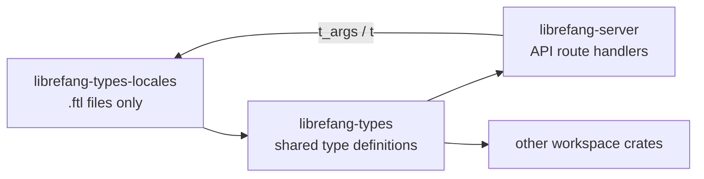

# Other — librefang-types-locales

# librefang-types-locales

## Overview

This module provides the localized API error message catalog for LibreFang. It contains [Fluent](https://projectfluent.org/) (`.ftl`) resource files — one per supported language — that map semantic error identifiers to human-readable strings. The API layer looks up keys at runtime via `t_args("key", …)` and returns the translated message to the caller.

There is no executable Rust code in this module. It is a pure **resource crate** consumed by whatever localization crate the server uses (likely `fluent` / `fluent-bundle`).

## File layout

```
librefang-types/locales/
├── de/errors.ftl      # German
├── en/errors.ftl      # English (canonical / most complete)
├── es/errors.ftl      # Spanish
├── fr/errors.ftl      # French
├── ja/errors.ftl      # Japanese
└── zh-CN/errors.ftl   # Simplified Chinese
```

Every file follows the same naming convention: `<language-tag>/errors.ftl`. The Fluent locale resolver selects the correct directory based on the negotiated language at request time.

## Message format

Each line is a Fluent message definition:

```fluent
<message-id> = <translated text>
```

Messages can interpolate variables using `{ $var }`:

```fluent
api-error-template-not-found = Template '{ $name }' not found
api-error-message-delivery-failed = Message delivery failed: { $reason }
api-error-generic = { $error }
```

The caller provides these variables through `t_args`. For example, `t_args("api-error-template-not-found", name = "analyst")` resolves to `"Template 'analyst' not found"`.

## Error domain categories

Messages are grouped by the subsystem that produces them. The prefix of the key encodes the domain.

### Core resource domains

| Prefix | Domain | Typical HTTP codes |
|---|---|---|
| `api-error-agent-*` | Agent lifecycle (spawn, lookup, execution, clone) | 404, 409, 500 |
| `api-error-session-*` | Session management (load, lookup, cleanup) | 400, 404, 500 |
| `api-error-message-*` | Inter-agent message delivery and streaming | 400, 500 |
| `api-error-workflow-*` | Multi-step workflow definition and execution | 400, 404, 500 |
| `api-error-trigger-*` | Event trigger registration and matching | 400, 404, 500 |
| `api-error-cron-*` | Scheduled (cron) job management | 400, 404, 500 |
| `api-error-schedule-*` | Schedule CRUD operations | 400, 404, 500 |
| `api-error-job-*` / `api-error-task-*` | Background job/task tracking | 400, 404 |

### Data and configuration domains

| Prefix | Domain |
|---|---|
| `api-error-template-*` | Agent template parsing and lookup |
| `api-error-manifest-*` | Template manifest validation and signature |
| `api-error-config-*` | TOML configuration read/write |
| `api-error-profile-*` | Named profile lookup |
| `api-error-budget-*` | Cost budget limits |
| `api-error-goal-*` | Hierarchical goal tracking |
| `api-error-memory-*` | Proactive memory KV store |
| `api-error-kv-*` | Structured key-value fields |
| `api-error-file-*` | File upload/download and workspace paths |
| `api-error-backup-*` | System backup creation and restoration |

### Integration domains

| Prefix | Domain |
|---|---|
| `api-error-auth-*` | API key authentication |
| `api-error-provider-*` | LLM provider/model configuration |
| `api-error-network-*` | Peer-to-peer / A2A networking |
| `api-error-plugin-*` | Plugin installation (registry/local/git) |
| `api-error-skill-*` | Custom skill creation and installation |
| `api-error-mcp-*` | Model Context Protocol server config |
| `api-error-channel-*` | Inter-agent channel routing |
| `api-error-hand-*` | Hand definitions and instances |
| `api-error-webhook-*` | Outbound webhook triggers |
| `api-error-integration-*` / `api-error-extension-*` | Third-party integrations |
| `api-error-approval-*` | Human-in-the-loop approval flow |
| `api-error-tool-*` | Direct tool invocation |
| `api-error-command-*` | CLI command dispatch |
| `api-error-pairing-*` | Device/entity pairing |
| `api-error-binding-*` | Binding index validation |

### Catch-all and general keys

| Key | Purpose |
|---|---|
| `api-error-generic` | Interpolates the raw error string verbatim. Used as a stopgap by 41+ HTTP 500 handlers that have not yet been migrated to typed error helpers. |
| `api-error-not-found` | Generic 404 |
| `api-error-internal` | Generic 500 |
| `api-error-bad-request` | Generic 400 with `{ $reason }` |
| `api-error-rate-limited` | Generic 429 |

## Language parity

English (`en`) is the **canonical** locale and contains every defined key. Other languages cover a subset:

- **Full parity with English**: `ja` (Japanese) — all domains including goal, memory, network, provider, skill, webhook, backup, schedule, job, file, tool, validation, and general keys.
- **Partial parity**: `de`, `es`, `fr`, `zh-CN` — cover agent, message, template, manifest, auth, session, workflow, trigger, budget, config, profile, cron, and general keys. Missing domains include goal, memory, network, plugin, channel, provider, skill, hand, MCP, webhook, backup, schedule, job, file, tool, validation, and approval.

When a key is missing from a non-English locale, the Fluent resolver falls back to English. The application never returns a raw key to the client unless the key is also absent from English.

## Naming conventions

All keys share the `api-error-` prefix followed by a domain segment and a descriptive suffix, joined by hyphens:

```
api-error-<domain>-<descriptor>
api-error-<domain>-<descriptor>-<qualifier>
```

Examples:

```fluent
api-error-agent-not-found                        # simple lookup failure
api-error-agent-not-found-with-id                # same failure, includes ID context
api-error-agent-not-found-or-terminated          # ambiguous case
api-error-schedule-invalid-cron-detail            # detailed variant of a shorter key
```

Suffixes follow consistent semantic patterns:

- `*-not-found` — resource does not exist (404)
- `*-invalid-*` — malformed input (400)
- `*-missing-*` — required field absent (400)
- `*-failed` / `*-create-failed` / `*-save-failed` — operation failure (500)
- `*-too-large` / `*-too-long` — size limit exceeded (400)
- `*-already-exists` / `*-exists` — uniqueness conflict (409)

## How to add a new error message

1. **Add the key to `en/errors.ftl` first.** Choose the correct domain prefix and a descriptive suffix. If the message needs runtime data, add Fluent variables: `{ $variable }`.

   ```fluent
   api-error-inference-timeout = Model inference timed out after { $seconds }s
   ```

2. **Add translations to every other locale file.** If you cannot provide a professional translation, leave the key out — the English fallback will be used. Do **not** copy the English text into other locale files as a placeholder.

3. **Use the key in the server** via the localization helper:

   ```rust
   t_args("api-error-inference-timeout", seconds = 30)
   ```

4. **If the key is a generic catch-all**, verify that the existing `api-error-generic` key does not already serve the purpose before adding a new one. The comment on `api-error-generic` explains that it exists specifically as a stopgap for untyped error paths.

## How to add a new language

1. Create a new directory under `locales/` with the appropriate BCP 47 tag (e.g., `pt-BR/`).
2. Create `errors.ftl` inside it.
3. Translate keys from `en/errors.ftl`. At minimum, translate the general errors (`api-error-not-found`, `api-error-internal`, `api-error-bad-request`, `api-error-rate-limited`, `api-error-generic`) and the most common domain keys (agent, session, auth, message).
4. Register the new Fluent resource with the locale bundle in the server's localization setup code.

## Dependency relationships

This module has **no Rust code** and **no build-time dependencies**. It is a pure data crate that other workspace members depend on at compile time so the Fluent resource files are included in the binary (typically via `include_str!` or a build script that copies `locales/` into the asset directory).


```mermaid
graph LR
    A[librefang-types-locales<br/>.ftl files only] --> B[librefang-types<br/>shared type definitions]
    B --> C[librefang-server<br/>API route handlers]
    B --> D[other workspace crates]
    C -->|t_args / t| A
```

At runtime the server's Fluent bundle loads the `.ftl` files from this crate, selects the locale matching the request's `Accept-Language` header, and resolves message keys to translated strings with interpolated variables.