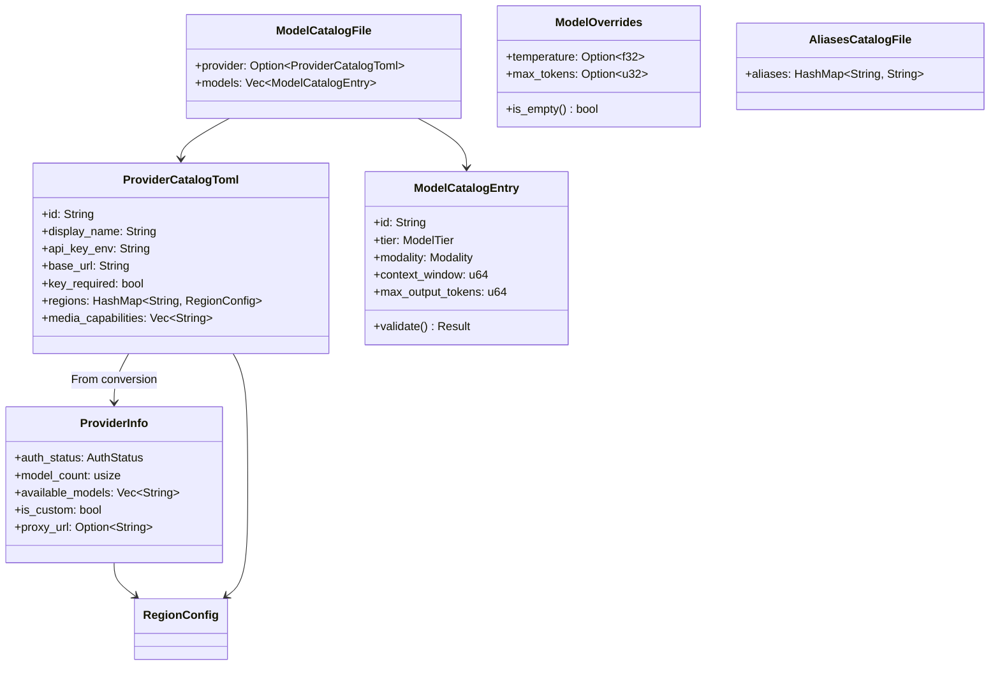

# Other — librefang-types-src

# librefang-types: Model Catalog Types

Shared data structures for the model registry. This is a pure type-definition module — no I/O, no network calls, no global state. Every other crate that needs to reason about models, providers, or catalog files depends on these types.

## Architecture



`ModelCatalogFile` is the top-level deserialization target for catalog TOML files. `ProviderCatalogToml` captures only what lives on disk; `ProviderInfo` extends it with runtime state (auth detection results, model counts, live probe data). The `From<ProviderCatalogToml>` conversion initializes all runtime fields to their defaults.

## Catalog File Format

Catalog TOML files live in `catalog/providers/*.toml` (main repo) and `providers/*.toml` (community catalog). Each file has an optional `[provider]` section and a `[[models]]` array:

```toml
[provider]
id = "anthropic"
display_name = "Anthropic"
api_key_env = "ANTHROPIC_API_KEY"
base_url = "https://api.anthropic.com"
key_required = true

# Optional regional endpoints
[provider.regions.us]
base_url = "https://dashscope-us.aliyuncs.com/compatible-mode/v1"

[[models]]
id = "claude-sonnet-4-20250514"
display_name = "Claude Sonnet 4"
provider = "anthropic"
tier = "smart"
modality = "text"                 # optional, defaults to "text"
context_window = 200000
max_output_tokens = 64000
input_cost_per_m = 3.0
output_cost_per_m = 15.0
supports_tools = true
supports_vision = true
supports_streaming = true
supports_thinking = true
aliases = ["sonnet", "claude-sonnet"]
```

For image and audio models, `context_window` and `max_output_tokens` are omitted entirely:

```toml
[[models]]
id = "gpt-image-2"
display_name = "GPT Image 2"
tier = "frontier"
modality = "image"
input_cost_per_m = 5.00
output_cost_per_m = 10.00
image_input_cost_per_m = 8.00
image_output_cost_per_m = 30.00
supports_vision = true
aliases = ["gpt-image-2-2026-04-21"]
```

Separate alias files (`AliasesCatalogFile`) map short names to canonical model IDs:

```toml
[aliases]
sonnet = "claude-sonnet-4-20250514"
haiku = "claude-haiku-4-5-20251001"
```

## Key Types

### Enums

**`ModelTier`** — Capability classification. Default is `Balanced`. Serializes as lowercase strings (`"frontier"`, `"smart"`, `"balanced"`, `"fast"`, `"local"`, `"custom"`).

**`AuthStatus`** — Provider authentication state. The important method is `is_available()`, which returns `true` for states where the provider is usable (`ValidatedKey`, `Configured`, `AutoDetected`, `ConfiguredCli`, `NotRequired`). `InvalidKey` deliberately returns `false` — the key exists but was rejected (HTTP 401/403). Default is `Missing`.

`LocalOffline` is probe-owned: only the probe logic transitions it back to `NotRequired` when the service comes back up. `detect_auth()` does not reset it.

**`Modality`** — Output type (`Text`, `Image`, `Audio`). Controls whether `context_window` and `max_output_tokens` are required during validation. Default is `Text`.

**`ModelType`** — Classification for inference routing (`Chat`, `Speech`, `Embedding`). Used in `ModelOverrides`. Default is `Chat`.

### ModelCatalogEntry

The core model descriptor. All cost fields use USD per million tokens:

| Field | Notes |
|---|---|
| `context_window` | `0` means unknown/N/A. **Must not** be fed into compaction thresholds or budget math. |
| `max_output_tokens` | Same `0`-means-unknown rule. |
| `image_input_cost_per_m` | Optional — only for multimodal models with separate image pricing. |
| `image_output_cost_per_m` | Optional — only for image-generation models. |

**`validate()`** enforces modality-aware rules:
- `Modality::Text` entries **must** have non-zero `context_window` and `max_output_tokens`.
- `Modality::Image` and `Modality::Audio` entries skip this check.

Catalog loaders in `librefang-runtime` (`from_sources`) and the providers route (`add_custom_model`) both call `validate()` and reject entries that fail. This prevents malformed entries from silently propagating `0` into downstream calculations.

**`is_image_generation()`** is a convenience check for `modality == Modality::Image`.

### ModelOverrides

Per-model inference parameter overrides persisted to `~/.librefang/model_overrides.json`, keyed by `provider:model_id`. Every field is `Option` — `None` means "use the agent's or system default."

Resolution order: agent-level `ModelConfig` → `ModelOverrides` → system defaults.

`is_empty()` returns `true` when all fields are `None`.

Notable fields:
- `use_max_completion_tokens` — switches the API parameter from `max_tokens` to `max_completion_tokens` (OpenAI reasoning models).
- `no_system_role` — suppresses the system role message for models that don't support it.
- `force_max_tokens` — sends `max_tokens` even when the provider doesn't require it.

### ProviderInfo vs ProviderCatalogToml

`ProviderCatalogToml` is the on-disk shape — it maps 1:1 to the `[provider]` TOML section with no runtime fields.

`ProviderInfo` adds:
- `auth_status` — populated by the auth detection system.
- `model_count` — computed by the catalog loader.
- `available_models` — filled by live API probes.
- `is_custom` — `true` for user-added providers (via dashboard "Add provider"), `false` for registry-shipped providers. Built-in providers cannot be deleted because registry sync would re-create them.
- `proxy_url` — per-provider proxy override.

### RegionConfig

Per-region endpoint overrides within a provider. Each region can override `base_url` and optionally `api_key_env`. When no region is selected, the provider-level `base_url` is used.

## Serde Behavior

All enums use `#[serde(rename_all = "lowercase")]` (for `ModelTier`, `Modality`, `ModelType`) or `snake_case` (for `AuthStatus`), so TOML/JSON values are plain strings like `"frontier"` or `"configured_cli"`.

`ModelCatalogEntry` uses `#[serde(default)]` on most fields, allowing partial TOML entries. Optional cost fields (`image_input_cost_per_m`, `image_output_cost_per_m`) use `skip_serializing_if = "Option::is_none"` to keep serialized output clean.

`ProviderCatalogToml.key_required` defaults to `true` via a custom `default_key_required()` function — TOML files that omit it get the correct behavior for cloud providers.

## Integration Points

This module is consumed by:

- **`librefang-runtime/src/model_catalog.rs`** — `from_sources()` loads and validates catalog entries; `merge_discovered_models()` builds entries from live API probes.
- **`librefang-runtime/src/model_metadata.rs`** — `synthesize_entry()` and the `entry()` helper construct `ModelCatalogEntry` instances for models discovered at runtime.
- **`src/routes/providers.rs`** — `add_custom_model()` validates user-submitted model entries before persisting them.
- **`librefang-kernel-metering`** — uses `ModelCatalogFile` data for cost estimation during token metering.