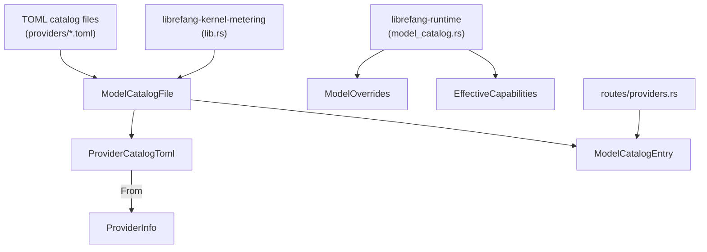

# Other — librefang-types-src

# librefang-types — Model Catalog Types

Shared data structures for the model registry. This crate is the single source of truth for how providers, models, and their metadata are represented across the entire codebase. It contains no runtime logic — only type definitions, serde bindings, display implementations, and validation rules.

## Architecture



TOML files on disk parse into `ModelCatalogFile`. The catalog loader in `librefang-runtime` converts `ProviderCatalogToml` into `ProviderInfo` (populating runtime-only fields like `auth_status`), loads `ModelCatalogEntry` records, and merges user overrides into `EffectiveCapabilities`. The metering kernel consumes `ModelCatalogFile` for cost estimation. Route handlers call `ModelCatalogEntry::validate` when adding custom models.

## Enums

### ModelTier

Capability tier for a model. Serialized as lowercase strings (`"frontier"`, `"smart"`, etc.). Default is `Balanced`.

| Variant | Typical examples |
|---|---|
| `Frontier` | Claude Opus, GPT-4.1 |
| `Smart` | Claude Sonnet, Gemini 2.5 Flash |
| `Balanced` | GPT-4o-mini, Groq Llama |
| `Fast` | Fastest, cheapest models for simple tasks |
| `Local` | Ollama, vLLM, LM Studio |
| `Custom` | User-defined models added at runtime |

The enum is `#[non_exhaustive]` — new tiers may be added without a semver break.

### AuthStatus

Provider authentication state, detected at runtime. Default is `Missing`.

| Variant | Meaning |
|---|---|
| `ValidatedKey` | API key present, confirmed valid via live probe |
| `Configured` | API key present but not yet validated |
| `ConfiguredCli` | No key, but a CLI tool (e.g. `claude-code`) is available |
| `AutoDetected` | Key found via fallback env var — may not match the actual provider |
| `InvalidKey` | Key present but rejected (HTTP 401/403) |
| `Missing` | No API key |
| `NotRequired` | Local providers that don't need a key |
| `CliNotInstalled` | CLI-based provider whose CLI is missing |
| `LocalOffline` | Local provider probed and found offline |

`is_available()` returns `true` for `ValidatedKey`, `Configured`, `AutoDetected`, `ConfiguredCli`, and `NotRequired`. Notably, `InvalidKey` returns `false` — the key exists but won't work.

`LocalOffline` is a special state: unlike `Missing`, the `detect_auth()` function will not reset it. Only the probe that detected the offline state can transition back to `NotRequired` when the service comes back up.

### Modality

What kind of output a model produces. Controls whether `context_window` and `max_output_tokens` are required during validation.

| Variant | Token context required? |
|---|---|
| `Text` (default) | Yes — both fields must be non-zero |
| `Image` | No |
| `Audio` | No |
| `Video` | No |
| `Music` | No |

Non-text models may omit `context_window` and `max_output_tokens` entirely because they are priced per-call/per-asset rather than per-token.

### ModelType

Classification of a model's function: `Chat` (default), `Speech`, or `Embedding`. Used in `ModelOverrides` to override type detection.

## Core Structs

### ModelCatalogEntry

A single model in the registry. Key fields:

- **`id`** — Canonical identifier (e.g. `"claude-sonnet-4-20250514"`)
- **`provider`** — Provider identifier (e.g. `"anthropic"`). Inferred from the `[provider]` section during catalog merge when omitted in community files.
- **`tier`** / **`modality`** — Capability tier and output modality
- **`context_window`** / **`max_output_tokens`** — Token limits. Zero means "unknown/not applicable". **Never feed zero into compaction thresholds or budget math.**
- **`input_cost_per_m`** / **`output_cost_per_m`** — Cost per million tokens (USD). Always present.
- **`image_input_cost_per_m`** / **`image_output_cost_per_m`** — Optional, only set for multimodal/image models where pixel tokens are priced separately.
- **Capability flags**: `supports_tools`, `supports_vision`, `supports_streaming`, `supports_thinking`
- **`aliases`** — Short names for lookup (e.g. `["sonnet", "claude-sonnet"]`)

All fields use `#[serde(default)]` so partial TOML entries parse cleanly.

#### Validation

`validate()` enforces modality-aware rules after deserialization:

```rust
entry.validate()?;
```

- `Modality::Text` entries **must** have non-zero `context_window` and `max_output_tokens`.
- Non-text entries skip the token check.
- Catalog loaders **must** call this and reject entries that fail. The guard exists because `#[serde(default)]` would silently fill `0` for missing fields, and downstream code (compaction, budget) must never see zero for text models.

`is_image_generation()` is a convenience that checks `self.modality == Modality::Image`.

### ModelOverrides

Per-model inference parameter overrides persisted to `~/.librefang/model_overrides.json`, keyed by `provider:model_id`. Every field is `Option` — `None` means "use the agent's or system default".

Fields include sampling parameters (`temperature`, `top_p`, `frequency_penalty`, `presence_penalty`), token limits (`max_tokens`), and capability overrides (`supports_tools`, `supports_vision`, `supports_streaming`, `supports_thinking`).

Capability override fields (`supports_tools` etc.) allow forcing a capability on or off regardless of what the catalog declares. This is useful when a provider's metadata is incorrect or non-standard (see issue #4745).

`is_empty()` returns `true` when all fields are `None`.

### EffectiveCapabilities

Resolved capability flags after applying user overrides on top of the catalog entry. Produced by `ModelCatalog::effective_capabilities` in `librefang-runtime` and consumed by code that gates runtime behavior (tool gating, vision validation, etc.).

```rust
pub struct EffectiveCapabilities {
    pub supports_tools: bool,
    pub supports_vision: bool,
    pub supports_streaming: bool,
    pub supports_thinking: bool,
}
```

### ProviderInfo

Full provider metadata including runtime state. Unlike `ProviderCatalogToml`, this struct carries fields that are only knowable at runtime:

- **`auth_status`** — Detected authentication state, defaults to `Missing`
- **`model_count`** — Number of models from this provider in the catalog
- **`available_models`** — Model IDs confirmed via live API probe. Empty until background validation completes.
- **`is_custom`** — `true` for user-added providers. Built-in providers cannot be deleted because registry sync would re-create them.
- **`proxy_url`** — Per-provider proxy override
- **`regions`** — `HashMap<String, RegionConfig>` for regional endpoint overrides

### RegionConfig

Per-region endpoint configuration:

```rust
pub struct RegionConfig {
    pub base_url: String,
    pub api_key_env: Option<String>,  // overrides provider-level key
}
```

When selecting a region, callers look up the region name in `provider.regions` and use the region's `base_url`. If no region is selected, fall back to `provider.base_url`.

### ProviderCatalogToml

1:1 mapping to the `[provider]` section in catalog TOML files. Omits runtime-only fields (`auth_status`, `model_count`, `available_models`, `is_custom`, `proxy_url`). Converts to `ProviderInfo` via `From<ProviderCatalogToml>`:

```rust
let info: ProviderInfo = toml_provider.into();
// auth_status = Missing, model_count = 0, available_models = [], is_custom = false
```

## TOML File Formats

### ModelCatalogFile

A catalog file with an optional `[provider]` section and a `[[models]]` array:

```toml
[provider]
id = "anthropic"
display_name = "Anthropic"
api_key_env = "ANTHROPIC_API_KEY"
base_url = "https://api.anthropic.com"
key_required = true

[provider.regions.us]
base_url = "https://us.api.anthropic.com"
api_key_env = "ANTHROPIC_US_API_KEY"  # optional override

[[models]]
id = "claude-sonnet-4-20250514"
display_name = "Claude Sonnet 4"
provider = "anthropic"
tier = "smart"
context_window = 200000
max_output_tokens = 64000
input_cost_per_m = 3.0
output_cost_per_m = 15.0
supports_tools = true
supports_vision = true
supports_streaming = true
aliases = ["sonnet", "claude-sonnet"]
```

The `provider` section is optional — files can contain only `[[models]]` entries. This is the unified format shared between the main repository and the community model-catalog repository.

### AliasesCatalogFile

A separate aliases file mapping short names to canonical IDs:

```toml
[aliases]
sonnet = "claude-sonnet-4-20250514"
haiku = "claude-haiku-4-5-20251001"
```

## Serde Behavior

- All enums use `#[serde(rename_all = "lowercase")]` or `snake_case` — variants serialize as lowercase strings.
- Optional fields use `#[serde(skip_serializing_if = "Option::is_none")]` to keep output clean.
- `Vec` fields that default to empty use `#[serde(default)]`.
- `ModelCatalogEntry` fields default generously so partial TOML parses cleanly — this is why `validate()` is critical for text models.

## Integration Points

| Consumer | What it uses |
|---|---|
| `librefang-runtime::model_catalog` | `ModelOverrides`, `ModelCatalogEntry`, `EffectiveCapabilities` — catalog loading, capability resolution, override merging |
| `librefang-runtime::model_metadata` | `ModelCatalogEntry` — constructing model metadata from catalog entries |
| `librefang-kernel-metering` | `ModelCatalogFile` — cost estimation from pricing fields |
| `routes::providers` | `ModelCatalogEntry::validate` — validating custom models on upload |

## Common Patterns

### Loading and validating a catalog entry

```rust
let entry: ModelCatalogEntry = toml::from_str(&toml_str)?;
entry.validate()?;  // rejects text models with zero token limits
```

### Converting a TOML provider to runtime form

```rust
let catalog: ModelCatalogFile = toml::from_str(&toml_str)?;
let provider: ProviderInfo = catalog.provider.unwrap().into();
// auth_status defaults to Missing, model_count to 0
```

### Resolving a regional endpoint

```rust
let url = region_name
    .and_then(|r| provider.regions.get(r))
    .map(|r| r.base_url.as_str())
    .unwrap_or(&provider.base_url);
```

### Checking if a provider is usable

```rust
if provider.auth_status.is_available() {
    // proceed with API call
}
```