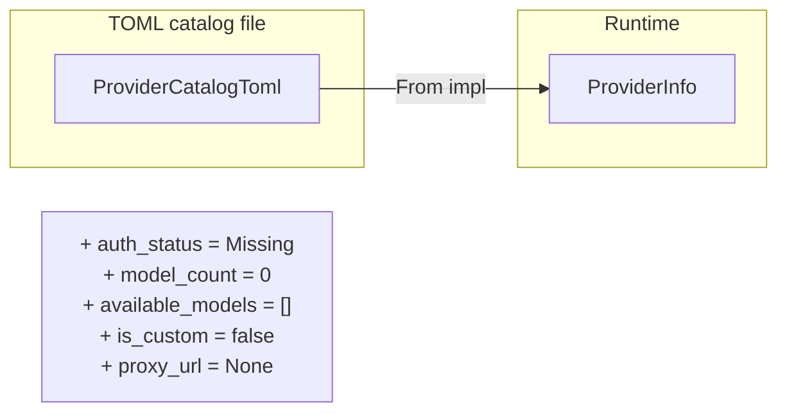

# Other — librefang-types-src

# Model Catalog Types (`librefang-types/src/model_catalog.rs`)

Shared data structures that define how LLM providers and their models are represented throughout the application. Every crate that needs to read, merge, or display model catalog information depends on these types.

## Overview

The types here serve two distinct serialization contexts:

- **TOML catalog files** — community-maintained `providers/*.toml` files that declare providers and models. Represented by `ProviderCatalogToml`, `ModelCatalogFile`, and `AliasesCatalogFile`.
- **Runtime state** — provider metadata enriched with live authentication status, model counts, and proxy configuration. Represented by `ProviderInfo` and `ModelOverrides`.

The conversion from catalog-file types to runtime types is one-directional: `ProviderCatalogToml` → `ProviderInfo` via the `From` impl, which fills runtime-only fields with defaults.

## Core Types

### `ModelTier`

Capability classification for models, ordered from most to least powerful:

| Variant | Examples | Serde form |
|---|---|---|
| `Frontier` | Claude Opus, GPT-4.1 | `"frontier"` |
| `Smart` | Claude Sonnet, Gemini 2.5 Flash | `"smart"` |
| `Balanced` *(default)* | GPT-4o-mini, Groq Llama | `"balanced"` |
| `Fast` | Cheapest models for trivial tasks | `"fast"` |
| `Local` | Ollama, vLLM, LM Studio | `"local"` |
| `Custom` | User-defined at runtime | `"custom"` |

Implements `Display` (lowercase name) and serde's `rename_all = "lowercase"`.

### `AuthStatus`

Tracks the full lifecycle of provider credential detection:

```
Missing ──► Configured ──► ValidatedKey    (live probe confirms key works)
              │
              ▼
          InvalidKey                   (HTTP 401/403 from provider)

Missing ──► AutoDetected               (key found via fallback env var)
Missing ──► ConfiguredCli              (CLI tool like claude-code available)
Missing ──► CliNotInstalled            (CLI provider, but tool not found)

NotRequired                            (local providers)
NotRequired ◄─► LocalOffline           (local service probe failed)
```

**`is_available()`** — returns `true` for `ValidatedKey`, `Configured`, `AutoDetected`, `ConfiguredCli`, and `NotRequired`. Returns `false` for `InvalidKey`, `Missing`, `CliNotInstalled`, and `LocalOffline`. This method is the primary gate used by API routes, WebSocket handlers, and the runtime catalog to decide whether a provider can be used for inference.

Note: `LocalOffline` is special — `detect_auth()` will **not** reset it. Only the background probe that detected the service going offline can transition it back to `NotRequired`.

### `ModelCatalogEntry`

A single model in the catalog with all metadata needed for routing and cost estimation:

- **Identity**: `id` (canonical), `display_name`, `provider`, `aliases`
- **Capability**: `tier`, `context_window`, `max_output_tokens`
- **Feature flags**: `supports_tools`, `supports_vision`, `supports_streaming`, `supports_thinking`
- **Pricing**: `input_cost_per_m`, `output_cost_per_m` (USD per million tokens)

All boolean feature flags default to `false`. The `provider` field defaults to empty — when omitted in community catalog files, it is inferred from the `[provider].id` section during catalog merge (handled in `librefang-runtime`).

### `ModelOverrides`

Per-model inference parameter overrides persisted to `~/.librefang/model_overrides.json`, keyed by `provider:model_id`. Every field is `Option` — `None` means "use the layer above":

```
Agent-level ModelConfig  →  ModelOverrides  →  System defaults
       (highest precedence)                      (lowest)
```

Fields include `temperature`, `top_p`, `max_tokens`, `frequency_penalty`, `presence_penalty`, `reasoning_effort`, and behavioral flags (`use_max_completion_tokens`, `no_system_role`, `force_max_tokens`).

Use `is_empty()` to check if no overrides are set (all fields `None`).

### `ModelType`

Classifies a model as `Chat` (default), `Speech`, or `Embedding`. Stored in `ModelOverrides.model_type` to override the default assumption that catalog models are chat models.

## Provider Types

### `ProviderCatalogToml` → `ProviderInfo`



`ProviderCatalogToml` maps 1:1 to the `[provider]` TOML section. It intentionally omits runtime-only fields so it can be cleanly deserialized from disk.

`ProviderInfo` adds the runtime layer:

| Field | Purpose |
|---|---|
| `auth_status` | Live credential detection state |
| `model_count` | Number of models from this provider in the catalog |
| `available_models` | Model IDs confirmed by live API probe (empty until background validation) |
| `is_custom` | `true` if added via dashboard "Add provider" (not from registry) |
| `proxy_url` | Per-provider proxy override |
| `media_capabilities` | e.g. `"image_generation"`, `"text_to_speech"` |

When `is_custom` is `true`, the dashboard shows a full "Delete" control. Built-in providers can only be deconfigured (key removed) because registry sync would recreate their TOML on next boot.

### `RegionConfig`

Per-region endpoint overrides within a provider. Each region has its own `base_url` and an optional `api_key_env` override. When `api_key_env` is `None`, the provider-level key is used.

Region selection at runtime:

```rust
let resolved_url = provider
    .regions
    .get(selected_region)
    .map(|r| r.base_url.as_str())
    .unwrap_or(&provider.base_url);
```

## File Formats

### `ModelCatalogFile`

The unified TOML format for both the main repository and community model catalogs:

```toml
[provider]
id = "anthropic"
display_name = "Anthropic"
api_key_env = "ANTHROPIC_API_KEY"
base_url = "https://api.anthropic.com"
key_required = true

# Optional regional endpoints
[provider.regions.us]
base_url = "https://us.api.anthropic.com"
api_key_env = "ANTHROPIC_API_KEY_US"  # optional override

[[models]]
id = "claude-sonnet-4-20250514"
display_name = "Claude Sonnet 4"
provider = "anthropic"
tier = "smart"
context_window = 200000
max_output_tokens = 64000
input_cost_per_m = 3.0
output_cost_per_m = 15.0
supports_tools = true
supports_vision = true
supports_streaming = true
aliases = ["sonnet", "claude-sonnet"]
```

The `provider` section is optional — catalog files that only contain models rely on the provider being resolved during merge.

### `AliasesCatalogFile`

Simple short-name → canonical-ID mapping:

```toml
[aliases]
sonnet = "claude-sonnet-4-20250514"
haiku = "claude-haiku-4-5-20251001"
```

## Cross-Crate Usage

These types are consumed across the codebase:

- **`librefang-runtime`** — merges discovered models into `ModelCatalogEntry`, calls `is_available()` to filter available models
- **`librefang-api`** — channel bridge and WebSocket handler call `is_available()` before routing requests
- **`librefang-kernel-metering`** — reads `ModelCatalogFile` for cost estimation (with fallback to legacy budget rates when pricing is zero)
- **HTTP routes** (`src/routes/agents.rs`, `src/routes/providers.rs`) — gate agent creation and model listing behind `is_available()`

All serde serialization uses `skip_serializing_if` on optional/empty fields in `ModelOverrides` and `ProviderInfo` to keep persisted output clean.