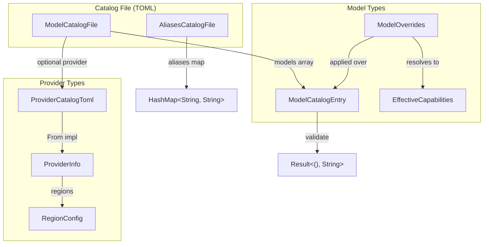

# Other — librefang-types-src

# librefang-types-src — Model Catalog Types

Shared data structures for the model registry, used across the runtime, API layer, and metering kernel. This crate has no dependencies on application logic — it defines the **schema** that other crates agree on.

## Architecture



## Model Classification Enums

### `ModelTier`

Capability tier for pricing and selection heuristics. Serialized as lowercase strings (`"frontier"`, `"smart"`, etc.). Default is `Balanced`.

| Variant | Typical models |
|---|---|
| `Frontier` | Claude Opus, GPT-4.1 |
| `Smart` | Claude Sonnet, Gemini 2.5 Flash |
| `Balanced` | GPT-4o-mini, Groq Llama |
| `Fast` | Cheapest models for simple tasks |
| `Local` | Ollama, vLLM, LM Studio |
| `Custom` | User-defined models added at runtime |

### `Modality`

What kind of output a model produces. Governs whether `context_window` / `max_output_tokens` are required — non-text modalities may legitimately omit them.

- `Text` (default) — chat/completion/reasoning models
- `Image`, `Audio`, `Video`, `Music` — generative models priced per-call

### `ModelType`

Broader model classification: `Chat` (default), `Speech` (TTS/STT), or `Embedding`.

## `AuthStatus` — Provider Authentication State

Tracks the lifecycle of provider credentials, from detection through validation:

```
Missing ──► Configured ──► ValidatedKey
  │              │
  │              ▼
  │         InvalidKey
  │
  ├─► AutoDetected (fallback env var)
  ├─► ConfiguredCli ──► (or CliNotInstalled)
  └─► NotRequired (local) ──► LocalOffline
```

**`is_available()`** returns `true` for states where the provider is usable: `ValidatedKey`, `Configured`, `AutoDetected`, `ConfiguredCli`, and `NotRequired`. Returns `false` for `InvalidKey` — the key exists but was rejected.

`LocalOffline` is a special state set by the probe subsystem. Unlike `Missing`, the `detect_auth()` function does **not** reset it; only the probe itself transitions back to `NotRequired` when the service comes back up.

## `ModelCatalogEntry` — Core Model Record

The central type representing a model in the registry. Key fields:

| Field | Notes |
|---|---|
| `id` | Canonical identifier (e.g. `"claude-sonnet-4-20250514"`) |
| `display_name` | Human-readable name |
| `provider` | Provider identifier (e.g. `"anthropic"`) |
| `tier` | `ModelTier` classification |
| `modality` | `Modality` — defaults to `Text` when absent in TOML |
| `context_window` | Tokens; `0` means unknown/N/A |
| `max_output_tokens` | Tokens; `0` means unknown/N/A |
| `input_cost_per_m` / `output_cost_per_m` | USD per million tokens |
| `image_input_cost_per_m` / `image_output_cost_per_m` | Optional; only for multimodal/image-gen models |
| `supports_tools`, `supports_vision`, `supports_streaming`, `supports_thinking` | Boolean capability flags |
| `reasoning_echo_policy` | `ReasoningEchoPolicy` for OpenAI-compat drivers |
| `aliases` | Short names for lookup (e.g. `["sonnet", "claude-sonnet"]`) |

### Validation

**`validate()`** enforces modality-aware rules after TOML deserialization:

- **Text models**: `context_window` and `max_output_tokens` must be non-zero. A zero value from a missing TOML field would silently propagate into compaction thresholds and budget math — this check prevents that.
- **Non-text models** (Image, Audio, Video, Music): these fields are optional and may remain zero.

Catalog loaders **must** call `validate()` and reject entries that fail. The API route for adding custom models (`add_custom_model` in `routes/providers.rs`) does this.

### Helper

- `is_image_generation()` — shorthand for `self.modality == Modality::Image`.

## `ReasoningEchoPolicy` — Multi-Turn Reasoning Wire Format

The OpenAI-compatible ecosystem has incompatible conventions for the `reasoning_content` field on historical assistant turns. This enum encodes the correct behavior per model, avoiding fragile substring-matching on model names:

| Variant | Behavior | Provider example |
|---|---|---|
| `None` (default) | Omit `reasoning_content` on history | Most providers |
| `Strip` | Strip historical `reasoning_content`; force non-null `content` on empty assistant turns | DeepSeek R1 / `deepseek-reasoner` |
| `Echo` | Echo original thinking text on `tool_calls` turns | DeepSeek V4 Flash (thinking mode on) |
| `EmptyString` | Send empty-string `reasoning_content` on `tool_calls` turns, disable thinking wire-side | Moonshot / Kimi K2 |

Drivers that don't use the OpenAI chat-completions format (Anthropic, Gemini) ignore this entirely. The `#[non_exhaustive]` attribute allows adding new variants if a future provider needs only one of the co-occurring behaviors currently bundled under `Strip`.

## `ModelOverrides` — Per-Model User Overrides

Persisted to `~/.librefang/model_overrides.json` keyed by `provider:model_id`. Every field is `Option` — `None` means "defer to agent or system default." The resolution order is:

```
agent-level ModelConfig → ModelOverrides → system defaults
```

Capability fields (`supports_tools`, `supports_vision`, `supports_streaming`, `supports_thinking`) can force a capability on or off regardless of what the catalog declares. This lets users correct provider metadata that is wrong, missing, or non-standard (ref #4745).

Other notable fields:

- `use_max_completion_tokens` — use `max_completion_tokens` instead of `max_tokens` in API requests
- `no_system_role` — model does not support a system role message
- `force_max_tokens` — send `max_tokens` even when the provider doesn't require it
- `reasoning_effort` — string level: `"low"`, `"medium"`, `"high"`

**`is_empty()`** returns `true` only when every field is `None`.

## `EffectiveCapabilities`

Resolved capabilities after applying `ModelOverrides` on top of a `ModelCatalogEntry`. Produced by `ModelCatalog::effective_capabilities` in `librefang-runtime` and consumed by code that gates runtime behavior (tool gating, vision input validation):

```rust
pub struct EffectiveCapabilities {
    pub supports_tools: bool,
    pub supports_vision: bool,
    pub supports_streaming: bool,
    pub supports_thinking: bool,
}
```

## Provider Types

### `ProviderCatalogToml` → `ProviderInfo`

Two structs represent providers at different stages:

- **`ProviderCatalogToml`** — maps 1:1 to the `[provider]` section in `providers/*.toml`. No runtime fields.
- **`ProviderInfo`** — runtime version with `auth_status`, `model_count`, `available_models`, `is_custom`, and `proxy_url`. The `From<ProviderCatalogToml>` conversion initializes runtime fields to defaults.

| Field | `ProviderCatalogToml` | `ProviderInfo` |
|---|---|---|
| `auth_status` | — | `Missing` (default) |
| `model_count` | — | `0` |
| `available_models` | — | empty |
| `is_custom` | — | `false` (set by catalog loader) |
| `proxy_url` | — | `None` |

`is_custom` drives dashboard behavior: built-in providers can only be deconfigured (key removed), not deleted, because registry sync would re-create their TOML on the next boot.

### `RegionConfig`

Per-region endpoint override with an optional `api_key_env`. When a region is selected, its `base_url` replaces the provider-level default. If the region has its own `api_key_env`, that also overrides the provider-level key.

## Catalog File Formats

### `ModelCatalogFile`

The unified TOML format shared between the main repository and community catalog repos:

```toml
[provider]
id = "anthropic"
display_name = "Anthropic"
api_key_env = "ANTHROPIC_API_KEY"
base_url = "https://api.anthropic.com"
key_required = true

[provider.regions.us]
base_url = "https://dashscope-us.aliyuncs.com/compatible-mode/v1"

[[models]]
id = "claude-sonnet-4-20250514"
display_name = "Claude Sonnet 4"
provider = "anthropic"
tier = "smart"
context_window = 200000
max_output_tokens = 64000
input_cost_per_m = 3.0
output_cost_per_m = 15.0
supports_tools = true
supports_vision = true
supports_streaming = true
aliases = ["sonnet", "claude-sonnet"]
```

The `[provider]` section is optional — community catalog files include it, but the main registry can load standalone model lists.

### `AliasesCatalogFile`

Separate alias mapping:

```toml
[aliases]
sonnet = "claude-sonnet-4-20250514"
haiku = "claude-haiku-4-5-20251001"
```

## Serde Conventions

- All enums use `#[serde(rename_all = "lowercase")]` or `snake_case` and are `#[non_exhaustive]` for forward compatibility.
- Optional cost fields (`image_input_cost_per_m`, `image_output_cost_per_m`) use `skip_serializing_if = "Option::is_none"`.
- `ModelOverrides` uses `#[serde(default)]` at the struct level so partial overrides deserialize correctly.
- `ModelCatalogEntry` fields with sensible defaults (`context_window`, `max_output_tokens`, capability flags) use `#[serde(default)]` so non-text models can omit them.

## Integration Points

| Consumer crate | What it uses |
|---|---|
| `librefang-runtime` (model_catalog) | `ModelOverrides`, `ModelCatalogEntry`, `EffectiveCapabilities` |
| `librefang-runtime` (model_metadata) | `ModelCatalogEntry` for constructing `ModelMetadata` entries |
| `librefang-api` (routes/providers) | `ModelCatalogEntry` and `validate()` for custom model creation |
| `librefang-kernel-metering` | `ModelCatalogFile` for cost estimation from catalog pricing |