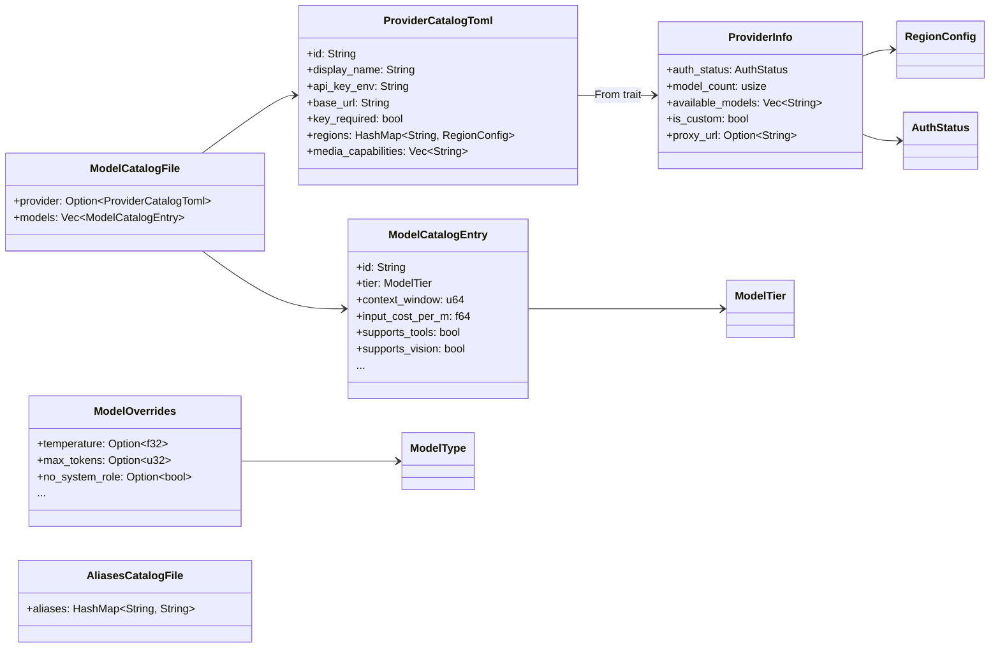

# Other — librefang-types-src

# Model Catalog Types (`librefang-types/src/model_catalog.rs`)

Shared data structures for the Librefang model registry — every component that reads, writes, or reasons about LLM providers and models depends on these types.

## Purpose

This module defines the **canonical schema** for provider metadata, model definitions, authentication state, and inference overrides. It is intentionally free of I/O and business logic: it contains only serializable structs, enums, and their `Display`/`Default` implementations. This keeps the types usable across the runtime, the metering kernel, the CLI, and the dashboard without pulling in conflicting dependencies.

## Architecture



## Key Types

### `ModelTier`

Classifies a model's capability level. Used for routing decisions and cost estimation.

| Variant | Typical examples | Default |
|---------|-----------------|---------|
| `Frontier` | Claude Opus, GPT-4.1 | |
| `Smart` | Claude Sonnet, Gemini 2.5 Flash | |
| **`Balanced`** | GPT-4o-mini, Groq Llama | **yes** |
| `Fast` | Fastest/cheapest models | |
| `Local` | Ollama, vLLM, LM Studio | |
| `Custom` | User-defined runtime additions | |

Serializes to lowercase strings (`"frontier"`, `"smart"`, etc.) via `#[serde(rename_all = "lowercase")]`.

### `AuthStatus`

Represents the full lifecycle of provider authentication, from key detection through validation to failure states.

```rust
pub fn is_available(self) -> bool
```

Returns `true` for states where the provider is usable: `ValidatedKey`, `Configured`, `AutoDetected`, `ConfiguredCli`, `NotRequired`. Notably, `InvalidKey` returns `false` — the key exists but the provider rejected it.

Special states to be aware of:

- **`AutoDetected`** — Key found via a fallback env var. Functionally usable but may not match the intended provider. Consumers should surface a hint to the user.
- **`LocalOffline`** — A local provider's port was probed and not listening. Unlike `Missing`, the `detect_auth()` function will **not** reset this state; the probe loop owns the transition back to `NotRequired` when the service comes back up.
- **`CliNotInstalled`** — A CLI-based provider (e.g. `claude-code`) whose binary is absent.

Defaults to `Missing`. Serializes to snake_case strings.

### `ModelCatalogEntry`

The core model definition. Each entry in a `[[models]]` TOML array maps to one of these.

Key fields:

| Field | Description |
|-------|-------------|
| `id` | Canonical identifier (e.g. `"claude-sonnet-4-20250514"`) |
| `display_name` | Human-readable name for UI |
| `provider` | Provider identifier; inferred from the `[provider]` section when absent |
| `tier` | Capability classification |
| `context_window` / `max_output_tokens` | Token limits |
| `input_cost_per_m` / `output_cost_per_m` | USD per million tokens |
| `supports_tools` / `supports_vision` / `supports_streaming` / `supports_thinking` | Capability flags (default `false`) |
| `aliases` | Short names for lookup (e.g. `["sonnet", "claude-sonnet"]`) |

### `ModelOverrides`

Per-model inference parameter overrides persisted to `~/.librefang/model_overrides.json`, keyed by `provider:model_id`.

Every field is `Option` — `None` means "inherit from the next layer up." The resolution order is:

1. Agent-level `ModelConfig` (highest precedence)
2. **Model overrides** (this struct)
3. System defaults

Notable fields beyond the standard sampling parameters:

- **`no_system_role`** — Set `true` for models that don't support the system role message; the runtime must fold the system prompt into the user message.
- **`force_max_tokens`** — Forces the `max_tokens` parameter even when the provider doesn't require it.
- **`use_max_completion_tokens`** — Swaps `max_tokens` for `max_completion_tokens` in the API request (required by some providers).

Use `is_empty()` to check whether any overrides are actually set.

### `RegionConfig` and Regional Endpoints

Some providers (e.g. Qwen/DashScope) expose different base URLs per geographic region. `RegionConfig` holds a region-specific `base_url` and an optional `api_key_env` override.

At runtime, region selection works by looking up the chosen region key in `ProviderInfo::regions`. If present, use `RegionConfig::base_url`; otherwise fall back to `ProviderInfo::base_url`:

```rust
let resolved_url = provider.regions.get(selected_region)
    .map(|r| r.base_url.as_str())
    .unwrap_or(&provider.base_url);
```

## Catalog File Formats

### `ModelCatalogFile` — Provider + Models

The unified TOML format shared between the main repository and community model catalogs:

```toml
[provider]
id = "anthropic"
display_name = "Anthropic"
api_key_env = "ANTHROPIC_API_KEY"
base_url = "https://api.anthropic.com"
key_required = true
signup_url = "https://console.anthropic.com/settings/keys"

[provider.regions.us]
base_url = "https://dashscope-us.aliyuncs.com/compatible-mode/v1"

[[models]]
id = "claude-sonnet-4-20250514"
display_name = "Claude Sonnet 4"
provider = "anthropic"
tier = "smart"
context_window = 200000
max_output_tokens = 64000
input_cost_per_m = 3.0
output_cost_per_m = 15.0
supports_tools = true
supports_vision = true
supports_streaming = true
aliases = ["sonnet", "claude-sonnet"]
```

The `[provider]` section is optional. Community catalogs that only contribute model entries can omit it.

### `AliasesCatalogFile` — Short Name Mappings

```toml
[aliases]
sonnet = "claude-sonnet-4-20250514"
haiku = "claude-haiku-4-5-20251001"
```

### `ProviderCatalogToml` vs `ProviderInfo`

`ProviderCatalogToml` is the **disk format** — it maps 1:1 to the `[provider]` TOML section and omits runtime-only fields. `ProviderInfo` is the **runtime format** that adds:

| Runtime-only field | Purpose |
|--------------------|---------|
| `auth_status` | Detected key/CLI state |
| `model_count` | Number of catalog models for this provider |
| `available_models` | Model IDs confirmed via live API probe |
| `is_custom` | `true` if added by the user at runtime; controls whether the dashboard shows a "Delete" button |
| `proxy_url` | Per-provider proxy override |

The `From<ProviderCatalogToml> for ProviderInfo` conversion initializes runtime fields to their defaults (`Missing` auth, zero count, empty available models, `is_custom = false`).

## Consumers

These types are used across several crates:

- **`librefang-runtime`** — `merge_discovered_models` and catalog loading operate on `ModelCatalogEntry` and `ModelCatalogFile`; model discovery populates `ProviderInfo::available_models`.
- **`librefang-kernel-metering`** — Cost estimation reads `ModelCatalogFile` to look up per-model pricing (`input_cost_per_m`, `output_cost_per_m`).

## Serialization Conventions

- All enums use `#[serde(rename_all = "lowercase")]` or `snake_case` for consistent TOML/JSON representation.
- `ModelOverrides` uses `#[serde(skip_serializing_if = "Option::is_none")]` to keep persisted files minimal.
- `ProviderInfo::available_models` uses `skip_serializing_if = "Vec::is_empty"` to avoid serializing an empty array when no probe has completed yet.